# AAVP — Especificación Técnica del Protocolo

> **v0.8.1 — Borrador Inicial — Febrero 2026**
>
> Este documento describe la arquitectura, los fundamentos criptográficos y el modelo de seguridad del Anonymous Age Verification Protocol. Para una introducción accesible, consultar [README.md](README.md).

---

## Índice

- [1. Arquitectura del Protocolo](#1-arquitectura-del-protocolo)
  - [1.3 Supuestos de Seguridad](#13-supuestos-de-seguridad)
- [2. Estructura del Token AAVP](#2-estructura-del-token-aavp)
- [3. Rotación de Tokens](#3-rotación-de-tokens)
- [4. Fundamentos Criptográficos](#4-fundamentos-criptográficos)
  - [4.4 Integridad del Dispositivo y Attestation](#44-integridad-del-dispositivo-y-attestation)
- [5. Modelo de Confianza Descentralizado](#5-modelo-de-confianza-descentralizado)
- [6. Flujo Operativo Detallado](#6-flujo-operativo-detallado)
- [7. Credencial de Sesión del Verification Gate](#7-credencial-de-sesión-del-verification-gate)
- [8. Segmentation Accountability Framework (SAF)](#8-segmentation-accountability-framework-saf)
- [9. Modelo de Amenazas](#9-modelo-de-amenazas)
- [10. Trabajo Futuro y Líneas Abiertas](#10-trabajo-futuro-y-líneas-abiertas)
- [Glosario](#glosario)

---

## 1. Arquitectura del Protocolo

### 1.1 Roles del Protocolo

AAVP define tres roles con responsabilidades diferenciadas. El diseño garantiza que ninguno necesita confiar ciegamente en los otros: la verificabilidad criptográfica sustituye a la confianza institucional.

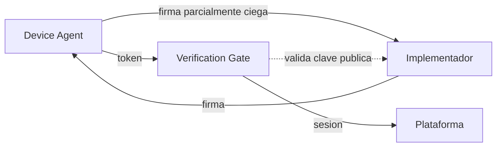
```mermaid
graph LR
    DA[Device Agent] -->|firma parcialmente ciega| IM[Implementador]
    IM -->|firma| DA
    DA -->|token| VG[Verification Gate]
    VG -.->|valida clave publica| IM
    VG -->|sesion| APP[Plataforma]
```

#### Device Agent (DA)

El Device Agent es un **rol abstracto del protocolo**: un componente de software que reside en el dispositivo del menor y es responsable de generar, custodiar y rotar los tokens de edad.

**Qué es:** Una pieza de software que implementa la especificación AAVP para la generación y gestión de tokens. Es el único componente del sistema que conoce la configuración real de franja de edad.

**Qué NO es:** El Device Agent no es sinónimo de "control parental". Es un rol del protocolo que puede ser implementado por distintos vehículos:

| Vehículo de implementación | Ejemplo |
|---------------------------|---------|
| Sistema de control parental | Qustodio, Bark, software de operador |
| Componente nativo del SO | Módulo integrado en iOS, Android, Windows |
| Extensión de navegador | Extensión conforme a la especificación |
| Firmware del dispositivo | Routers con control parental integrado |

La separación entre el rol (Device Agent) y su vehículo de implementación es deliberada: permite que el ecosistema evolucione sin modificar el protocolo. Hoy, el vehículo más probable es el software de control parental existente; mañana, podría ser un componente nativo del sistema operativo.

**Responsabilidades del DA:**
- Generar pares de claves locales en almacenamiento seguro (Secure Enclave, TPM, StrongBox).
- Generar tokens efímeros con la franja de edad configurada.
- Obtener firma parcialmente ciega del Implementador: los metadatos públicos (`age_bracket`, `expires_at`) son visibles al IM, pero el `nonce` permanece cegado.
- Presentar tokens firmados al Verification Gate.
- Rotar tokens antes de su expiración.
- Proteger la configuración de franja mediante PIN parental o mecanismo equivalente a nivel de SO.

#### Verification Gate (VG)

Endpoint dedicado de la plataforma digital que actúa como puerta de entrada al servicio. Valida el token AAVP y establece una sesión interna con la marca de franja de edad.

**Responsabilidades del VG:**
- Exponer el endpoint de descubrimiento `.well-known/aavp` y opcionalmente el registro DNS `_aavp` conforme a la sección 5.3.
- Validar la firma criptográfica del token contra las claves públicas de Implementadores aceptados.
- Verificar el TTL del token.
- Extraer la franja de edad y establecer una sesión interna.
- Rechazar tokens expirados, malformados o firmados por Implementadores no confiables.

#### Implementador (IM)

Empresa u organización que desarrolla software que actúa como Device Agent, conforme al estándar AAVP.

**Responsabilidades del IM:**
- Publicar su clave pública en su propio dominio mediante el endpoint `.well-known/aavp-issuer` conforme a la sección 5.2.3.
- Mantener código auditable (preferentemente open source).
- Proveer servicio de firma parcialmente ciega al Device Agent.
- Cumplir con la especificación abierta.

### 1.2 Modelo de Puerta de Entrada (Verification Gate)

Un enfoque ingenuo enviaría la credencial de edad en cada petición HTTP, exponiéndola continuamente a posibles interceptaciones. AAVP adopta un modelo diferente: la **puerta de entrada**.

El token de edad solo viaja una vez por sesión, durante un handshake inicial dedicado. Después, la plataforma trabaja con su propio sistema de sesiones.

> **Idea clave:** El token de edad nunca convive con el tráfico regular de la aplicación. Es un canal separado, un handshake puntual. Después, la información "este usuario es menor" es un flag interno de la plataforma, completamente desacoplado del token original.

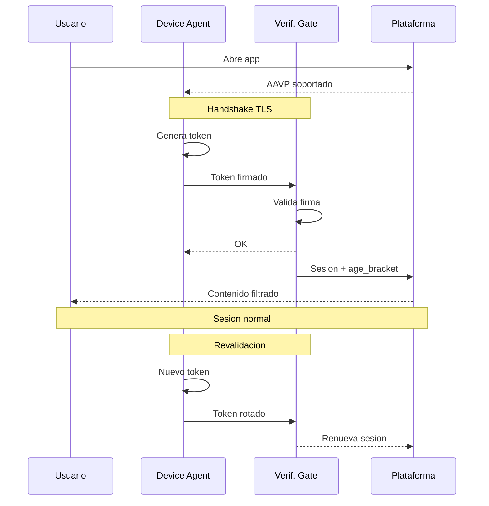
```mermaid
sequenceDiagram
    participant U as Usuario
    participant DA as Device Agent
    participant VG as Verif. Gate
    participant APP as Plataforma

    U->>APP: Abre app
    APP-->>DA: AAVP soportado

    Note over DA,VG: Handshake TLS
    DA->>DA: Genera token
    DA->>VG: Token firmado
    VG->>VG: Valida firma
    VG-->>DA: OK

    VG->>APP: Sesion + age_bracket
    APP-->>U: Contenido filtrado

    Note over U,APP: Sesion normal

    Note over DA,VG: Revalidacion
    DA->>DA: Nuevo token
    DA->>VG: Token rotado
    VG-->>APP: Renueva sesion
```

**Ventajas del modelo de puerta de entrada:**

- **Superficie de ataque reducida:** el token de edad solo viaja una vez por sesión, no en cada request.
- **Separación de contextos:** la información de edad nunca convive con el tráfico de datos de la aplicación.
- **Compatibilidad:** las plataformas ya gestionan sesiones; AAVP solo añade un paso previo.
- **Ventana temporal mínima para MITM:** interceptar el handshake inicial requiere comprometer TLS en una ventana muy breve. Todos los canales del protocolo (DA-VG y DA-IM) requieren TLS 1.3 o superior.

### 1.3 Supuestos de Seguridad

Todo protocolo criptográfico descansa sobre supuestos explícitos e implícitos. AAVP los hace explícitos para que implementadores, auditores y reguladores puedan evaluar las garantías y sus límites. Para un análisis detallado de cada supuesto, consultar [SECURITY-ANALYSIS.md](SECURITY-ANALYSIS.md) sección 1.

#### Categoría A — Supuestos resueltos en la especificación

Estos supuestos tienen cobertura directa en la especificación técnica.

| ID | Supuesto | Nivel | Referencia |
|----|----------|-------|------------|
| S1 | TLS 1.3 + Certificate Transparency protege los canales DA-VG y DA-IM | Obligatorio | Secciones 4.3, 5.2.3 |
| S3 | Las firmas parcialmente ciegas impiden vincular token con usuario | Obligatorio | Sección 4.1 |
| S4 | La rotación de tokens impide rastreo longitudinal | Obligatorio | Sección 3 |
| S5 | Las sesiones post-handshake son seguras | Obligatorio | Sección 7 |
| S9 | El canal DA-IM es confidencial e íntegro | Obligatorio | Sección 4.3 |
| S10 | Los relojes están razonablemente sincronizados (tolerancia definida) | Obligatorio | Sección 3 |
| S11 | Cada IM publica sus claves en su propio dominio | Obligatorio | Sección 5.2.3 |
| S14 | La revocación de IMs se produce por expiración natural y decisión bilateral | Obligatorio | Sección 5.2 |

Cada supuesto está respaldado por mecanismos criptográficos o de protocolo definidos en las secciones referenciadas. Las garantías son verificables por cualquier implementador.

#### Categoría B — Supuestos parcialmente resueltos

Estos supuestos tienen mitigaciones parciales en la especificación pero conservan riesgo residual.

| ID | Supuesto | Nivel | Estado |
|----|----------|-------|--------|
| S2 | Hardware seguro protege las claves del DA | Recomendado (obligatorio cuando disponible) | Key attestation opcional (sección 4.4) |
| S6 | La auditoría open source previene IMs maliciosos | Recomendado | Sin verificación en runtime |
| S7 | PIN parental o protección del SO impide desactivación por el menor | Depende del vehículo de implementación | Parcialmente mitigado por persistencia a nivel de cuenta (sección 7.7) |
| S8 | El dispositivo no está comprometido (root/jailbreak) | Explícito; no garantizable por el protocolo | Device attestation opcional (sección 4.4) |
| S12 | Las plataformas implementan correctamente la segmentación | Recomendado (con verificación pública) | SAF (sección 8) mitiga con SPD + PTL + OVP |

**S2 — Hardware seguro.** Las claves del DA deben generarse en hardware seguro cuando el dispositivo lo soporta (sección 4.4.1). Key attestation (sección 4.4.2) permite al IM diferenciar entre claves hardware-backed y software-only. Riesgo residual: dispositivos sin TEE y ataques a implementaciones específicas de TEE.

**S6 — Auditoría open source.** El estándar recomienda código auditable (sección 5.2.2), pero no existe verificación en runtime de que el código publicado sea el que se ejecuta. La mitigación depende de *reproducible builds* y auditorías periódicas, que están fuera del alcance del protocolo.

**S7 — Protección contra desactivación.** La efectividad depende del vehículo de implementación del DA. La persistencia a nivel de cuenta (sección 7.7) mitiga parcialmente: aunque el menor desinstale el DA, las restricciones de cuenta se mantienen. Riesgo residual: dispositivos donde el DA no tiene protección a nivel de SO.

**S8 — Dispositivo no comprometido.** En un dispositivo con root o jailbreak, todas las garantías del DA son anulables. La sección 4.4 define device attestation opcional (key attestation + señales de integridad) como mitigación parcial. Documentado explícitamente como limitación del protocolo (sección 4.4.5).

**S12 — Segmentación correcta.** El SAF (sección 8) define infraestructura de accountability: SPD firmada, logs de transparencia (PTL) y verificación abierta (OVP). Riesgo residual: el contenido dinámico y UGC dificultan la verificación exhaustiva.

#### Categoría C — Limitaciones reconocidas del protocolo

| ID | Supuesto | Justificación |
|----|----------|---------------|
| S13 | El menor no tiene acceso a un segundo dispositivo sin DA | Limitación inherente. AAVP protege los dispositivos donde está presente. El modelo aditivo (sección 7.7) mitiga parcialmente: la cuenta conserva las restricciones aunque se acceda desde otro dispositivo con DA. Un dispositivo sin DA no genera señal AAVP. |

Estas limitaciones son inherentes al modelo y no pueden resolverse sin comprometer los principios del protocolo. Para un análisis completo de cada supuesto, incluyendo escenarios de fallo e impacto, consultar [SECURITY-ANALYSIS.md](SECURITY-ANALYSIS.md).

---

## 2. Estructura del Token AAVP

El token es una estructura criptográfica de tamaño fijo (331 bytes) diseñada para ser mínima. Cada campo tiene una justificación específica y supera el test de minimalismo de datos del protocolo.

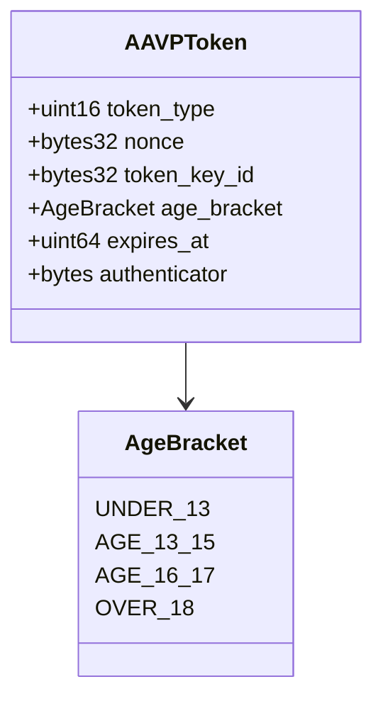
```mermaid
classDiagram
    class AAVPToken {
        +uint16 token_type
        +bytes32 nonce
        +bytes32 token_key_id
        +AgeBracket age_bracket
        +uint64 expires_at
        +bytes authenticator
    }
    class AgeBracket {
        UNDER_13
        AGE_13_15
        AGE_16_17
        OVER_18
    }
    AAVPToken --> AgeBracket
```

| Campo | Contenido | Propósito |
|-------|-----------|-----------|
| `token_type` | uint16, identifica el esquema criptográfico | Permite agilidad criptográfica y migración post-cuántica. |
| `nonce` | 32 bytes aleatorios criptográficamente seguros | Previene reutilización y asegura unicidad de cada token. Cegado durante la emisión. |
| `token_key_id` | SHA-256 de la clave pública del IM (32 bytes) | Permite al VG identificar qué clave usar para verificar la firma. |
| `age_bracket` | Enumeración: `UNDER_13` (0x00), `AGE_13_15` (0x01), `AGE_16_17` (0x02), `OVER_18` (0x03) | Señal de franja de edad. Metadato público de la firma parcialmente ciega. |
| `expires_at` | uint64 big-endian, timestamp Unix con precisión de 1 hora | Ventana de validez. Metadato público. La precisión gruesa agrupa tokens temporalmente. |
| `authenticator` | Firma parcialmente ciega RSAPBSSA-SHA384 (256 bytes) | Demuestra que el token proviene de un IM legítimo sin vincular al usuario. |

### Formato binario

El token tiene un formato binario fijo de 331 bytes, sin separadores ni metadatos de codificación. La canonicalización está implícita en el formato: los campos se concatenan en el orden especificado con offsets determinísticos.

```
Offset  Tamaño  Campo                Visibilidad
0       2       token_type           Público
2       32      nonce                Cegado (oculto al IM durante emisión)
34      32      token_key_id         Público
66      1       age_bracket          Metadato público (0x00-0x03)
67      8       expires_at           Metadato público (uint64 BE, precisión 1h)
75      256     authenticator        Firma parcialmente ciega (RSAPBSSA-SHA384)
---
Total: 331 bytes (fijo)
```

Todas las implementaciones conformes deben producir tokens de exactamente 331 bytes. Un token de tamaño diferente es inválido.

### Metadatos públicos vs. contenido cegado

El token AAVP utiliza **firmas parcialmente ciegas** (Partially Blind Signatures). Esto implica una distinción entre dos tipos de contenido dentro del token:

- **Metadatos públicos** (`age_bracket`, `expires_at`): visibles al IM durante el proceso de firma. El IM los utiliza para derivar una clave de firma específica via HKDF. Son parte del contrato visible entre el DA y el IM.
- **Contenido cegado** (`nonce`): oculto al IM durante la emisión. Solo el DA y el VG conocen su valor. El cegamiento criptográfico garantiza que el IM no puede leerlo.

El IM conoce la franja de edad del token que firma, pero **no puede vincular esa información con la identidad del usuario** que la solicita. Dentro de una misma franja, todos los tokens son indistinguibles para el IM. Esto preserva la *unlinkability*: la franja de edad no es un dato personal, es la señal mínima que el protocolo necesita transmitir.

Esta arquitectura es aceptable porque:
1. La franja de edad es precisamente la señal que el protocolo transmite. No es información adicional.
2. El IM no obtiene nada que el VG no obtenga también al verificar el token.
3. El IM puede actuar como segunda barrera contra la suplantación de `age_bracket`, verificando coherencia con la configuración del DA.

### Test de minimalismo de los campos nuevos

Los campos `token_type` y `token_key_id` son adiciones respecto a versiones anteriores de la especificación. Ambos superan el test de minimalismo de datos:

- **`token_type`**: necesario para la agilidad criptográfica (migración post-cuántica). Su valor es idéntico para todos los tokens del mismo esquema. No permite *fingerprinting* individual.
- **`token_key_id`**: necesario para que el VG identifique la clave de verificación sin probar todas las claves conocidas. Derivado de la clave pública del IM (no del usuario). Idéntico para todos los tokens del mismo IM.

### Campos explícitamente excluidos

El token **no contiene** y **no puede contener**:

- Identidad del usuario
- Identificador del dispositivo
- Dirección IP
- Localización geográfica
- Versión del software
- Sistema operativo
- Timestamp de emisión (`issued_at`): eliminado porque la frescura se gestiona con `expires_at` grueso, y un timestamp de emisión con jitter es una superficie innecesaria de *fingerprinting*
- Ningún otro dato que permita correlación o rastreo

Cada dato adicional es un vector potencial de *fingerprinting* y debe justificarse rigurosamente antes de incluirse en futuras versiones del protocolo.

### Generación del nonce

El nonce de 32 bytes debe generarse utilizando un generador de números pseudoaleatorios criptográficamente seguro (CSPRNG) proporcionado por el sistema operativo. El uso de fuentes de aleatoriedad débiles compromete las garantías de unicidad del token y puede facilitar ataques de predicción.

**APIs requeridas por plataforma:**

| Plataforma | API requerida | Alternativa |
|------------|--------------|-------------|
| iOS / macOS | `SecRandomCopyBytes` (Security.framework) | `CryptoKit` (`SymmetricKey(size:)`) |
| Android | `java.security.SecureRandom` (respaldado por `/dev/urandom`) | — |
| Linux | `getrandom(2)` o `getentropy()` | `/dev/urandom` |
| Windows | `BCryptGenRandom` (BCrypt) | — |
| Web (navegador) | `crypto.getRandomValues()` (Web Crypto API) | — |

**Fuentes prohibidas:**

Las siguientes fuentes de aleatoriedad producen tokens no conformes:

- `Math.random()` (JavaScript) o equivalentes no criptográficos en otros lenguajes.
- `rand()`, `random()` (C/C++ estándar).
- Derivación a partir de timestamps, direcciones MAC o identificadores del dispositivo.
- PRNGs inicializados con semillas predecibles o de baja entropía.

**Justificación:** El espacio de 256 bits del nonce es suficiente para prevenir colisiones (SECURITY-ANALYSIS.md sección 4.6 demuestra probabilidad negligible incluso tras 10^18 tokens). Sin embargo, un PRNG débil con 32 bits de entropía efectiva reduce el espacio a 2^32 valores posibles, haciendo las colisiones probables tras ~65.000 tokens. La especificación de APIs de CSPRNG del SO garantiza que los 256 bits se utilizan en su totalidad.

**Test de conformidad:** Las auditorías de implementaciones del Device Agent deben verificar:

1. Que el código fuente utiliza exclusivamente las APIs de CSPRNG del SO listadas.
2. Que una muestra de 10.000 nonces generados supera la suite de tests estadísticos NIST SP 800-22 o equivalente.
3. Que nonces consecutivos no comparten prefijos, sufijos ni patrones detectables.

---

## 3. Rotación de Tokens

Incluso sin datos personales, un token estático podría convertirse en un pseudoidentificador persistente si se reutiliza. Por ello, AAVP implementa rotación obligatoria:

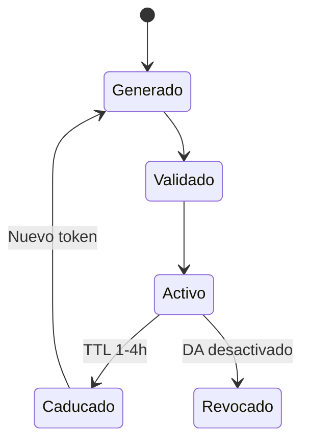
```mermaid
stateDiagram-v2
    [*] --> Generado
    Generado --> Validado
    Validado --> Activo
    Activo --> Caducado : TTL 1-4h
    Caducado --> Generado : Nuevo token
    Activo --> Revocado : DA desactivado
```

- **Tiempo de vida máximo (TTL):** Cada token tiene una validez definida por `expires_at`, recomendándose entre 1 y 4 horas. El VG valida `expires_at` contra su propio reloj.
- **Precisión gruesa de `expires_at`:** El valor de `expires_at` se redondea a la hora completa más cercana. Esto implica que todos los tokens emitidos en la misma hora comparten el mismo valor de expiración, lo que incrementa el *anonymity set* y dificulta la correlación temporal.
- **Tolerancia de reloj (*clock skew*):** El VG aplica una tolerancia asimétrica al validar `expires_at`:
  - **Tokens expirados:** El VG acepta tokens cuyo `expires_at` haya pasado hace no más de **5 minutos** (300 segundos). Esto acomoda la sincronización imperfecta de relojes en dispositivos móviles, coherente con la tolerancia de facto de Kerberos (RFC 4120) y las recomendaciones de JWT (RFC 7519).
  - **Tokens del futuro:** El VG rechaza tokens cuyo `expires_at` supere la hora actual del VG en más del TTL máximo permitido (4 horas) **más 1 minuto** (60 segundos). Un `expires_at` excesivamente futuro indica un reloj manipulado o un token fabricado.
  - **Valor canónico:** Las implementaciones conformes usan `CLOCK_SKEW_TOLERANCE_PAST = 300` y `CLOCK_SKEW_TOLERANCE_FUTURE = 60` como valores por defecto. Los VGs pueden ajustar estos valores según su entorno, pero no deben exceder los máximos recomendados.
- **Rotación proactiva:** El Device Agent puede generar un nuevo token antes de la expiración para mantener la continuidad de la sesión.
- **No vinculabilidad (*unlinkability*):** Dos tokens consecutivos del mismo dispositivo no son correlacionables entre sí. Cada token es criptográficamente independiente del anterior.

---

## 4. Fundamentos Criptográficos

### 4.1 Firmas Parcialmente Ciegas (Partially Blind Signatures)

El mecanismo central de AAVP para desacoplar la identidad del usuario de la señal de edad es el uso de **firmas parcialmente ciegas**, una evolución de las firmas ciegas propuestas por David Chaum en 1983.

**Analogía:** Un sobre con papel carbón y una ventanilla transparente. El firmante estampa su firma sobre el sobre cerrado: ve a través de la ventanilla la franja de edad (metadato público), pero el resto del contenido permanece oculto.

**Esquema elegido:** RSAPBSSA-SHA384 (*RSA Partially Blind Signature Scheme with Appendix*), basado en RFC 9474 y draft-irtf-cfrg-partially-blind-rsa. Este esquema permite que el IM vea los metadatos públicos (`age_bracket`, `expires_at`) mientras el `nonce` permanece cegado.

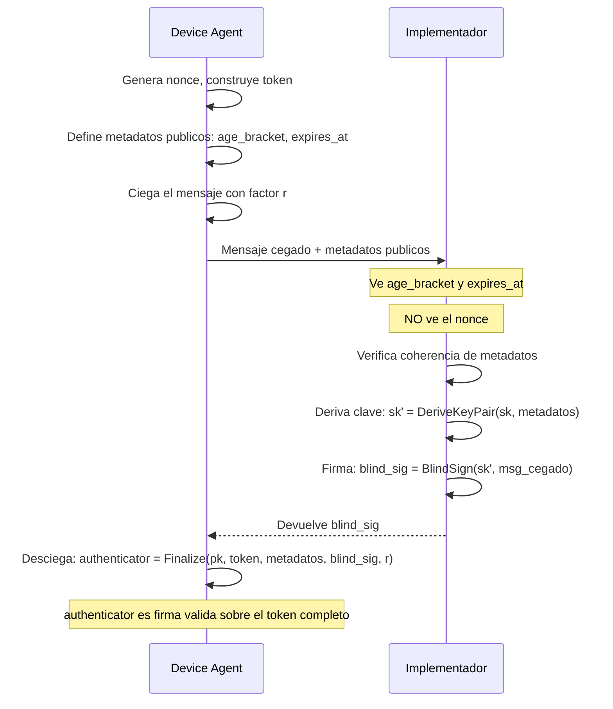
```mermaid
sequenceDiagram
    participant DA as Device Agent
    participant IM as Implementador

    DA->>DA: Genera nonce, construye token
    DA->>DA: Define metadatos publicos: age_bracket, expires_at
    DA->>DA: Ciega el mensaje con factor r

    DA->>IM: Mensaje cegado + metadatos publicos
    Note over IM: Ve age_bracket y expires_at
    Note over IM: NO ve el nonce
    IM->>IM: Verifica coherencia de metadatos
    IM->>IM: Deriva clave: sk' = DeriveKeyPair(sk, metadatos)
    IM->>IM: Firma: blind_sig = BlindSign(sk', msg_cegado)
    IM-->>DA: Devuelve blind_sig

    DA->>DA: Desciega: authenticator = Finalize(pk, token, metadatos, blind_sig, r)
    Note over DA: authenticator es firma valida sobre el token completo
```

**Derivación de clave por metadato:** El IM tiene una sola clave maestra (sk, pk). Para cada combinación de metadatos públicos (age_bracket, expires_at), se deriva automáticamente un par de claves (sk', pk') via HKDF. El VG, que conoce la clave pública maestra y los metadatos del token, realiza la misma derivación para verificar. Esto vincula criptográficamente los metadatos a la firma sin revelar el contenido cegado.

**Resultado:** El Implementador conoce la franja de edad pero **no puede vincular un token firmado con el DA que lo solicitó**. Dentro de la misma franja, todos los tokens son indistinguibles para el IM. La franja no es un dato personal: es la señal que el protocolo transmite.

#### Seguridad del canal DA-IM

La firma parcialmente ciega garantiza que el IM no puede vincular el token finalizado con la petición de firma (*blindness*). Sin embargo, el canal de transporte puede filtrar metadatos que comprometan esta propiedad:

- **Requisito mínimo:** El canal DA-IM requiere TLS 1.3 o superior. El DA verifica la cadena de certificados del IM contra los certificados raíz del sistema operativo. La integridad de los certificados se respalda con Certificate Transparency (RFC 9162).
- **Metadatos de red:** Incluso con TLS, el IM observa la dirección IP del DA, su *fingerprint* TLS (JA3/JA4) y los patrones temporales de las peticiones. Estas fugas son inherentes al transporte TCP/IP y se mitigan parcialmente con la rotación de tokens y la precisión gruesa de `expires_at`.
- **Recomendación para máxima privacidad:** Las implementaciones que busquen minimizar la fuga de metadatos de red pueden utilizar Oblivious HTTP (RFC 9458) para el canal DA-IM, interponiendo un relay que oculte la IP del DA al IM. Esta medida es opcional y queda fuera del alcance mínimo del protocolo.

> [!NOTE]
> El canal DA-VG tiene los mismos requisitos de TLS. La diferencia es que en DA-VG el token ya está finalizado y no contiene datos vinculables con el DA, por lo que la fuga de metadatos de red tiene menor impacto en la privacidad.

**Esquema principal y alternativas:**
- **RSAPBSSA-SHA384** (RFC 9474 + draft-irtf-cfrg-partially-blind-rsa) — Esquema elegido por AAVP.
- Blind BLS Signatures — Alternativa futura por tamaño de firma reducido (48 bytes). Sin RFC publicado.
- ZKP (Bulletproofs) — Complemento para la verificación inicial de edad contra un documento oficial.

### 4.2 Pruebas de Conocimiento Cero (ZKP)

Como alternativa o complemento a las firmas ciegas, AAVP contempla el uso de **pruebas de conocimiento cero** (Zero-Knowledge Proofs).

Un ZKP permite demostrar una afirmación — "mi edad está dentro de la franja X" — sin revelar ningún dato adicional. Esto es especialmente útil en escenarios donde la verificación inicial de la edad se realiza contra un documento oficial: el ZKP demostraría que la fecha de nacimiento cumple el criterio de franja sin exponer la fecha, el nombre ni ningún otro campo del documento.

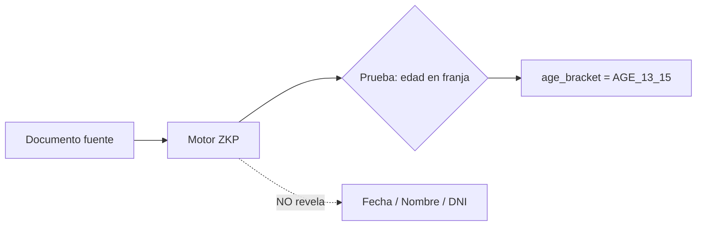
```mermaid
flowchart LR
    A[Documento fuente] --> B[Motor ZKP]
    B --> C{Prueba: edad en franja}
    C --> D[age_bracket = AGE_13_15]
    B -.->|NO revela| E[Fecha / Nombre / DNI]
```

**Esquemas candidatos:**
- zk-SNARKs (Groth16, PLONK)
- zk-STARKs (sin trusted setup)
- Bulletproofs (para range proofs sobre edad)

### 4.3 Prevención de Fingerprinting

Cada campo del token está diseñado para minimizar la información que podría usarse para identificar o rastrear al usuario:

| Medida | Campo afectado | Propósito |
|--------|---------------|-----------|
| Precisión gruesa | `expires_at` | Redondeo a la hora elimina correlación temporal. Todos los tokens emitidos en la misma hora comparten el mismo valor. |
| Nonce criptográfico | `nonce` | Generado sin derivación de identificadores del dispositivo |
| Metadatos mínimos | `age_bracket`, `expires_at` | Solo dos metadatos públicos. `age_bracket` particiona el *anonymity set* en 4 grupos (inherente al propósito del protocolo). La precisión horaria de `expires_at` agrupa todos los tokens de la misma hora. |
| Rotación frecuente | `expires_at` | Tokens de corta vida impiden seguimiento longitudinal |
| Tamaño fijo | (todo el token) | Todos los tokens tienen exactamente 331 bytes |

### 4.4 Integridad del Dispositivo y Attestation

Las garantías criptográficas de AAVP dependen de que el Device Agent opere en un entorno íntegro. Si el dispositivo está comprometido (root/jailbreak), un atacante puede eludir las protecciones del DA. Esta sección define los mecanismos de integridad del dispositivo como señales de confianza opcionales que modulan — pero nunca condicionan — el acceso al protocolo.

#### 4.4.1 Claves del DA en hardware seguro

Las claves criptográficas del Device Agent deben generarse y almacenarse en hardware seguro cuando el dispositivo lo soporta. Las claves privadas son no exportables: todas las operaciones criptográficas ocurren dentro del entorno seguro.

| Plataforma | Hardware seguro | API de generación de claves |
|------------|----------------|---------------------------|
| iOS / macOS | Secure Enclave | `SecKey` con `kSecAttrTokenIDSecureEnclave` |
| Android | StrongBox / TEE | Android Keystore con `setIsStrongBoxBacked()` |
| Windows | TPM 2.0 | CNG con `NCRYPT_PROVIDER_HANDLE` (TPM) |
| Linux | TPM 2.0 | `tpm2-tss` / PKCS#11 |

Cuando el hardware seguro no está disponible, las claves se generan en almacenamiento seguro por software (Keychain, Android Keystore sin StrongBox). El nivel de confianza resultante es menor, pero el DA sigue siendo funcional.

#### 4.4.2 Key Attestation

Key attestation es el mecanismo central de integridad del dispositivo en AAVP. Permite al DA demostrar al IM que sus claves criptográficas residen en hardware seguro genuino, no en un entorno emulado.

**Flujo de key attestation:**

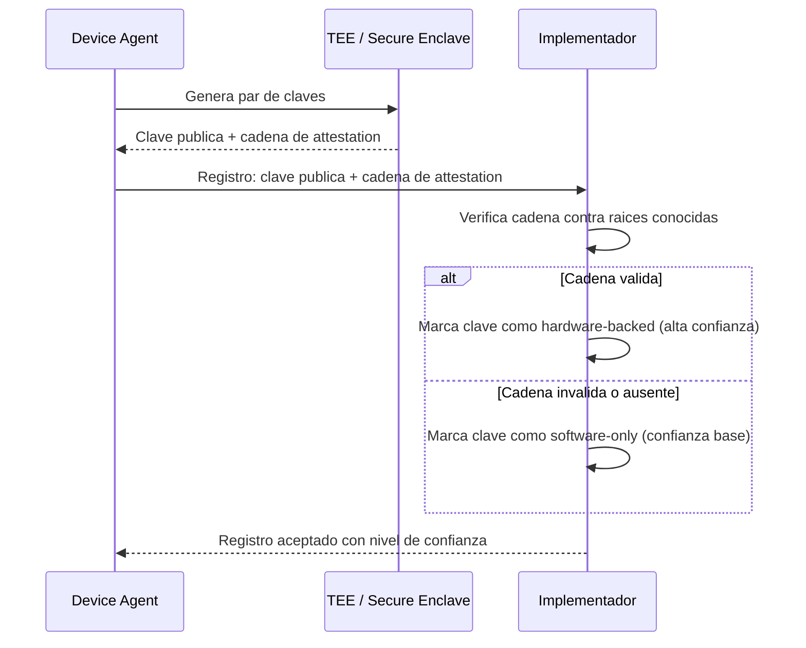
```mermaid
sequenceDiagram
    participant DA as Device Agent
    participant TEE as TEE / Secure Enclave
    participant IM as Implementador

    DA->>TEE: Genera par de claves
    TEE-->>DA: Clave publica + cadena de attestation
    DA->>IM: Registro: clave publica + cadena de attestation
    IM->>IM: Verifica cadena contra raices conocidas
    alt Cadena valida
        IM->>IM: Marca clave como hardware-backed (alta confianza)
    else Cadena invalida o ausente
        IM->>IM: Marca clave como software-only (confianza base)
    end
    IM-->>DA: Registro aceptado con nivel de confianza
```

1. El DA genera un par de claves dentro del TEE.
2. El TEE produce una cadena de certificados de attestation cuya raíz es la CA del fabricante del hardware.
3. El DA presenta la cadena al IM junto con la petición de registro.
4. El IM verifica la cadena contra las raíces de attestation conocidas.
5. Si la cadena es válida: la clave se marca como hardware-backed (alta confianza). Si no: la clave se acepta como software-only (confianza base).

**Mecanismos de key attestation por plataforma:**

| Plataforma | Mecanismo | Cadena de confianza |
|------------|-----------|-------------------|
| Android (API 24+) | Key Attestation (`android.security.keystore`) | Google Hardware Attestation Root |
| iOS / macOS | App Attest (`DCAppAttestService`) | Apple Attestation CA |
| Windows | TPM 2.0 Key Attestation | CA del fabricante del TPM |

**Restricciones de privacidad de la cadena de attestation:**

| Dato | El IM puede inspeccionar | El IM no debe usar |
|------|:-----------------------:|:-----------------:|
| Nivel de seguridad del hardware (TEE, StrongBox, software) | Sí | — |
| Propiedades de la clave (no exportable, uso restringido) | Sí | — |
| Modelo del dispositivo | — | No (fingerprinting) |
| Identificador del dispositivo | — | No (vinculación) |
| Versión del SO | — | No (fingerprinting) |

La cadena de attestation no revela la identidad del usuario. El IM solo inspecciona el nivel de seguridad del hardware y las propiedades de la clave.

> [!IMPORTANT]
> La key attestation es una **señal de confianza, no una puerta de acceso**. Un IM que rechace categóricamente peticiones sin attestation está creando una barrera que viola el principio de Estándar Abierto. El IM debe aceptar claves software-only a nivel de confianza base.

#### 4.4.3 Señales de integridad del dispositivo

Además de key attestation, el DA puede verificar localmente la integridad de su entorno de ejecución:

- **Detección de root/jailbreak:** El DA puede negarse a operar si detecta que el dispositivo está comprometido. La detección de root es una carrera armamentística entre detectores y evasores, por lo que no puede considerarse una garantía absoluta.
- **APIs de integridad del dispositivo** (Play Integrity en Android, App Attest en iOS): el DA puede utilizarlas como autocomprobación local. El resultado de estas comprobaciones no se transmite al IM ni al VG.

**Tres decisiones de diseño resuelven la tensión con la descentralización:**

1. **Key attestation opera a nivel DA-IM** (relación bilateral). No introduce ninguna autoridad central nueva: cada IM decide independientemente qué raíces de attestation acepta.
2. **Las señales de integridad del dispositivo son autocomprobación local del DA.** No se transmiten a terceros.
3. **No hay puerta de attestation.** La attestation modula el nivel de confianza, no el acceso al protocolo.

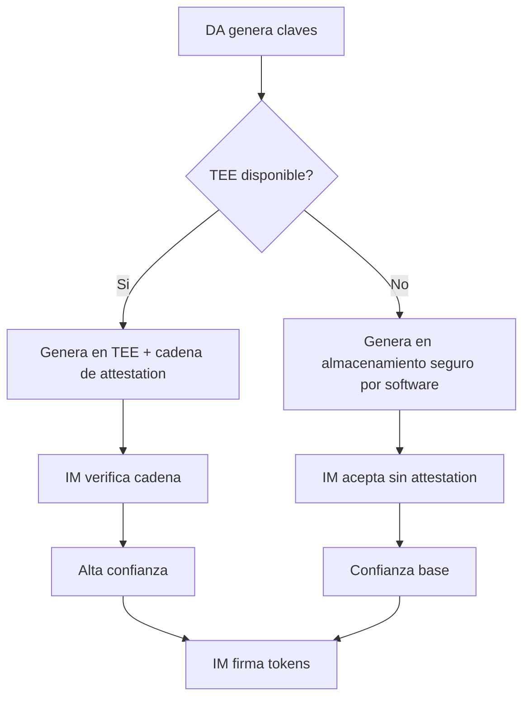
```mermaid
graph TD
    A[DA genera claves] --> B{TEE disponible?}
    B -->|Si| C[Genera en TEE + cadena de attestation]
    B -->|No| D[Genera en almacenamiento seguro por software]
    C --> E[IM verifica cadena]
    D --> F[IM acepta sin attestation]
    E --> G[Alta confianza]
    F --> H[Confianza base]
    G --> I[IM firma tokens]
    H --> I
```

#### 4.4.4 Rotación de claves del DA

Las claves del DA tienen una vida limitada. La rotación periódica fuerza re-attestation y acota la ventana de explotación ante un compromiso.

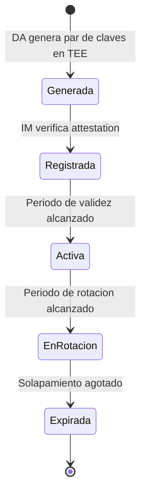
```mermaid
stateDiagram-v2
    [*] --> Generada : DA genera par de claves en TEE
    Generada --> Registrada : IM verifica attestation
    Registrada --> Activa : Periodo de validez alcanzado
    Activa --> EnRotacion : Periodo de rotacion alcanzado
    EnRotacion --> Expirada : Solapamiento agotado
    Expirada --> [*]
```

| Parámetro | Valor recomendado | Justificación |
|-----------|-------------------|---------------|
| Periodo de rotación | 7 días | Limita la ventana de explotación de claves comprometidas |
| Solapamiento mínimo | ≥ TTL máximo del token (4 horas) | Tokens firmados con la clave anterior siguen siendo verificables |
| Periodo máximo sin rotación | 30 días | Fuerza re-attestation incluso en dispositivos con uso intermitente |

Durante la rotación, el DA genera un nuevo par de claves, obtiene una nueva cadena de attestation y la registra con el IM. La clave anterior permanece válida durante el periodo de solapamiento para que los tokens ya emitidos no se invaliden prematuramente.

#### 4.4.5 Supuesto explícito: root/jailbreak

AAVP asume que el sistema operativo del dispositivo es íntegro. En un dispositivo con privilegios de root o jailbreak, todas las garantías del DA son anulables: un atacante puede interceptar las claves, modificar la franja de edad en memoria o inyectar tokens fabricados.

Key attestation (sección 4.4.2) y las señales de integridad del dispositivo (sección 4.4.3) ofrecen detección parcial. La rotación semanal de claves (sección 4.4.4) limita la ventana de explotación. Sin embargo, un dispositivo completamente comprometido puede evadir estas mitigaciones.

Esta es una **limitación reconocida del protocolo**, no un fallo. AAVP documenta explícitamente este supuesto (sección 1.3, S8) y ofrece las mitigaciones técnicas viables sin comprometer el principio de descentralización. Para un análisis completo del impacto, consultar [SECURITY-ANALYSIS.md](SECURITY-ANALYSIS.md) sección 1.2 (S8).

---

## 5. Modelo de Confianza Descentralizado

### 5.1 Confianza sin Autoridad Central

AAVP rechaza explícitamente el modelo de Autoridad de Certificación centralizada. La centralización de la certificación crea:

- **Incentivos perversos:** la entidad central adquiere poder de veto.
- **Objetivo prioritario:** de presión política y ataques.
- **Punto único de fallo:** cuya compromisión invalida todo el sistema.

AAVP adopta un **modelo de confianza distribuida**, inspirado en DMARC/DKIM para autenticación de correo electrónico.

**Modelo centralizado (rechazado):**

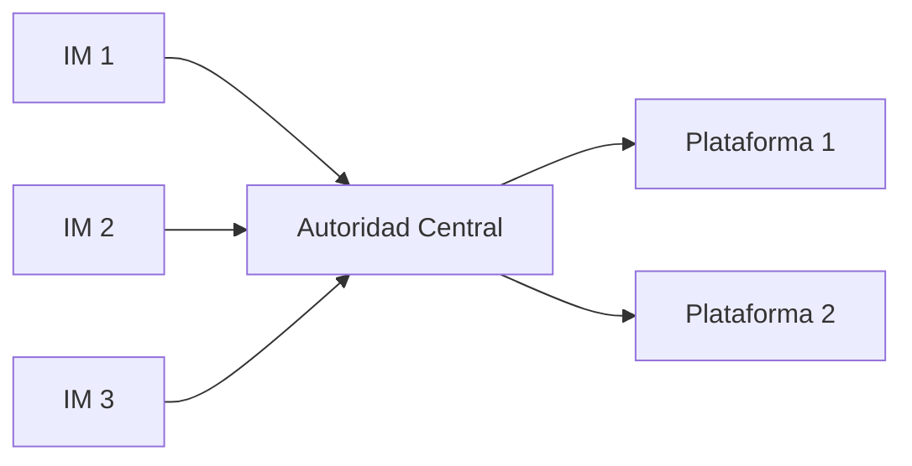
```mermaid
graph LR
    IM1[IM 1] --> CA[Autoridad Central]
    IM2[IM 2] --> CA
    IM3[IM 3] --> CA
    CA --> P1[Plataforma 1]
    CA --> P2[Plataforma 2]
```

**Modelo AAVP (adoptado) — cada plataforma decide en quién confiar:**

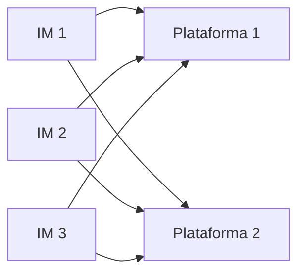
```mermaid
graph LR
    IM1[IM 1] --> P1[Plataforma 1]
    IM1 --> P2[Plataforma 2]
    IM2[IM 2] --> P1
    IM2 --> P2
    IM3[IM 3] --> P1
    IM3 --> P2
```

### 5.2 Mecanismos de Confianza

#### 5.2.1 Estándar abierto y verificable

Cualquier organización puede implementar AAVP. Sus tokens son verificables criptográficamente por cualquier plataforma que también implemente el estándar. No se necesita permiso de ningún tercero. La confianza proviene de la verificabilidad matemática, no de una autorización institucional.

#### 5.2.2 Código auditable

El estándar recomienda firmemente — y la regulación podría exigir — que las implementaciones del Device Agent sean de código abierto o, como mínimo, auditables por terceros independientes. Esto es análogo a los logs de Certificate Transparency: la comunidad puede verificar que el software cumple con la especificación.

#### 5.2.3 Publicación de claves del Implementador

Cada Implementador publica su material criptográfico en su propio dominio. No existe un registro centralizado: el IM es la fuente autoritativa de sus propias claves.

**Endpoint primario:** `https://[dominio-IM]/.well-known/aavp-issuer`

El endpoint se sirve sobre TLS 1.3, con integridad de certificados respaldada por Certificate Transparency (RFC 9162).

**Respuesta JSON** (`application/json`):

```json
{
  "issuer": "im-provider.example",
  "aavp_version": "0.6",
  "signing_endpoint": "https://im-provider.example/aavp/v1/sign",
  "keys": [
    {
      "token_key_id": "base64url(SHA-256 de la clave publica)",
      "token_type": 1,
      "public_key": "base64url(SPKI DER de la clave publica)",
      "not_before": "2026-01-15T00:00:00Z",
      "not_after": "2026-07-15T00:00:00Z"
    }
  ]
}
```

**Campos:**

| Campo | Tipo | Obligatorio | Descripción |
|-------|------|:-----------:|-------------|
| `issuer` | string (hostname) | Sí | FQDN del IM. Debe coincidir con el dominio que sirve el endpoint. |
| `aavp_version` | string | Sí | Versión del protocolo soportada. Formato `MAJOR.MINOR`. |
| `signing_endpoint` | string (URI) | Sí | URI HTTPS del servicio de firma parcialmente ciega. Mismo dominio o subdominio de `issuer`. |
| `keys` | array | Sí | Claves de firma activas (incluye claves en rotación). |
| `keys[].token_key_id` | string | Sí | SHA-256 de la clave pública, codificado en base64url sin padding (43 caracteres). Coincide con el campo `token_key_id` del token. |
| `keys[].token_type` | uint16 | Sí | Identificador del esquema criptográfico. Coincide con `token_type` del token (ver registro en sección 5.4). |
| `keys[].public_key` | string | Sí | Clave pública en formato SPKI DER (SubjectPublicKeyInfo, RFC 5280), codificada en base64url sin padding. |
| `keys[].not_before` | string (ISO 8601) | Sí | Inicio del periodo de validez. |
| `keys[].not_after` | string (ISO 8601) | Sí | Fin del periodo de validez. `not_after - not_before` ≤ 180 días. |

**Requisitos HTTP:**

- HTTPS obligatorio (TLS 1.3, CT verificable).
- `Cache-Control: public, max-age=86400` (24 horas, coherente con sección 5.2.5).
- `Access-Control-Allow-Origin: *` (para DAs basados en navegador).
- El cliente debe verificar que `issuer` coincide con el dominio del que se obtuvo el documento.

**DNS complementario:** Registro TXT `_aavp-keys.[dominio-IM]`:

```
v=aavp1; url=https://im.example/.well-known/aavp-issuer
```

**Ejemplo con rotación de claves** (dos claves con solapamiento de 30 días, como en sección 5.2.4):

```json
{
  "issuer": "im-provider.example",
  "aavp_version": "0.6",
  "signing_endpoint": "https://im-provider.example/aavp/v1/sign",
  "keys": [
    {
      "token_key_id": "OGQ0MTNhMjI4NjRkNzBiZjAyZDdiOTlhMTVjNGUz",
      "token_type": 1,
      "public_key": "MIIBIjANBgkqhkiG9w0BAQEFAAOCAQ8AMIIBCgKCAQEA...",
      "not_before": "2026-01-01T00:00:00Z",
      "not_after": "2026-06-30T00:00:00Z"
    },
    {
      "token_key_id": "YjVmNzgyZTMxMjk4YTBkZjc0NWUxMjQzZGFkNTY3",
      "token_type": 1,
      "public_key": "MIIBIjANBgkqhkiG9w0BAQEFAAOCAQ8AMIIBCgKCAQEB...",
      "not_before": "2026-06-01T00:00:00Z",
      "not_after": "2026-11-30T00:00:00Z"
    }
  ]
}
```

El `token_key_id` ya presente en cada token permite al VG identificar qué clave usar para verificar la firma sin probar todas las claves conocidas.

> [!IMPORTANT]
> Este endpoint **no es una autoridad de aprobación**. Cualquier organización puede publicar claves en su dominio. La confianza no proviene de estar publicado, sino de la decisión independiente de cada VG de aceptar a ese Implementador.

#### 5.2.4 Ciclo de vida de las claves del Implementador

Las claves de firma del IM tienen una vida limitada. Esto reduce la ventana de exposición si una clave es comprometida y elimina la necesidad de un mecanismo de revocación centralizado.

- **Vida máxima recomendada:** 6 meses (180 días). Las implementaciones no deben aceptar claves con un periodo de validez superior.
- **Rotación:** Cuando el IM genera una nueva clave, publica ambas (antigua y nueva) simultáneamente. El periodo de solapamiento debe ser al menos igual al TTL máximo de los tokens (4 horas), para que los tokens firmados con la clave anterior sigan siendo verificables hasta su expiración. Se recomienda un solapamiento de al menos 24 horas para dar margen a los VGs a refrescar su caché.
- **Expiración natural:** Una clave que supera su fecha de expiración deja de ser válida para la verificación de firmas. Los VGs rechazan tokens cuyo `token_key_id` corresponda a una clave expirada.
- **Sin revocación centralizada:** No existe un mecanismo central para revocar una clave de IM. Si un IM detecta que su clave ha sido comprometida, retira la clave de su endpoint. La revocación efectiva es bilateral: cada VG gestiona su propio trust store y puede retirar a un IM en cualquier momento.

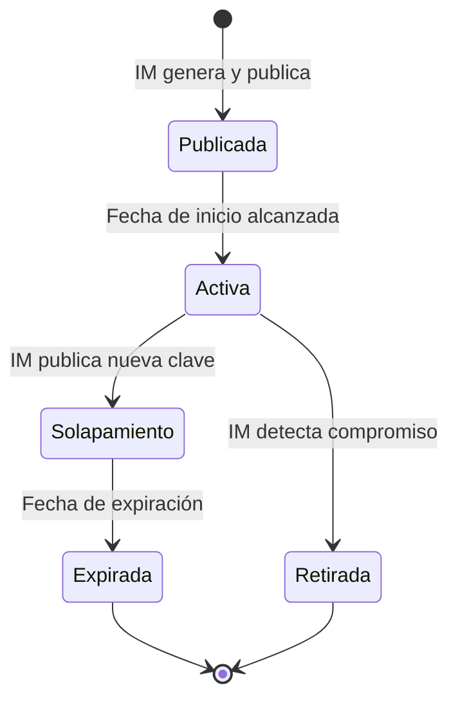
```mermaid
stateDiagram-v2
    [*] --> Publicada : IM genera y publica
    Publicada --> Activa : Fecha de inicio alcanzada
    Activa --> Solapamiento : IM publica nueva clave
    Solapamiento --> Expirada : Fecha de expiración
    Activa --> Retirada : IM detecta compromiso
    Expirada --> [*]
    Retirada --> [*]
```

#### 5.2.5 Gestión de confianza por el Verification Gate

Cada VG mantiene un **trust store local**: una lista de Implementadores aceptados junto con sus claves públicas. La decisión de confiar en un IM es independiente para cada VG, sin mediación de ninguna autoridad central.

- **Obtención de claves:** El VG obtiene las claves públicas directamente del dominio del IM, sobre TLS 1.3. El VG verifica la cadena de certificados TLS y la presencia en logs de Certificate Transparency antes de aceptar el material criptográfico.
- **Caché y refresco:** El VG cachea las claves de los IMs aceptados. El refresco debe ser periódico (recomendado: al menos cada 24 horas) para detectar rotaciones de clave y posibles retiros.
- **Revocación de confianza:** El VG puede retirar a un IM de su trust store en cualquier momento, sin coordinación con otros VGs. Esto es análogo a cómo un navegador puede dejar de confiar en una Autoridad de Certificación unilateralmente.
- **Descubrimiento de nuevos IMs:** Los VGs no confían automáticamente en IMs desconocidos. La incorporación de un nuevo IM al trust store es una decisión deliberada que sigue el proceso reputacional descrito en la sección 5.2.6.

#### 5.2.6 Confianza por reputación

Las plataformas deciden individualmente en qué Implementadores confían, del mismo modo que los navegadores deciden en qué CAs confían para TLS. No hay una decisión centralizada, sino múltiples decisiones independientes que tienden a converger.

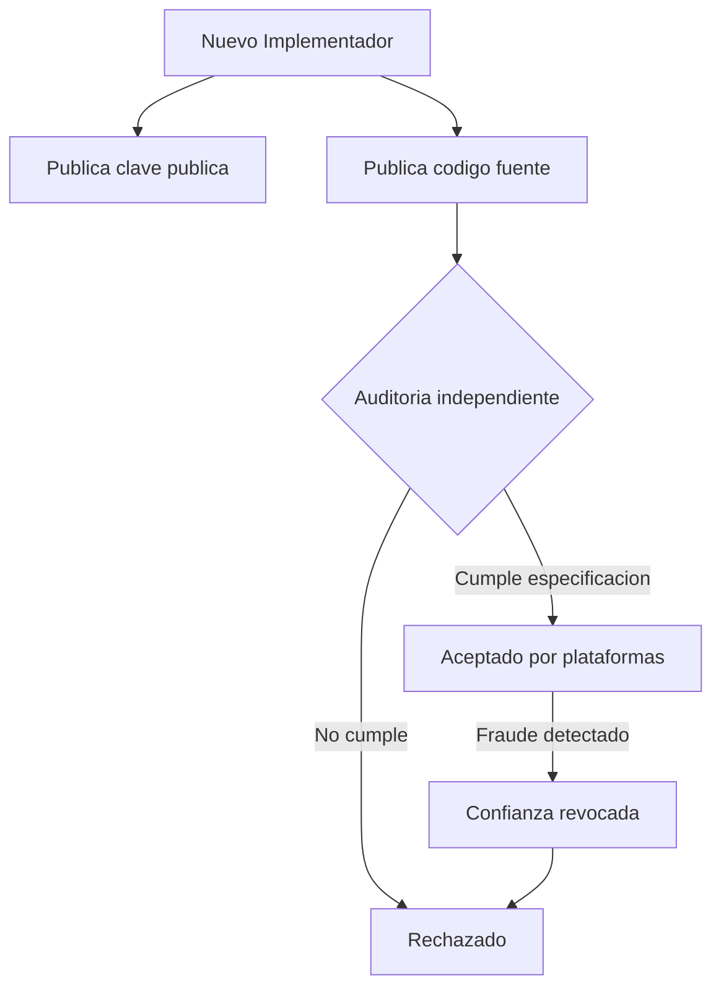
```mermaid
flowchart TD
    A[Nuevo Implementador] --> B[Publica clave publica]
    A --> C[Publica codigo fuente]
    C --> D{Auditoria independiente}
    D -->|Cumple especificacion| E[Aceptado por plataformas]
    D -->|No cumple| F[Rechazado]
    E -->|Fraude detectado| G[Confianza revocada]
    G --> F
```

### 5.3 Descubrimiento del Servicio

Las plataformas que soportan AAVP lo anuncian mediante un endpoint de descubrimiento. El Device Agent consulta este endpoint para determinar si la plataforma acepta tokens AAVP, qué Implementadores reconoce, y a qué URL enviar el handshake.

#### 5.3.1 Endpoint de descubrimiento del VG

**URI:** `https://[dominio-plataforma]/.well-known/aavp`

**Respuesta JSON** (`application/json`):

| Campo | Tipo | Obligatorio | Descripción |
|-------|------|:-----------:|-------------|
| `aavp_version` | string | Sí | Versión del protocolo soportada. Formato `MAJOR.MINOR`. |
| `vg_endpoint` | string (URI) | Sí | URI HTTPS del endpoint de handshake donde el DA presenta tokens. Mismo dominio o subdominio del host `.well-known`. |
| `accepted_ims` | array de objetos | Sí | Implementadores aceptados por este VG. |
| `accepted_ims[].domain` | string (hostname) | Sí | FQDN del IM. El DA usa este dominio para localizar `.well-known/aavp-issuer`. |
| `accepted_ims[].token_key_ids` | array de strings | No | `token_key_id` actualmente aceptados (base64url). Si se omite, se aceptan todas las claves activas del IM. |
| `accepted_token_types` | array de uint16 | Sí | Valores de `token_type` aceptados (ver registro en sección 5.4). |
| `age_policy` | string (URI) | No | URI del documento de Segmentation Policy Declaration (SPD). Si se omite, la plataforma no publica política de segmentación verificable. Ver sección 8. |

**Ejemplo:**

```json
{
  "aavp_version": "0.6",
  "vg_endpoint": "https://platform.example/aavp/verify",
  "accepted_ims": [
    {
      "domain": "qustodio.com",
      "token_key_ids": ["OGQ0MTNhMjI4NjRkNzBiZjAyZDdiOTlhMTVjNGUz"]
    },
    {
      "domain": "familylink.google.com"
    }
  ],
  "accepted_token_types": [1],
  "age_policy": "https://platform.example/.well-known/aavp-age-policy.json"
}
```

**Requisitos HTTP:**

- HTTPS obligatorio.
- `Cache-Control: public, max-age=3600` (1 hora).
- `Access-Control-Allow-Origin: *`.
- El DA valida que `vg_endpoint` está en el mismo dominio o subdominio del host `.well-known`.

**Códigos de respuesta:**

| Código | Significado | Comportamiento del DA |
|--------|-------------|----------------------|
| 200 | AAVP soportado | Parsear y proceder |
| 404 | Sin soporte AAVP | Fallback a DNS; si DNS también falla, sin soporte |
| 429 | Limitación de tasa | Reintentar con *backoff* exponencial |
| 5xx | Error de servidor | Reintentar una vez; usar caché si disponible; fallback a DNS |

#### 5.3.2 DNS como mecanismo complementario

Registro TXT `_aavp.[dominio-plataforma]`:

```
v=aavp1; e=https://platform.example/aavp/verify; im=im1.example,im2.example
```

| Clave | Obligatorio | Descripción |
|-------|:-----------:|-------------|
| `v` | Sí | Tag de versión. Valor fijo `aavp1`. |
| `e` | Sí | URI del endpoint de handshake (equivale a `vg_endpoint`). |
| `im` | No | Lista de dominios de IMs aceptados, separados por comas. |

El DNS es informativo: si el DA puede alcanzar `.well-known/aavp`, el documento JSON prevalece.

#### 5.3.3 Prioridad de descubrimiento

El DA sigue esta cadena de prioridad para detectar soporte AAVP:

1. **Caché local** de plataformas conocidas (si la entrada no ha expirado).
2. **`.well-known/aavp`** sobre HTTPS (mecanismo primario).
3. **DNS `_aavp` TXT** como fallback.

Si ningún mecanismo responde, el DA concluye que la plataforma no soporta AAVP. Un resultado negativo se cachea durante 1 hora.

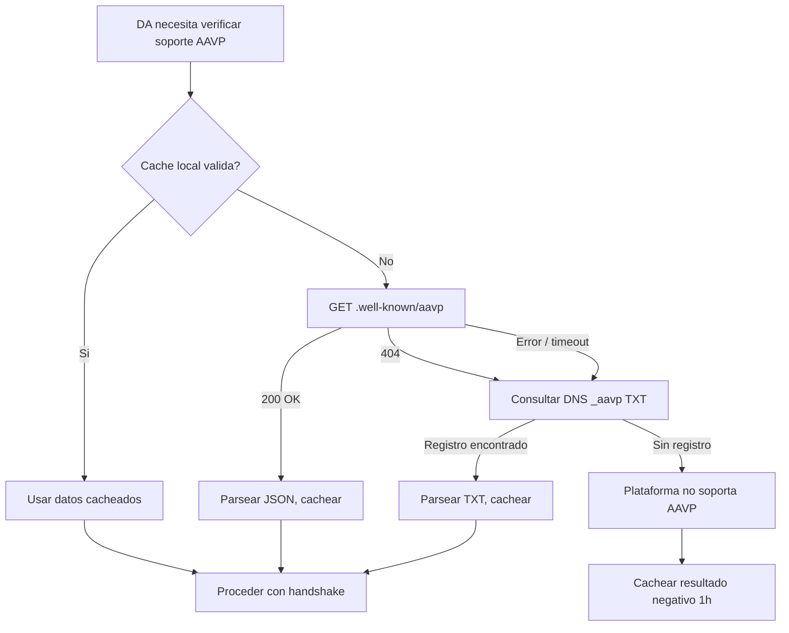
```mermaid
flowchart TD
    A[DA necesita verificar soporte AAVP] --> B{Cache local valida?}
    B -->|Si| C[Usar datos cacheados]
    B -->|No| D[GET .well-known/aavp]
    D -->|200 OK| E[Parsear JSON, cachear]
    D -->|404| F[Consultar DNS _aavp TXT]
    D -->|Error / timeout| F
    F -->|Registro encontrado| G[Parsear TXT, cachear]
    F -->|Sin registro| H[Plataforma no soporta AAVP]
    H --> I[Cachear resultado negativo 1h]
    E --> J[Proceder con handshake]
    G --> J
    C --> J
```

#### 5.3.4 Flujo de conexión entre endpoints

1. El DA obtiene `.well-known/aavp` de la plataforma.
2. Lee `accepted_ims` y verifica si su IM está en la lista.
3. Si `token_key_ids` está presente, verifica si tiene un token pre-firmado con una clave aceptada.
4. Si necesita un token nuevo, consulta `.well-known/aavp-issuer` del IM para obtener las claves activas.
5. Solicita firma parcialmente ciega al `signing_endpoint` del IM.
6. Presenta el token al `vg_endpoint` de la plataforma.

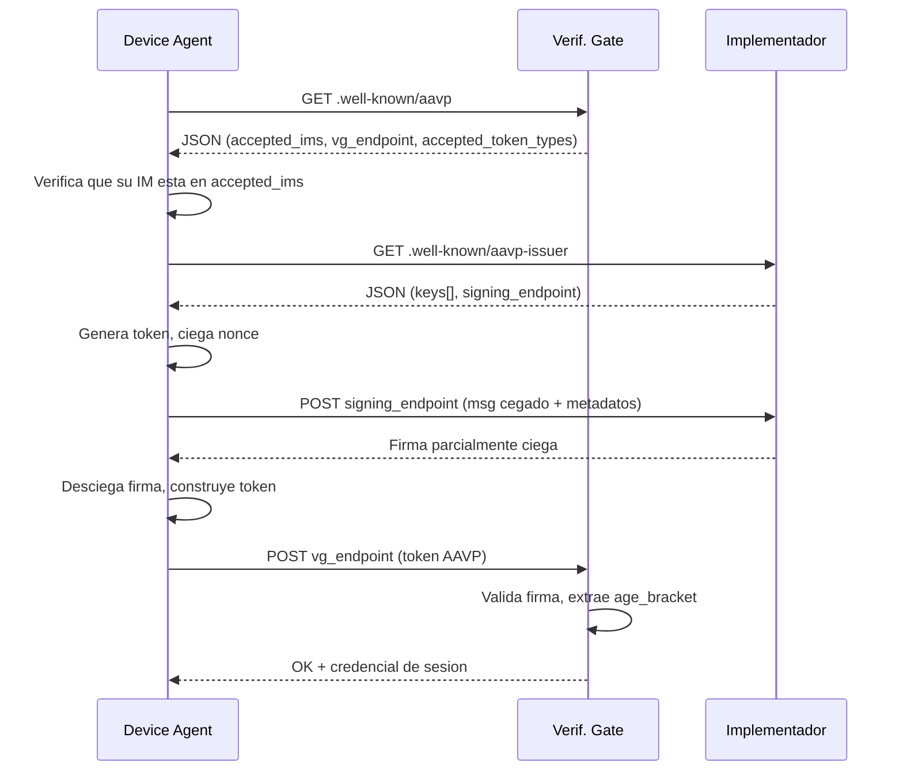
```mermaid
sequenceDiagram
    participant DA as Device Agent
    participant VG as Verif. Gate
    participant IM as Implementador

    DA->>VG: GET .well-known/aavp
    VG-->>DA: JSON (accepted_ims, vg_endpoint, accepted_token_types)

    DA->>DA: Verifica que su IM esta en accepted_ims

    DA->>IM: GET .well-known/aavp-issuer
    IM-->>DA: JSON (keys[], signing_endpoint)

    DA->>DA: Genera token, ciega nonce
    DA->>IM: POST signing_endpoint (msg cegado + metadatos)
    IM-->>DA: Firma parcialmente ciega

    DA->>DA: Desciega firma, construye token
    DA->>VG: POST vg_endpoint (token AAVP)
    VG->>VG: Valida firma, extrae age_bracket
    VG-->>DA: OK + credencial de sesion
```

### 5.4 Registro de valores de `token_type`

El campo `token_type` del token y los campos `accepted_token_types` y `keys[].token_type` de los endpoints de descubrimiento comparten el mismo espacio de valores.

| Valor | Esquema | Referencia | Estado |
|-------|---------|------------|--------|
| 0 | Reservado | — | — |
| 1 | RSAPBSSA-SHA384 | RFC 9474, draft-irtf-cfrg-partially-blind-rsa | Activo |
| 2-65535 | Sin asignar | — | Reservado para futuros esquemas |

### 5.5 Analogía con DMARC/DKIM

| Aspecto | DMARC/DKIM | AAVP |
|---------|-----------|------|
| Autoridad central | No existe | No existe |
| Quién puede emitir | Cualquier servidor de correo | Cualquier Implementador |
| Quién decide confiar | Cada receptor (Gmail, Outlook...) | Cada plataforma digital |
| Base de la confianza | Cumplimiento del estándar + historial | Cumplimiento del estándar + auditoría |
| Consecuencia del fraude | Correos rechazados / spam | Tokens rechazados por plataformas |

---

## 6. Flujo Operativo Detallado

### 6.1 Configuración Inicial (una sola vez)

Este paso lo realizan los padres o tutores. Es el único momento que requiere intervención humana consciente.

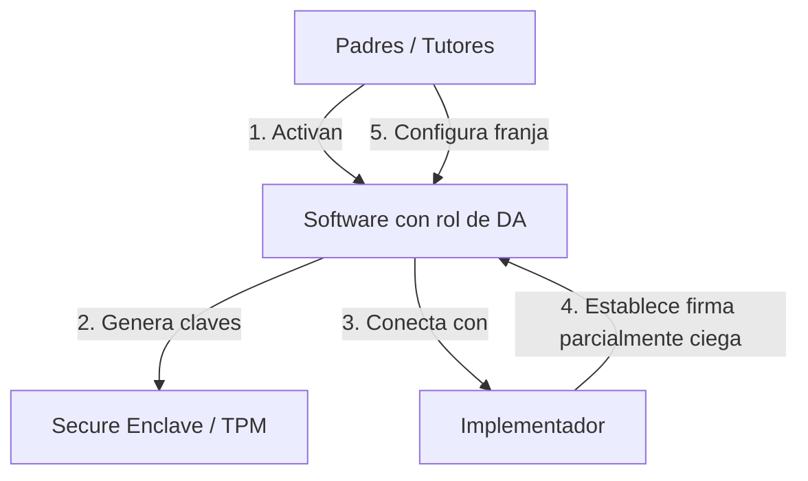
```mermaid
flowchart TD
    A[Padres / Tutores] -->|1. Activan| B[Software con rol de DA]
    B -->|2. Genera claves| C[Secure Enclave / TPM]
    B -->|3. Conecta con| D[Implementador]
    D -->|4. Establece firma parcialmente ciega| B
    A -->|5. Configura franja| B
```

1. Los padres activan la funcionalidad AAVP en el dispositivo del menor. El vehículo puede ser un sistema de control parental, una configuración nativa del SO, u otro software conforme.
2. El software que actúa como Device Agent genera un par de claves locales en el almacenamiento seguro del dispositivo (Secure Enclave en iOS, StrongBox/TEE en Android, TPM en Windows/Linux).
3. El DA establece una conexión única con el servicio de firma del Implementador para obtener la capacidad de firma parcialmente ciega.
4. Se configura la franja de edad correspondiente al menor.

### 6.2 Acceso a una Plataforma (cada sesión)

Este proceso es **completamente transparente** para el usuario:

1. El usuario abre la aplicación o accede al sitio web.
2. El Device Agent detecta que la plataforma soporta AAVP siguiendo la cadena de descubrimiento definida en la sección 5.3.3: caché local, `.well-known/aavp` sobre HTTPS, y DNS `_aavp` TXT como fallback.
3. El DA genera un token efímero, ciega el `nonce`, envía el mensaje cegado junto con los metadatos públicos (`age_bracket`, `expires_at`) al Implementador para firma parcialmente ciega, desciega la firma y presenta el token al Verification Gate.
4. El VG valida la firma contra las claves públicas de los Implementadores aceptados, verifica el TTL y extrae la franja de edad.
5. La plataforma establece una sesión conforme al modelo de credencial de sesión descrito en la sección 7.
6. El contenido se filtra según la política de la plataforma para esa franja.
7. Al caducar el token, el DA genera uno nuevo y el VG renueva la sesión. El proceso es transparente.

### 6.3 Desactivación

Si el software que actúa como Device Agent se desactiva durante una sesión activa, deja de emitir tokens. En la siguiente revalidación, la sesión no puede renovarse y transiciona a un estado "no verificado".

La política de qué hacer con sesiones donde el DA desaparece es decisión de cada plataforma. Sin embargo, el protocolo establece directrices en la sección 7.7: si la plataforma ha registrado previamente una franja menor para esa cuenta, las restricciones deben mantenerse hasta que se presente una credencial `OVER_18` válida.

---

## 7. Credencial de Sesión del Verification Gate

Una vez que el VG valida un token AAVP, necesita un mecanismo para mantener
la señal de franja de edad durante la sesión del usuario sin retener el token
original ni almacenar estado en el servidor. Esta sección define el modelo
recomendado: una credencial de sesión autocontenida, efímera y no vinculable.

### 7.1 Principios de diseño

| Principio AAVP | Aplicación a la sesión |
|-----------------|----------------------|
| **Privacidad por Diseño** | La credencial contiene exclusivamente `age_bracket`. El token AAVP completo se descarta tras la validación. |
| **Descentralización** | Cada VG genera y valida sus propias credenciales de sesión. No existe un servicio centralizado de sesiones. |
| **Estándar Abierto** | El modelo es parte de la especificación abierta. Cada plataforma elige su formato concreto. |
| **Minimalismo de Datos** | Solo tres campos: `age_bracket`, `session_expires_at` y firma del VG. Ningún dato adicional. |

### 7.2 Descarte obligatorio del token

Tras validar un token AAVP, el VG:

1. **Extrae** exclusivamente `age_bracket` del token.
2. **Descarta** el token completo. El VG no debe almacenar, registrar en logs ni retransmitir ningún campo del token AAVP tras la validación. Esto incluye `nonce`, `authenticator`, `token_key_id` y `expires_at`.
3. **No debe** generar ni almacenar derivados del token (hashes, resúmenes) que puedan actuar como pseudoidentificadores.

> [!IMPORTANT]
> El descarte del token es la propiedad de privacidad más importante de la gestión de sesiones. Un VG que almacene tokens completos está creando inadvertidamente un repositorio de pseudoidentificadores que, en caso de brecha de seguridad, podría comprometer la privacidad de los usuarios.

### 7.3 Estructura de la credencial de sesión

El VG emite una **credencial de sesión autocontenida** (*self-contained session credential*) que contiene únicamente:

| Campo | Tipo | Propósito |
|-------|------|-----------|
| `age_bracket` | Enumeración (`UNDER_13`, `AGE_13_15`, `AGE_16_17`, `OVER_18`) | Franja de edad extraída del token validado |
| `session_expires_at` | Timestamp | Momento de expiración de la credencial de sesión |
| `vg_signature` | Firma del VG | Garantiza integridad y autenticidad de la credencial |

La credencial es **autocontenida**: incluye toda la información necesaria para su validación. El VG no necesita mantener estado en servidor (*session store*). La verificación se realiza comprobando `vg_signature` y que `session_expires_at` no ha pasado.

> [!NOTE]
> El formato concreto de la credencial (estructura binaria, algoritmo de firma, mecanismo de transporte al cliente) es decisión de implementación de cada plataforma. La especificación define los campos obligatorios y las propiedades que la credencial debe cumplir, no el formato exacto. Esto es coherente con la separación entre el protocolo AAVP (interoperable entre DA, IM y VG) y la gestión de sesiones interna (específica de cada plataforma).

### 7.4 Tiempo de vida y renovación

El TTL de la credencial de sesión debe ser **estrictamente menor o igual** al TTL del token AAVP que la originó.

| Propiedad | Valor recomendado | Justificación |
|-----------|-------------------|---------------|
| TTL de la credencial | 15-30 minutos | Limita la ventana de explotación ante *session hijacking* |
| Relación con TTL del token | `session_expires_at` ≤ `expires_at` del token | La sesión no debe sobrevivir al token que la generó |
| Frecuencia de renovación | Al expirar la credencial | El DA presenta un nuevo token AAVP |

La renovación de la credencial implica un ciclo completo:

1. La credencial de sesión caduca.
2. El DA genera un **nuevo** token AAVP, criptográficamente independiente del anterior.
3. El DA presenta el nuevo token al VG.
4. El VG valida el nuevo token, descarta el token y emite una **nueva** credencial de sesión.
5. La nueva credencial no es vinculable con la anterior.

Este modelo garantiza que cada renovación produce una sesión criptográficamente independiente: el VG no puede correlacionar dos credenciales consecutivas del mismo usuario.

### 7.5 Ciclo de vida

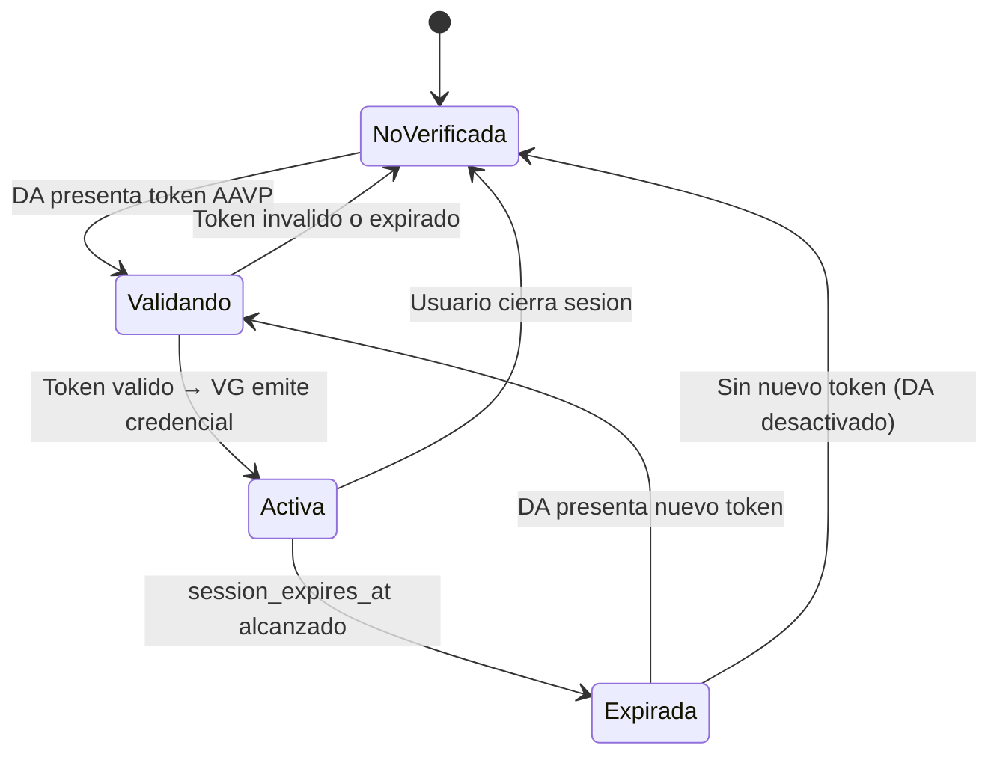
```mermaid
stateDiagram-v2
    [*] --> NoVerificada
    NoVerificada --> Validando : DA presenta token AAVP
    Validando --> Activa : Token valido → VG emite credencial
    Validando --> NoVerificada : Token invalido o expirado
    Activa --> Expirada : session_expires_at alcanzado
    Expirada --> Validando : DA presenta nuevo token
    Expirada --> NoVerificada : Sin nuevo token (DA desactivado)
    Activa --> NoVerificada : Usuario cierra sesion
```

El flujo de renovación sincronizada con el DA:

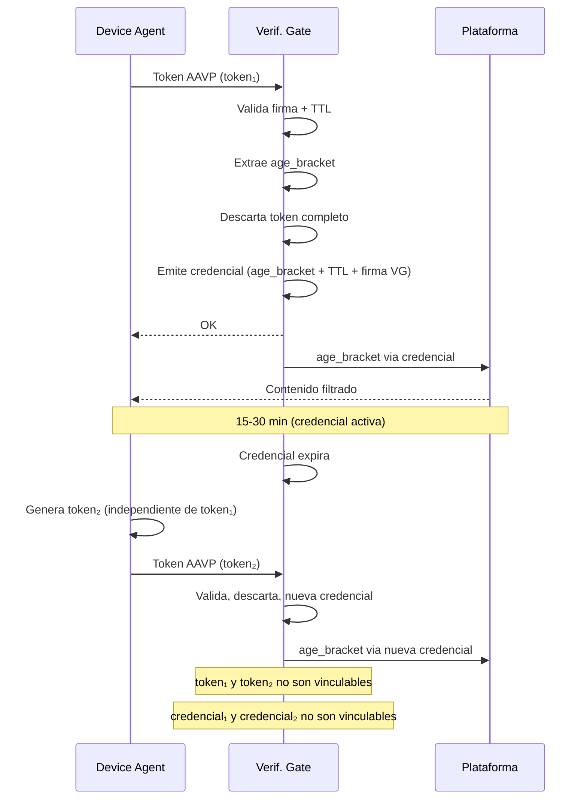
```mermaid
sequenceDiagram
    participant DA as Device Agent
    participant VG as Verif. Gate
    participant APP as Plataforma

    DA->>VG: Token AAVP (token₁)
    VG->>VG: Valida firma + TTL
    VG->>VG: Extrae age_bracket
    VG->>VG: Descarta token completo
    VG->>VG: Emite credencial (age_bracket + TTL + firma VG)
    VG-->>DA: OK
    VG->>APP: age_bracket via credencial
    APP-->>DA: Contenido filtrado

    Note over DA,APP: 15-30 min (credencial activa)

    VG->>VG: Credencial expira
    DA->>DA: Genera token₂ (independiente de token₁)
    DA->>VG: Token AAVP (token₂)
    VG->>VG: Valida, descarta, nueva credencial
    VG->>APP: age_bracket via nueva credencial

    Note over VG: token₁ y token₂ no son vinculables
    Note over VG: credencial₁ y credencial₂ no son vinculables
```

### 7.6 Propiedades de seguridad

La credencial de sesión cumple las siguientes propiedades:

- **Autocontenida.** No requiere estado en servidor. Validable con la clave de verificación del VG. Compatible con arquitecturas CDN/edge donde la validación puede ocurrir en el borde de la red.
- **Efímera.** TTL corto (15-30 minutos) que limita la ventana de explotación ante robo de credencial (*session hijacking*).
- **No vinculable.** Dos credenciales consecutivas del mismo usuario son independientes. Cada una proviene de un token AAVP diferente, y la credencial no contiene identificadores que permitan correlacionarlas.
- **Puramente aditiva.** AAVP solo restringe cuando hay una señal activa de franja menor. La ausencia de señal AAVP (usuario sin DA) no implica restricción alguna: la experiencia es idéntica a la que existiría sin AAVP. Las restricciones se aplican exclusivamente a cuentas que han recibido una franja menor.
- **Persistente a nivel de cuenta.** Cuando una plataforma recibe una franja menor para una cuenta, esa restricción debe persistir a nivel de cuenta. Retirar las restricciones requiere una credencial `OVER_18` válida; la mera ausencia de señal AAVP no es suficiente.
- **Minimalista.** Contiene exclusivamente `age_bracket`, `session_expires_at` y `vg_signature`. Cualquier dato adicional viola el principio de minimalismo de datos y no debe incluirse.

### 7.7 Modelo aditivo y persistencia a nivel de cuenta

AAVP es un protocolo **puramente aditivo**: solo añade restricciones cuando un DA envía activamente una señal de franja menor. Un usuario sin DA no se ve afectado en absoluto.

#### Principio fundamental

| Situación | Experiencia del usuario |
|-----------|------------------------|
| Sin DA (nunca hubo handshake AAVP) | Sin restricciones. Experiencia idéntica a la de una plataforma sin AAVP. |
| DA presente, franja menor | Restricciones según la franja recibida. |
| DA presente, franja `OVER_18` | Sin restricciones. Prueba criptográfica de edad disponible. |

#### Persistencia a nivel de cuenta

Cuando una plataforma recibe una señal de franja menor para una cuenta de usuario, debe **persistir esa señal como un flag interno** de la cuenta. Este flag sobrevive a la expiración de la credencial de sesión y a la desactivación del DA:

| Situación | Comportamiento recomendado |
|-----------|--------------------------|
| Cuenta marcada como menor, credencial de sesión activa | Restricciones según la franja de la credencial |
| Cuenta marcada como menor, credencial expirada sin renovación | Restricciones se mantienen (la cuenta sigue marcada) |
| Cuenta marcada como menor, DA desinstalado | Restricciones se mantienen (la cuenta sigue marcada) |
| Retirada de restricciones | Solo mediante credencial `OVER_18` válida |

> [!IMPORTANT]
> La persistencia a nivel de cuenta es la principal defensa contra la evasión por desactivación del DA. Si un menor desinstala el software que actúa como Device Agent, las plataformas donde su cuenta ya fue marcada como menor siguen aplicando restricciones. Para retirarlas, es necesario presentar una credencial `OVER_18` válida — que requiere un DA configurado con esa franja y la firma de un Implementador.

#### Señalización

La plataforma debe señalizar al usuario cuando las restricciones están activas y ofrecer un mecanismo para presentar una credencial `OVER_18` si el usuario considera que las restricciones no le corresponden.

### 7.8 Escenarios de borde

- **El usuario borra cookies durante una sesión activa.** La plataforma pierde la credencial de sesión, pero el flag de franja menor a nivel de cuenta persiste. En la siguiente interacción, si el DA está presente, se inicia un nuevo handshake AAVP. Si el DA no está presente, las restricciones de cuenta se mantienen.
- **Múltiples pestañas o ventanas.** Cada pestaña puede tener su propia credencial de sesión. El DA debe poder gestionar múltiples handshakes concurrentes sin reutilizar tokens.
- **Sesión expira sin que el DA esté disponible.** La credencial caduca naturalmente. Sin DA disponible para renovar, las restricciones de cuenta se mantienen según la sección 7.7.
- **Menor desinstala el DA y crea cuenta nueva en un dispositivo sin DA.** La cuenta nueva no tiene historial de señal AAVP. Sin DA en el dispositivo, no hay handshake y la plataforma no aplica restricciones. Este es el mismo vector que existe sin AAVP: un menor con acceso a un dispositivo no controlado. AAVP protege las puertas, no las ventanas.
- **El menor cumple 18 años.** Los padres actualizan la franja en el DA o lo retiran. El joven presenta una credencial `OVER_18` a las plataformas. Las restricciones de cuenta se retiran.

### 7.9 Compatibilidad con arquitecturas CDN y edge

La credencial autocontenida es compatible con arquitecturas donde la validación ocurre en nodos edge:

- El nodo edge puede validar `vg_signature` sin consultar al *origin server*.
- La clave de verificación del VG puede distribuirse a todos los nodos edge de la plataforma.
- El endpoint del handshake AAVP no debe cachearse: `Cache-Control: no-store`.
- Las respuestas de contenido segmentado deben incluir `Vary` con un identificador de franja para que el CDN distinga las variantes por `age_bracket`.

---

## 8. Segmentation Accountability Framework (SAF)

### 8.1 Motivación y alcance

AAVP entrega una señal de edad fiable (`age_bracket`) con garantías criptográficas. Pero la eficacia del sistema depende de que las plataformas utilicen esa señal para segmentar efectivamente el contenido. Sin un mecanismo de verificación, la señal de edad podría convertirse en un *rubber stamp* sin efecto real.

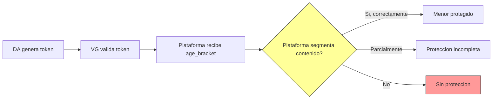
```mermaid
flowchart LR
    A[DA genera token] --> B[VG valida token]
    B --> C[Plataforma recibe age_bracket]
    C --> D{Plataforma segmenta contenido?}
    D -->|Si, correctamente| E[Menor protegido]
    D -->|Parcialmente| F[Proteccion incompleta]
    D -->|No| G[Sin proteccion]
    style D fill:#ff9,stroke:#333
    style G fill:#f99,stroke:#333
```

AAVP controla las fases A y B con garantías criptográficas. La fase C-D está fuera de su control directo. El Segmentation Accountability Framework (SAF) aborda esta brecha con un enfoque de **accountability** (detección), no de **enforcement** (imposición):

- **Qué puede hacer AAVP:** Definir infraestructura para que las plataformas declaren públicamente sus políticas de segmentación, registrarlas de forma transparente e inmutable, y permitir que cualquier parte verifique su cumplimiento.
- **Qué no puede hacer AAVP:** Forzar a una plataforma a segmentar correctamente. La imposición corresponde a los marcos regulatorios (DSA, AADC, OSA, COPPA).

El enfoque es análogo a **Certificate Transparency** (RFC 6962): CT no impide que una CA emita un certificado fraudulento, pero garantiza que cualquier emisión queda registrada y es detectable. Del mismo modo, SAF no impide que una plataforma ignore la señal de edad, pero garantiza que su política declarada es pública, auditable y verificable.

### 8.2 Segmentation Policy Declaration (SPD)

La Segmentation Policy Declaration es un documento JSON firmado que declara la política de segmentación de contenido de una plataforma por franja de edad. Es un compromiso público y máquina-legible.

#### 8.2.1 Endpoint

**URI:** `https://[dominio-plataforma]/.well-known/aavp-age-policy.json`

**Requisitos HTTP:**

- HTTPS obligatorio (TLS 1.3).
- `Cache-Control: public, max-age=86400` (24 horas).
- `Access-Control-Allow-Origin: *`.
- Content-Type: `application/json`.

**Códigos de respuesta:**

| Código | Significado | Comportamiento del DA |
|--------|-------------|----------------------|
| 200 | SPD disponible | Parsear, verificar firma y procesar |
| 404 | Sin SPD publicada | La plataforma no publica política de segmentación verificable |
| 429 | Limitación de tasa | Reintentar con *backoff* exponencial |
| 5xx | Error de servidor | Reintentar una vez; usar caché si disponible |

#### 8.2.2 Esquema JSON

| Campo | Tipo | Obligatorio | Descripción |
|-------|------|:-----------:|-------------|
| `spd_version` | string | Sí | Versión del esquema SPD. Valor actual: `"1.0"`. |
| `platform` | string (hostname) | Sí | FQDN de la plataforma. Debe coincidir con el dominio que sirve el endpoint. |
| `published` | string (ISO 8601) | Sí | Fecha de publicación de esta versión de la política. |
| `taxonomy_version` | string | Sí | Identificador de la taxonomía de contenido utilizada. Ver sección 8.2.3. |
| `segmentation` | objeto | Sí | Mapa de franjas de edad a reglas de segmentación. Cada clave es un código de franja (`UNDER_13`, `AGE_13_15`, `AGE_16_17`, `OVER_18`). |
| `segmentation[bracket].restricted` | array de strings | Sí | Categorías de contenido bloqueadas completamente para esta franja. |
| `segmentation[bracket].adapted` | array de strings | Sí | Categorías de contenido modificado o reducido para esta franja. |
| `segmentation[bracket].unrestricted` | array de strings | Sí | Categorías sin restricciones para esta franja. Valor `"*"` indica todas las categorías. |
| `policy_url` | string (URI) | Sí | URI de la política de segmentación legible para humanos. |
| `spts` | array de objetos | No | Signed Policy Timestamps obtenidos de logs de transparencia. Ver sección 8.3. |
| `signature` | string | Sí | Firma RSASSA-PKCS1-v1_5 con SHA-256 sobre el JSON canónico (sin el propio campo `signature`), codificada en base64url. La clave de firma es la misma clave del VG. |

**Ejemplo completo:**

```json
{
  "spd_version": "1.0",
  "platform": "example.com",
  "published": "2026-02-01T00:00:00Z",
  "taxonomy_version": "aavp-content-taxonomy-v1",
  "segmentation": {
    "UNDER_13": {
      "restricted": ["explicit-sexual", "violence-graphic", "gambling", "substances", "self-harm"],
      "adapted": ["profanity"],
      "unrestricted": []
    },
    "AGE_13_15": {
      "restricted": ["explicit-sexual", "violence-graphic", "gambling"],
      "adapted": ["substances", "self-harm", "profanity"],
      "unrestricted": []
    },
    "AGE_16_17": {
      "restricted": ["explicit-sexual"],
      "adapted": ["violence-graphic", "gambling"],
      "unrestricted": ["substances", "self-harm", "profanity"]
    },
    "OVER_18": {
      "unrestricted": ["*"]
    }
  },
  "policy_url": "https://example.com/age-policy",
  "spts": [
    {
      "log_id": "base64url(SHA-256 de la clave publica del log)",
      "timestamp": "2026-02-01T00:01:00Z",
      "signature": "base64url(...)"
    }
  ],
  "signature": "base64url(...)"
}
```

#### 8.2.3 Taxonomía de contenido

SAF define una taxonomía mínima de categorías de contenido. Las plataformas deben mapear su contenido a estas categorías como mínimo.

| Categoría | Código | Descripción |
|-----------|--------|-------------|
| Sexual explícito | `explicit-sexual` | Contenido con actividad sexual explícita |
| Violencia gráfica | `violence-graphic` | Representaciones gráficas de violencia o gore |
| Juego con dinero real | `gambling` | Juegos de azar con apuestas de dinero real |
| Sustancias | `substances` | Promoción o representación de alcohol, tabaco o drogas |
| Autolesiones | `self-harm` | Contenido que promueve autolesiones o suicidio |
| Lenguaje explícito | `profanity` | Lenguaje vulgar o profanidades intensas |

**Extensibilidad:** Las plataformas pueden añadir categorías adicionales con el prefijo `x-` (ej: `x-de-jugendschutz` para el JMStV alemán, `x-uk-vsc` para las categorías de la BBFC). Las categorías extendidas no afectan a la interoperabilidad: los verificadores que no las reconozcan las ignoran.

**Tres niveles de acción por categoría y franja:**

| Nivel | Significado |
|-------|-------------|
| `restricted` | Contenido bloqueado completamente para esta franja |
| `adapted` | Contenido modificado o reducido (ej: filtros, versiones editadas, avisos) |
| `unrestricted` | Sin restricciones para esta franja |

#### 8.2.4 Firma de la SPD

La SPD se firma con la clave del VG para garantizar su integridad y autenticidad.

- **Algoritmo:** RSASSA-PKCS1-v1_5 con SHA-256 sobre el JSON canónico.
- **JSON canónico:** El documento SPD completo sin el campo `signature`, serializado con claves ordenadas alfabéticamente, sin espacios ni saltos de línea (RFC 8785, JSON Canonicalization Scheme).
- **Campo `signature`:** Resultado de la firma codificado en base64url sin padding.
- **Verificación:** El DA o cualquier monitor puede verificar la firma utilizando la clave pública del VG obtenida de `.well-known/aavp` o del trust store del IM.

### 8.3 Policy Transparency Log (PTL)

#### 8.3.1 Arquitectura

El Policy Transparency Log es un registro append-only, inspirado en Certificate Transparency (RFC 6962), donde se registran las SPDs de las plataformas. Múltiples logs independientes operan en paralelo, garantizando la descentralización.

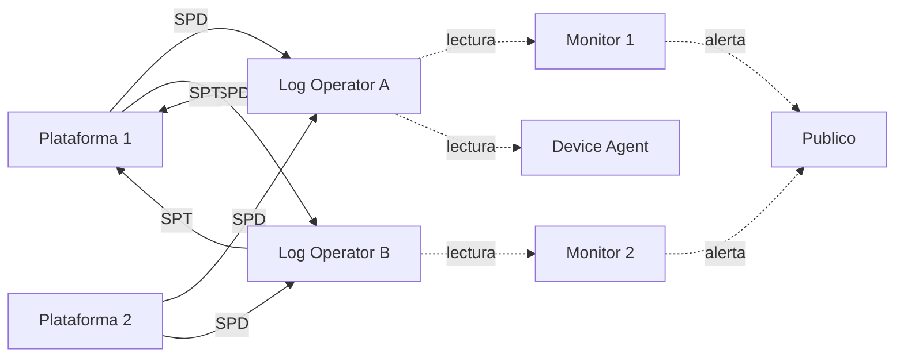
```mermaid
graph LR
    P1[Plataforma 1] -->|SPD| L1[Log Operator A]
    P1 -->|SPD| L2[Log Operator B]
    P2[Plataforma 2] -->|SPD| L1
    P2 -->|SPD| L2
    L1 -->|SPT| P1
    L2 -->|SPT| P1
    L1 -.->|lectura| M1[Monitor 1]
    L2 -.->|lectura| M2[Monitor 2]
    L1 -.->|lectura| DA[Device Agent]
    M1 -.->|alerta| PUB[Publico]
    M2 -.->|alerta| PUB
```

**Principios:**
- **Descentralización:** Cualquier organización puede operar un log. No existe un log oficial ni obligatorio.
- **Append-only:** Las entradas no se pueden modificar ni eliminar una vez registradas.
- **Verificabilidad:** Cualquier parte puede verificar la inclusión de una SPD en el log.

#### 8.3.2 Estructura del log

Cada log mantiene un **árbol Merkle append-only** donde cada hoja contiene:

- La SPD completa.
- Timestamp de registro en el log.
- Firma del operador del log sobre la entrada.

**Signed Policy Timestamp (SPT):**

Al registrar una SPD, el log emite un SPT como prueba criptográfica de registro:

| Campo | Tipo | Descripción |
|-------|------|-------------|
| `log_id` | string | SHA-256 de la clave pública del log, codificado en base64url. |
| `timestamp` | string (ISO 8601) | Momento en que el log registró la SPD. |
| `signature` | string | Firma del operador del log sobre la SPD + timestamp, codificada en base64url. |

La plataforma incluye los SPTs obtenidos en su SPD (campo `spts`), demostrando que la política ha sido registrada en logs de transparencia.

#### 8.3.3 Requisitos para operadores de log

| Requisito | Descripción |
|-----------|-------------|
| **Disponibilidad** | El log debe estar accesible públicamente sobre HTTPS. |
| **Retención** | Las entradas deben conservarse al menos 2 años. |
| **Auditoría** | El log debe exponer una API de consulta que permita verificar la inclusión de cualquier SPD (Merkle inclusion proof). |
| **Consistencia** | El log debe proporcionar pruebas de consistencia (Merkle consistency proof) para demostrar que no ha eliminado ni modificado entradas. |

#### 8.3.4 Rol de monitor

Los monitores son entidades independientes que observan los logs de transparencia para detectar anomalías:

- **Cambios de política:** Detectar cuándo una plataforma modifica su SPD (endurecimiento o relajación de restricciones).
- **Inconsistencias:** Detectar si una plataforma presenta SPDs diferentes a diferentes observadores (*split-view attack*).
- **Ausencia de registro:** Alertar cuando una plataforma declara una `age_policy` en `.well-known/aavp` pero no registra su SPD en ningún log.

Cualquier organización o individuo puede operar un monitor. No se requiere autorización ni registro.

### 8.4 Open Verification Protocol (OVP)

#### 8.4.1 Metodología

El Open Verification Protocol define una metodología estandarizada para verificar que una plataforma cumple con su SPD declarada:

1. El verificador obtiene la SPD de la plataforma desde `.well-known/aavp-age-policy.json`.
2. Accede a la plataforma con tokens AAVP válidos de cada franja de edad (`UNDER_13`, `AGE_13_15`, `AGE_16_17`, `OVER_18`).
3. Para cada franja, evalúa la accesibilidad de contenido de cada categoría de la taxonomía.
4. Compara los resultados observados contra la política declarada en la SPD.

#### 8.4.2 Métricas de cumplimiento

| Métrica | Descripción | Objetivo |
|---------|-------------|---------|
| **Ratio de consistencia** | % de categorías donde el comportamiento observado coincide con la SPD declarada | > 95% |
| **Delta entre franjas** | Diferencia de contenido restringido entre franjas adyacentes | > 0 (cada franja tiene menos restricciones que la anterior) |
| **Falsos negativos** | Contenido declarado como `restricted` que resulta accesible | < 1% |
| **Falsos positivos** | Contenido declarado como `unrestricted` que resulta bloqueado | < 5% |

#### 8.4.3 Verificadores

- **Descentralizado:** Cualquier organización o individuo puede ejecutar verificaciones OVP. No se requiere autorización.
- **Implementación de referencia:** Se publicará una herramienta open-source de verificación OVP como trabajo futuro (ver sección 10).
- **Limitaciones del crawling:** El contenido dinámico (feeds algorítmicos, recomendaciones personalizadas) y el contenido generado por usuarios (UGC) dificultan la verificación exhaustiva. OVP mide una instantánea representativa, no la totalidad del contenido.

### 8.5 Señal de cumplimiento

#### 8.5.1 Extensión del handshake

El VG puede incluir opcionalmente en su respuesta al handshake AAVP información sobre su política de segmentación:

- **Hash de la SPD:** SHA-256 del JSON canónico de la SPD actual, codificado en base64url.
- **SPTs:** Lista de Signed Policy Timestamps que prueban el registro en logs de transparencia.

```mermaid
sequenceDiagram
    participant DA as Device Agent
    participant VG as Verif. Gate

    DA->>VG: Token AAVP
    VG->>VG: Valida token, extrae age_bracket
    VG-->>DA: OK + credencial + spd_hash + spts

    DA->>DA: Obtiene SPD desde .well-known/aavp-age-policy.json
    DA->>DA: Verifica SHA-256(SPD) == spd_hash
    DA->>DA: Verifica SPTs contra claves de logs conocidos

    alt SPD verificada y registrada en logs
        DA->>DA: Politica verificada
    else SPD sin registro en logs
        DA->>DA: Politica sin log
    else Sin SPD
        DA->>DA: Sin politica
    end
```

#### 8.5.2 Indicadores para el usuario

El DA puede presentar al usuario un indicador de cumplimiento con tres estados:

| Estado | Significado | Condición |
|--------|-------------|-----------|
| **Política verificada** | La plataforma tiene una SPD firmada y registrada en al menos un log de transparencia | SPD válida + al menos 1 SPT verificable |
| **Política sin log** | La plataforma tiene una SPD firmada pero no registrada en logs de transparencia | SPD válida + 0 SPTs |
| **Sin política** | La plataforma no publica SPD | Campo `age_policy` ausente en `.well-known/aavp` o SPD no disponible |

El DA **no clasifica contenido** ni juzga la calidad de la política declarada. Solo informa al usuario sobre la transparencia de la plataforma respecto a su compromiso de segmentación.

### 8.6 Niveles de conformidad

SAF define tres niveles de conformidad para plataformas que implementan AAVP:

| Nivel | Nombre | Requisitos |
|-------|--------|-----------|
| **Nivel 1** | Básico | La plataforma implementa un VG conforme y acepta tokens AAVP válidos. |
| **Nivel 2** | Intermedio | Nivel 1 + la plataforma publica una SPD firmada en `.well-known/aavp-age-policy.json` con política de segmentación documentada. |
| **Nivel 3** | Avanzado | Nivel 2 + la SPD está registrada en al menos un PTL y la plataforma se somete a verificación OVP periódica (resultados públicos). |

**Sin autoridad central de certificación:** Los niveles de conformidad son verificables por cualquier parte utilizando los mecanismos definidos en este framework. No existe una entidad que "otorgue" la certificación. Una plataforma cumple un nivel si las condiciones son verificablemente ciertas.

### 8.7 Límites y riesgo residual

SAF define la infraestructura de accountability, pero no elimina todos los riesgos:

- **Contenido dinámico:** Los feeds algorítmicos y los sistemas de recomendación generan contenido personalizado difícil de auditar. Una plataforma puede cumplir su SPD para contenido estático pero no para recomendaciones dinámicas.
- **Contenido generado por usuarios (UGC):** Es imposible clasificar el 100% del UGC en tiempo real. Los sistemas de moderación tienen tasas de error inherentes.
- **Segmentación no es censura:** La segmentación adapta el contenido a la franja de edad, no lo elimina. Las plataformas deben permitir excepciones documentadas (ej: contenido educativo sobre salud sexual para `AGE_16_17`).
- **Declarar y no cumplir:** Una plataforma puede publicar una SPD restrictiva y no implementarla. Este riesgo es detectable vía OVP pero no prevenible por el protocolo.

> [!IMPORTANT]
> AAVP define la infraestructura de accountability. La imposición efectiva corresponde a los marcos regulatorios (DSA, AADC, OSA, COPPA).

---

## 9. Modelo de Amenazas

Todo protocolo de seguridad debe analizar honestamente sus vectores de ataque:

| Amenaza | Mitigación | Riesgo residual |
|---------|------------|-----------------|
| **Bypass por dispositivo sin DA** | Política de plataforma para sesiones sin token | Medio |
| **Implementador fraudulento** | Auditoría open source, reputación, exclusión por plataformas | Bajo |
| **Compromiso del dominio del IM** | Claves de vida limitada (≤ 6 meses), TLS 1.3 + CT para la obtención de claves, key pinning por VGs, revocación bilateral | Bajo |
| **MITM en handshake** | TLS 1.3, Certificate Transparency, ventana temporal mínima | Muy bajo |
| **Correlación de tokens** | Rotación, nonces, `expires_at` con precisión gruesa, firmas parcialmente ciegas, tamaño fijo (331 bytes) | Muy bajo |
| **Menor desactiva DA** | Protección a nivel de SO, PIN parental, políticas MDM. Persistencia a nivel de cuenta: las restricciones no se levantan al desinstalar el DA (sección 7.7) | Bajo |
| **Fabricación de tokens** | Firma criptográfica RSAPBSSA-SHA384 computacionalmente inviable de falsificar | Muy bajo |
| **Implementador colude con plataforma** | El IM conoce `age_bracket` (metadato público) pero no puede vincular el token con un DA concreto. El VG también conoce `age_bracket` (es la señal que recibe). El IM no gana información adicional útil para correlación. | Muy bajo |
| **Replay de tokens** | Nonce único + `expires_at` validado por el VG contra su propio reloj | Muy bajo |
| **Manipulación de reloj** | Tolerancia asimétrica de `expires_at`: 300s pasado, 60s futuro; rechazo de tokens con `expires_at` excesivamente futuro | Bajo |
| **Suplantación de `age_bracket`** | Con Partially Blind RSA, el IM puede verificar coherencia de `age_bracket` con la configuración del DA, actuando como segunda barrera de validación | Bajo |
| **Dispositivo rooteado** | Device attestation opcional (sección 4.4): key attestation detecta TEE emulado; rotación semanal fuerza re-attestation. Limitación reconocida (sección 1.3, S8) | Medio-Alto |

```mermaid
pie title Distribucion de riesgo residual
    "Muy bajo" : 5
    "Bajo" : 5
    "Medio" : 1
    "Medio-Alto" : 1
```

### Limitaciones reconocidas

- **Dispositivos no controlados:** Si un menor accede desde un dispositivo sin software que actúe como DA, AAVP no puede protegerle. El protocolo protege las puertas, no las ventanas.
- **Dispositivos comprometidos (root/jailbreak):** En un dispositivo con privilegios de root, las garantías del DA son anulables. La key attestation (sección 4.4) ofrece detección parcial. Ver sección 1.3, supuesto S8.
- **Calidad de la implementación:** Una implementación deficiente del DA o del VG puede anular las garantías teóricas del protocolo.
- **Complemento, no sustituto:** AAVP es una herramienta técnica que complementa la educación digital y la supervisión familiar.

---

## 10. Trabajo Futuro y Líneas Abiertas

- **Especificación formal:** Desarrollar una especificación técnica completa en formato RFC, incluyendo formatos de mensaje, procedimientos de prueba de conformidad y test vectors.
- **Implementación de referencia:** Crear bibliotecas open source en múltiples lenguajes para Device Agent y Verification Gate.
- **Análisis formal de seguridad:** Verificación formal de las propiedades de privacidad y seguridad mediante herramientas como ProVerif o Tamarin.
- **Pruebas de usabilidad:** Evaluar la experiencia de usuario completa, especialmente la transparencia de la revalidación y la configuración inicial.
- **Evaluación de rendimiento:** Medir el impacto en latencia del handshake y optimizar para conexiones móviles de baja calidad.
- **Extensibilidad del token:** Explorar señales adicionales (preferencias de privacidad parentales, por ejemplo) manteniendo las garantías de anonimato.
- **Gobernanza del estándar:** Definir un modelo de gobernanza comunitaria para la evolución del protocolo, potencialmente bajo el W3C o el IETF.
- **Migración post-cuántica:** El campo `token_type` permite adoptar esquemas de firma ciega post-cuánticos cuando estén estandarizados. Las firmas basadas en retículos (*lattice-based blind signatures*) son la línea de investigación más prometedora. Los estándares NIST PQC actuales (ML-KEM, ML-DSA, SLH-DSA) no cubren firmas ciegas.
- **Registro IANA:** Registrar los valores de `token_type` y la extensión `age_bracket` en los registros IANA correspondientes cuando se formalice el Internet-Draft.
- **Implementación de referencia del PTL:** Crear una implementación open-source de un operador de Policy Transparency Log conforme a la sección 8.3.
- **Herramientas OVP:** Publicar una herramienta open-source de verificación OVP (sección 8.4) que permita a cualquier parte auditar el cumplimiento de plataformas con sus SPDs.

---

## Glosario

| Término | Definición |
|---------|-----------|
| **`.well-known/aavp`** | Endpoint de descubrimiento que una plataforma expone para anunciar soporte AAVP. Contiene la URL del handshake, los Implementadores aceptados y los esquemas criptográficos soportados. Ver sección 5.3. |
| **`.well-known/aavp-issuer`** | Endpoint que cada Implementador expone para publicar sus claves de firma activas. Contiene la clave pública, el `token_key_id`, el periodo de validez y la URL del servicio de firma. Ver sección 5.2.3. |
| **AAVP** | Anonymous Age Verification Protocol. El protocolo propuesto en este documento. |
| **Blind Signature** | Técnica criptográfica donde un firmante puede firmar un mensaje sin conocer su contenido. |
| **Certificate Transparency (CT)** | Estándar abierto (RFC 9162) que exige a las Autoridades de Certificación registrar todos los certificados emitidos en logs públicos auditables. Reemplaza al *certificate pinning* (deprecado) como mecanismo principal de detección de certificados fraudulentos. |
| **Clock skew** | Diferencia de sincronización entre los relojes de dos sistemas. En AAVP, la tolerancia asimétrica (`CLOCK_SKEW_TOLERANCE_PAST = 300`, `CLOCK_SKEW_TOLERANCE_FUTURE = 60`) acomoda las divergencias entre el reloj del DA y el del VG. |
| **Credencial de sesión** | Estructura autocontenida emitida por el VG tras validar un token AAVP. Contiene exclusivamente `age_bracket`, `session_expires_at` y la firma del VG. No requiere estado en servidor. |
| **Device attestation** | Proceso por el cual un dispositivo demuestra la integridad de su entorno de ejecución a un tercero. Incluye key attestation y señales de integridad del dispositivo. En AAVP, es un mecanismo opcional que modula la confianza, no una puerta de acceso. Ver sección 4.4. |
| **Device Agent (DA)** | Rol del protocolo AAVP: componente de software en el dispositivo del menor que genera y gestiona los tokens de edad. No es sinónimo de "control parental"; puede ser implementado por distintos tipos de software. |
| **Fail-closed** | Política de seguridad donde la pérdida de señal de verificación mantiene las restricciones activas. En AAVP se aplica a nivel de cuenta: una cuenta marcada como menor conserva las restricciones aunque el DA deje de estar disponible. Solo una credencial `OVER_18` válida las retira. |
| **Fingerprinting** | Técnica de rastreo que identifica usuarios por características únicas de su dispositivo o comportamiento. |
| **Key attestation** | Mecanismo criptográfico mediante el cual el TEE del dispositivo genera una cadena de certificados que demuestra que un par de claves fue generado dentro de hardware seguro y es no exportable. Ver sección 4.4.2. |
| **Implementador (IM)** | Organización que desarrolla software conforme al estándar AAVP, actuando como proveedor de la funcionalidad de Device Agent. |
| **Metadato público** | Parte del token visible al IM durante la firma parcialmente ciega, vinculada criptográficamente via derivación de clave. En AAVP: `age_bracket` y `expires_at`. |
| **OVP** | Open Verification Protocol. Metodología abierta y estandarizada para verificar que una plataforma cumple con su SPD declarada. Cualquier parte puede ejecutar verificaciones OVP. Ver sección 8.4. |
| **Partially Blind Signature** | Esquema de firma donde el firmante ve una parte del mensaje (metadato público) pero no el resto. En AAVP, el IM ve `age_bracket` y `expires_at` pero no el `nonce`. |
| **PTL** | Policy Transparency Log. Registro append-only, inspirado en Certificate Transparency (RFC 6962), donde se registran las SPDs de las plataformas. Múltiples logs independientes operan en paralelo. Ver sección 8.3. |
| **RSAPBSSA** | RSA Partially Blind Signature Scheme with Appendix. Esquema concreto elegido por AAVP, basado en RFC 9474 y draft-irtf-cfrg-partially-blind-rsa. Utiliza SHA-384 como función hash. |
| **SAF** | Segmentation Accountability Framework. Marco de declaración, transparencia y verificación de políticas de segmentación por edad. Define SPD, PTL, OVP y señal de cumplimiento. Ver sección 8. |
| **SPD** | Segmentation Policy Declaration. Documento JSON firmado que declara la política de segmentación de contenido de una plataforma por franja de edad. Servido en `.well-known/aavp-age-policy.json`. Ver sección 8.2. |
| **SPT** | Signed Policy Timestamp. Prueba criptográfica emitida por un operador de log de transparencia que confirma el registro de una SPD en un momento determinado. Ver sección 8.3.2. |
| **Self-contained** | Propiedad de una credencial que contiene toda la información necesaria para su validación sin consultar un almacén de estado externo. |
| **TEE (Trusted Execution Environment)** | Entorno de ejecución aislado dentro del procesador que proporciona almacenamiento seguro de claves y ejecución de operaciones criptográficas. Implementaciones: Apple Secure Enclave, Android StrongBox, TPM 2.0. |
| **`token_key_id`** | SHA-256 de la clave pública del IM. Permite al VG identificar qué clave usar para verificar la firma sin probar todas las claves conocidas. |
| **`token_type`** | Campo del token que identifica el esquema criptográfico utilizado. Permite agilidad criptográfica y migración futura a esquemas post-cuánticos. |
| **Trust store** | Lista de Implementadores aceptados por un Verification Gate, junto con sus claves públicas. Cada VG mantiene su propio trust store de forma independiente. Análogo al trust store de certificados raíz de un navegador. |
| **TTL (Time To Live)** | Tiempo de vida máximo de un token antes de que expire y deba ser reemplazado. |
| **Unlinkability** | Propiedad criptográfica que impide correlacionar dos tokens como pertenecientes al mismo usuario o dispositivo. |
| **Verification Gate (VG)** | Endpoint dedicado de una plataforma que valida tokens AAVP y establece sesiones con franja de edad. |
| **ZKP** | Zero-Knowledge Proof. Prueba criptográfica que demuestra una afirmación sin revelar información adicional. |

---

<div align="center">

**AAVP** · Anonymous Age Verification Protocol · Especificación Técnica · v0.8.1

*Documento de trabajo — Sujeto a revisión*

</div>
