# AAVP — Especificación Técnica del Protocolo

> **v0.3.0 — Borrador Inicial — Febrero 2026**
>
> Este documento describe la arquitectura, los fundamentos criptográficos y el modelo de seguridad del Anonymous Age Verification Protocol. Para una introducción accesible, consultar [README.md](README.md).

---

## Índice

- [1. Arquitectura del Protocolo](#1-arquitectura-del-protocolo)
- [2. Estructura del Token AAVP](#2-estructura-del-token-aavp)
- [3. Rotación de Tokens](#3-rotación-de-tokens)
- [4. Fundamentos Criptográficos](#4-fundamentos-criptográficos)
- [5. Modelo de Confianza Descentralizado](#5-modelo-de-confianza-descentralizado)
- [6. Flujo Operativo Detallado](#6-flujo-operativo-detallado)
- [7. Modelo de Amenazas](#7-modelo-de-amenazas)
- [8. Trabajo Futuro y Líneas Abiertas](#8-trabajo-futuro-y-líneas-abiertas)
- [Glosario](#glosario)

---

## 1. Arquitectura del Protocolo

### 1.1 Roles del Protocolo

AAVP define tres roles con responsabilidades diferenciadas. El diseño garantiza que ninguno necesita confiar ciegamente en los otros: la verificabilidad criptográfica sustituye a la confianza institucional.

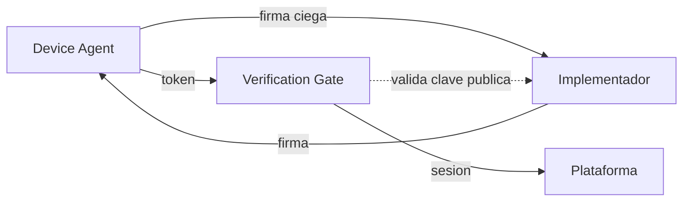

#### Device Agent (DA)

El Device Agent es un **rol abstracto del protocolo**: un componente de software que reside en el dispositivo del menor y es responsable de generar, custodiar y rotar los tokens de edad.

**Qué es:** Una pieza de software que implementa la especificación AAVP para la generación y gestión de tokens. Es el único componente del sistema que conoce la configuración real de franja de edad.

**Qué NO es:** El Device Agent no es sinónimo de "control parental". Es un rol del protocolo que puede ser implementado por distintos vehículos:

| Vehículo de implementación | Ejemplo |
|---------------------------|---------|
| Sistema de control parental | Qustodio, Bark, software de operador |
| Componente nativo del SO | Módulo integrado en iOS, Android, Windows |
| Extensión de navegador | Extensión conforme a la especificación |
| Firmware del dispositivo | Routers con control parental integrado |

La separación entre el rol (Device Agent) y su vehículo de implementación es deliberada: permite que el ecosistema evolucione sin modificar el protocolo. Hoy, el vehículo más probable es el software de control parental existente; mañana, podría ser un componente nativo del sistema operativo.

**Responsabilidades del DA:**
- Generar pares de claves locales en almacenamiento seguro (Secure Enclave, TPM, StrongBox).
- Generar tokens efímeros con la franja de edad configurada.
- Obtener firma ciega del Implementador sin revelar el contenido del token.
- Presentar tokens firmados al Verification Gate.
- Rotar tokens antes de su expiración.
- Proteger la configuración de franja mediante PIN parental o mecanismo equivalente a nivel de SO.

#### Verification Gate (VG)

Endpoint dedicado de la plataforma digital que actúa como puerta de entrada al servicio. Valida el token AAVP y establece una sesión interna con la marca de franja de edad.

**Responsabilidades del VG:**
- Exponer un endpoint estándar (`.well-known/aavp`) o registro DNS para anunciar soporte AAVP.
- Validar la firma criptográfica del token contra las claves públicas de Implementadores aceptados.
- Verificar el TTL del token.
- Extraer la franja de edad y establecer una sesión interna.
- Rechazar tokens expirados, malformados o firmados por Implementadores no confiables.

#### Implementador (IM)

Empresa u organización que desarrolla software que actúa como Device Agent, conforme al estándar AAVP.

**Responsabilidades del IM:**
- Publicar su clave pública en el registro de Implementadores.
- Mantener código auditable (preferentemente open source).
- Proveer servicio de firma ciega al Device Agent.
- Cumplir con la especificación abierta.

### 1.2 Modelo de Puerta de Entrada (Verification Gate)

Un enfoque ingenuo enviaría la credencial de edad en cada petición HTTP, exponiéndola continuamente a posibles interceptaciones. AAVP adopta un modelo diferente: la **puerta de entrada**.

El token de edad solo viaja una vez por sesión, durante un handshake inicial dedicado. Después, la plataforma trabaja con su propio sistema de sesiones.

> **Idea clave:** El token de edad nunca convive con el tráfico regular de la aplicación. Es un canal separado, un handshake puntual. Después, la información "este usuario es menor" es un flag interno de la plataforma, completamente desacoplado del token original.

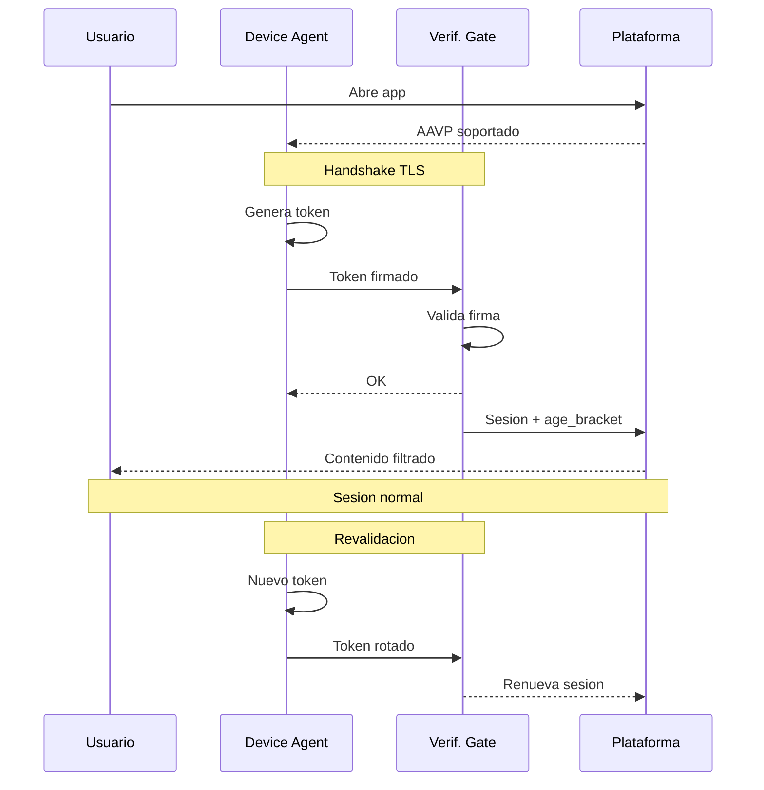

**Ventajas del modelo de puerta de entrada:**

- **Superficie de ataque reducida:** el token de edad solo viaja una vez por sesión, no en cada request.
- **Separación de contextos:** la información de edad nunca convive con el tráfico de datos de la aplicación.
- **Compatibilidad:** las plataformas ya gestionan sesiones; AAVP solo añade un paso previo.
- **Ventana temporal mínima para MITM:** interceptar el handshake inicial requiere comprometer TLS con certificate pinning en una ventana muy breve.

---

## 2. Estructura del Token AAVP

El token es una estructura criptográfica diseñada para ser mínima. Cada campo tiene una justificación específica:

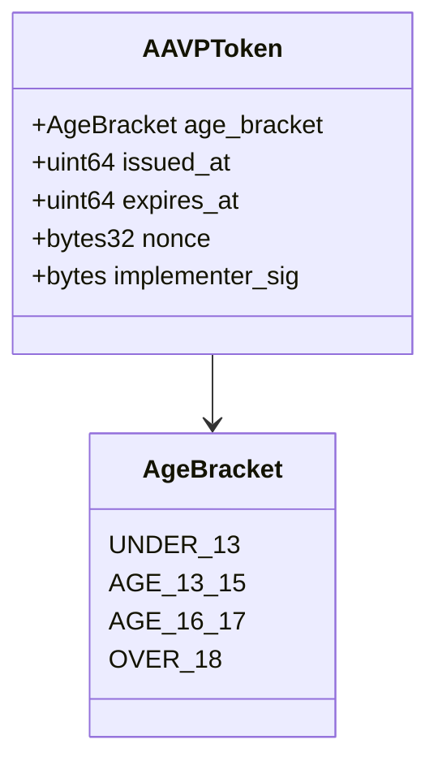

| Campo | Contenido | Propósito |
|-------|-----------|-----------|
| `age_bracket` | Enumeración: `UNDER_13`, `AGE_13_15`, `AGE_16_17`, `OVER_18` | Señal de franja de edad para filtrado de contenido. |
| `issued_at` | Timestamp Unix con ruido aleatorio | Verificar frescura sin revelar el momento exacto de emisión. |
| `expires_at` | Timestamp Unix | Ventana de validez. Fuerza la rotación. |
| `nonce` | Valor aleatorio criptográficamente seguro (32 bytes) | Previene reutilización y asegura unicidad de cada token. |
| `implementer_sig` | Firma ciega (blind signature) | Demuestra que el token proviene de un IM legítimo sin vincular al usuario. |

### Campos explícitamente excluidos

El token **no contiene** y **no puede contener**:

- Identidad del usuario
- Identificador del dispositivo
- Dirección IP
- Localización geográfica
- Versión del software
- Sistema operativo
- Ningún otro dato que permita correlación o rastreo

Cada dato adicional es un vector potencial de fingerprinting y debe justificarse rigurosamente antes de incluirse en futuras versiones del protocolo.

---

## 3. Rotación de Tokens

Incluso sin datos personales, un token estático podría convertirse en un pseudoidentificador persistente si se reutiliza. Por ello, AAVP implementa rotación obligatoria:

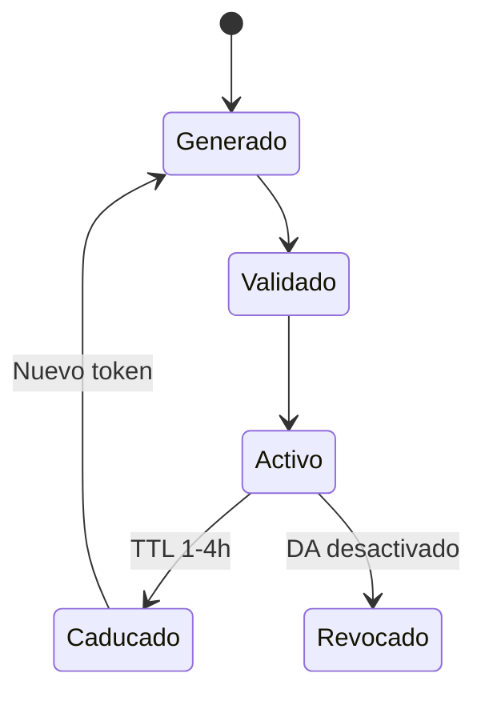

- **Tiempo de vida máximo (TTL):** Cada token tiene una validez configurable, recomendándose entre 1 y 4 horas.
- **Rotación proactiva:** El Device Agent puede generar un nuevo token antes de la expiración para mantener la continuidad de la sesión.
- **No vinculabilidad (*unlinkability*):** Dos tokens consecutivos del mismo dispositivo no son correlacionables entre sí. Cada token es criptográficamente independiente del anterior.

---

## 4. Fundamentos Criptográficos

### 4.1 Firmas Ciegas (Blind Signatures)

El mecanismo central de AAVP para desacoplar la identidad del usuario de la señal de edad es el uso de **firmas ciegas**, una técnica propuesta por David Chaum en 1983.

**Analogía:** Un sobre con papel carbón. El firmante estampa su firma sobre el sobre cerrado, y la firma se transfiere al documento interior sin que el firmante lo vea.

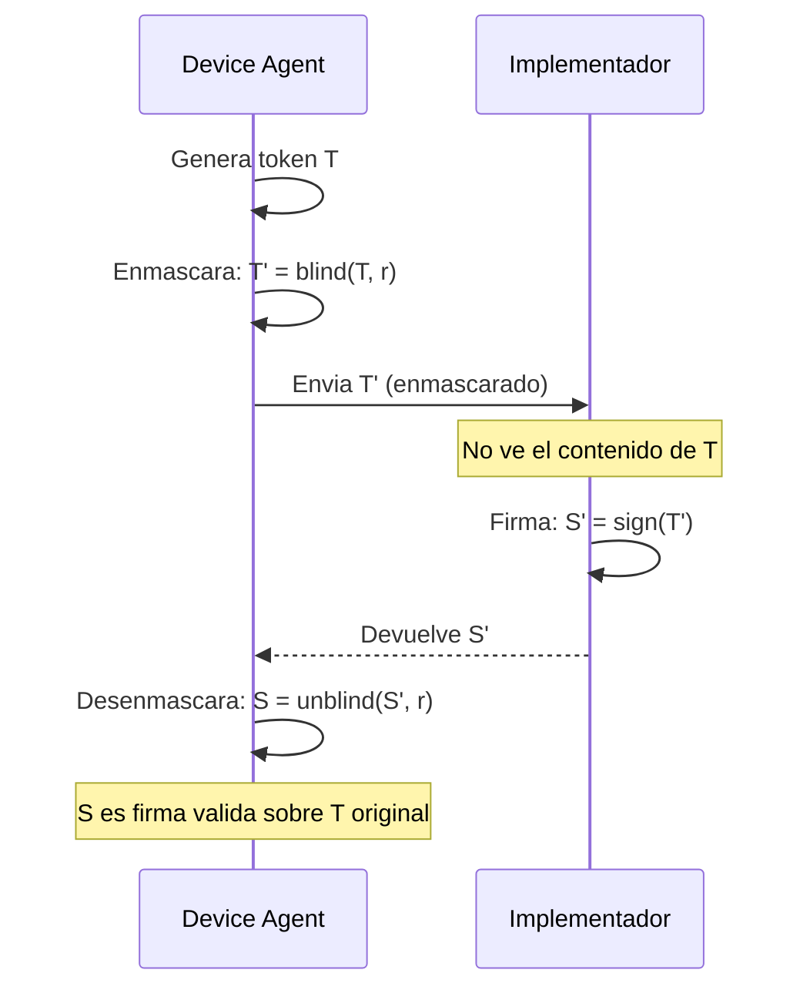

**Resultado:** El Implementador puede certificar que un token es legítimo (proviene de una instalación real que actúa como Device Agent) sin saber qué token ha firmado. **Ni siquiera el Implementador puede vincular un token con un usuario o dispositivo.**

**Esquemas candidatos:**
- RSA Blind Signatures (RFC 9474)
- Blind BLS Signatures
- Partially Blind Signatures (para vincular la firma a la franja sin revelar el nonce)

### 4.2 Pruebas de Conocimiento Cero (ZKP)

Como alternativa o complemento a las firmas ciegas, AAVP contempla el uso de **pruebas de conocimiento cero** (Zero-Knowledge Proofs).

Un ZKP permite demostrar una afirmación — "mi edad está dentro de la franja X" — sin revelar ningún dato adicional. Esto es especialmente útil en escenarios donde la verificación inicial de la edad se realiza contra un documento oficial: el ZKP demostraría que la fecha de nacimiento cumple el criterio de franja sin exponer la fecha, el nombre ni ningún otro campo del documento.

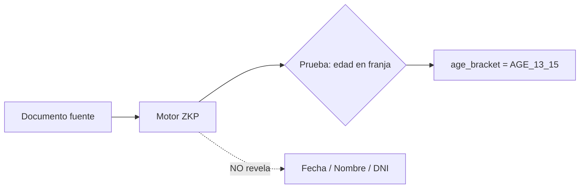

**Esquemas candidatos:**
- zk-SNARKs (Groth16, PLONK)
- zk-STARKs (sin trusted setup)
- Bulletproofs (para range proofs sobre edad)

### 4.3 Prevención de Fingerprinting

Cada campo del token está diseñado para minimizar la información que podría usarse para identificar o rastrear al usuario:

| Medida | Campo afectado | Propósito |
|--------|---------------|-----------|
| Ruido temporal (jitter) | `issued_at` | Evita correlación por momento de emisión |
| Nonce criptográfico | `nonce` | Generado sin derivación de identificadores del dispositivo |
| Ausencia de metadatos | (todo el token) | No se incluye versión de software, SO ni dato del entorno |
| Rotación frecuente | `expires_at` | Tokens de corta vida impiden seguimiento longitudinal |
| Tamaño fijo | (todo el token) | Todos los tokens tienen idéntico tamaño en bytes |

---

## 5. Modelo de Confianza Descentralizado

### 5.1 Confianza sin Autoridad Central

AAVP rechaza explícitamente el modelo de Autoridad de Certificación centralizada. La centralización de la certificación crea:

- **Incentivos perversos:** la entidad central adquiere poder de veto.
- **Objetivo prioritario:** de presión política y ataques.
- **Punto único de fallo:** cuya compromisión invalida todo el sistema.

AAVP adopta un **modelo de confianza distribuida**, inspirado en DMARC/DKIM para autenticación de correo electrónico.

**Modelo centralizado (rechazado):**

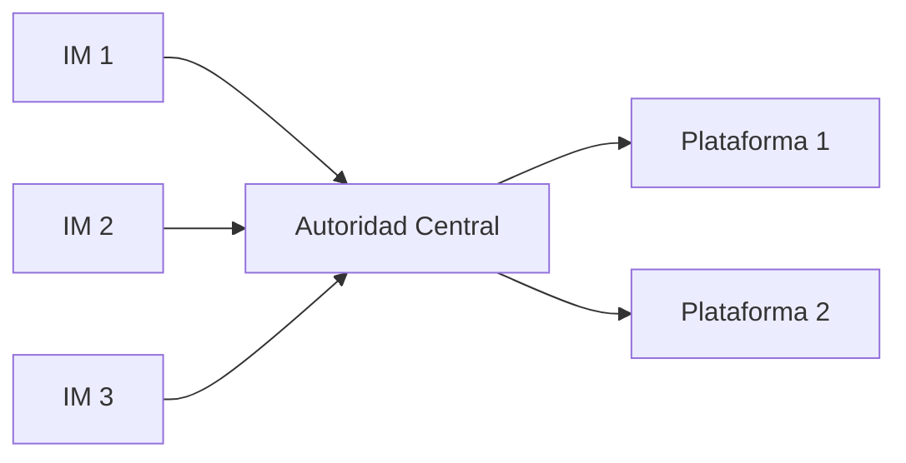

**Modelo AAVP (adoptado) — cada plataforma decide en quién confiar:**

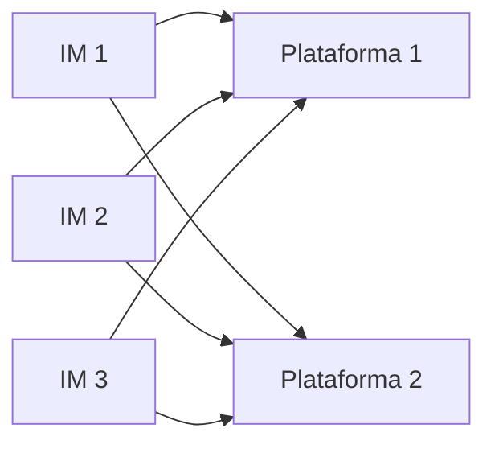

### 5.2 Mecanismos de Confianza

#### 5.2.1 Estándar abierto y verificable

Cualquier organización puede implementar AAVP. Sus tokens son verificables criptográficamente por cualquier plataforma que también implemente el estándar. No se necesita permiso de ningún tercero. La confianza proviene de la verificabilidad matemática, no de una autorización institucional.

#### 5.2.2 Código auditable

El estándar recomienda firmemente — y la regulación podría exigir — que las implementaciones del Device Agent sean de código abierto o, como mínimo, auditables por terceros independientes. Esto es análogo a los logs de Certificate Transparency: la comunidad puede verificar que el software cumple con la especificación.

#### 5.2.3 Registro público de Implementadores

Se propone un registro público descentralizado (potencialmente basado en un log transparente) donde los Implementadores publican sus claves públicas y declaran conformidad con el estándar.

> **Importante:** Esto **no es una autoridad de aprobación**. Es un directorio público auditable, abierto a cualquiera.

#### 5.2.4 Confianza por reputación

Las plataformas deciden individualmente en qué Implementadores confían, del mismo modo que los navegadores deciden en qué CAs confían para TLS. No hay una decisión centralizada, sino múltiples decisiones independientes que tienden a converger.

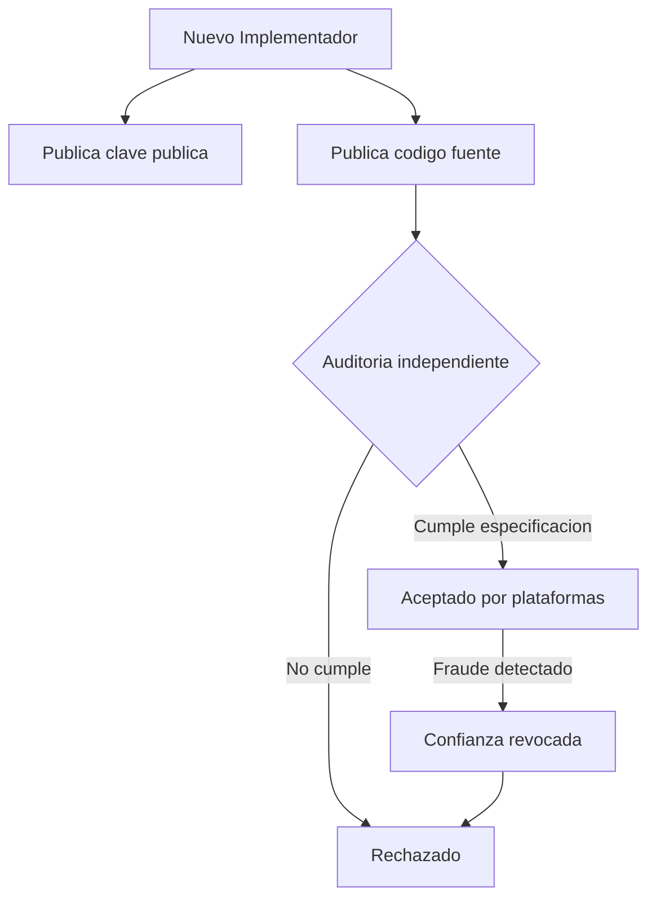

### 5.3 Analogía con DMARC/DKIM

| Aspecto | DMARC/DKIM | AAVP |
|---------|-----------|------|
| Autoridad central | No existe | No existe |
| Quién puede emitir | Cualquier servidor de correo | Cualquier Implementador |
| Quién decide confiar | Cada receptor (Gmail, Outlook...) | Cada plataforma digital |
| Base de la confianza | Cumplimiento del estándar + historial | Cumplimiento del estándar + auditoría |
| Consecuencia del fraude | Correos rechazados / spam | Tokens rechazados por plataformas |

---

## 6. Flujo Operativo Detallado

### 6.1 Configuración Inicial (una sola vez)

Este paso lo realizan los padres o tutores. Es el único momento que requiere intervención humana consciente.

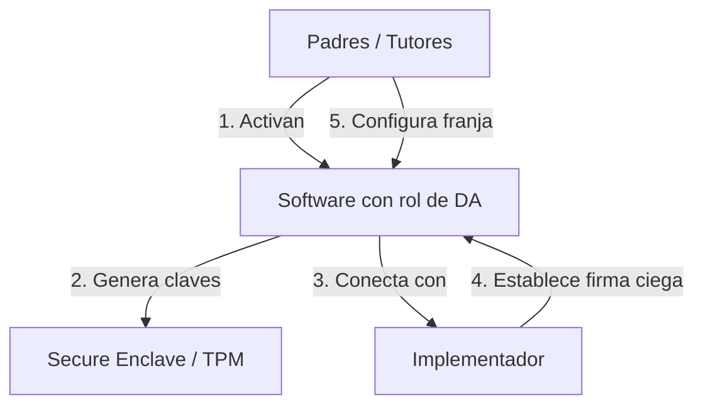

1. Los padres activan la funcionalidad AAVP en el dispositivo del menor. El vehículo puede ser un sistema de control parental, una configuración nativa del SO, u otro software conforme.
2. El software que actúa como Device Agent genera un par de claves locales en el almacenamiento seguro del dispositivo (Secure Enclave en iOS, StrongBox/TEE en Android, TPM en Windows/Linux).
3. El DA establece una conexión única con el servicio de firma del Implementador para obtener la capacidad de firma ciega.
4. Se configura la franja de edad correspondiente al menor.

### 6.2 Acceso a una Plataforma (cada sesión)

Este proceso es **completamente transparente** para el usuario:

1. El usuario abre la aplicación o accede al sitio web.
2. El Device Agent detecta que la plataforma soporta AAVP (vía registro DNS `_aavp` o endpoint `.well-known/aavp`).
3. El DA genera un token efímero, lo enmascara (blind), lo envía al Implementador para firma ciega, lo desenmascara y lo presenta al Verification Gate.
4. El VG valida la firma contra las claves públicas de los Implementadores aceptados, verifica el TTL y extrae la franja de edad.
5. La plataforma establece una sesión con un flag interno de franja de edad.
6. El contenido se filtra según la política de la plataforma para esa franja.
7. Al caducar el token, el DA genera uno nuevo y el VG renueva la sesión. El proceso es transparente.

### 6.3 Desactivación

Si el software que actúa como Device Agent se desactiva durante una sesión activa, deja de emitir tokens. En la siguiente revalidación, la sesión no puede renovarse y transiciona a un estado "no verificado".

La política de qué hacer con sesiones no verificadas es decisión exclusiva de cada plataforma. El protocolo es deliberadamente agnóstico en este punto.

---

## 7. Modelo de Amenazas

Todo protocolo de seguridad debe analizar honestamente sus vectores de ataque:

| Amenaza | Mitigación | Riesgo residual |
|---------|------------|-----------------|
| **Bypass por dispositivo sin DA** | Política de plataforma para sesiones sin token | Medio |
| **Implementador fraudulento** | Auditoría open source, reputación, exclusión por plataformas | Bajo |
| **MITM en handshake** | TLS con certificate pinning, ventana temporal mínima | Muy bajo |
| **Correlación de tokens** | Rotación, nonces, ruido temporal, firmas ciegas, tamaño fijo | Muy bajo |
| **Menor desactiva DA** | Protección a nivel de SO, PIN parental, políticas MDM | Medio |
| **Fabricación de tokens** | Firma criptográfica computacionalmente inviable de falsificar | Muy bajo |
| **Implementador colude con plataforma** | Firmas ciegas impiden al IM conocer el contenido del token | Muy bajo |
| **Replay de tokens** | Nonce único + TTL corto + validación de expiración por el VG | Muy bajo |

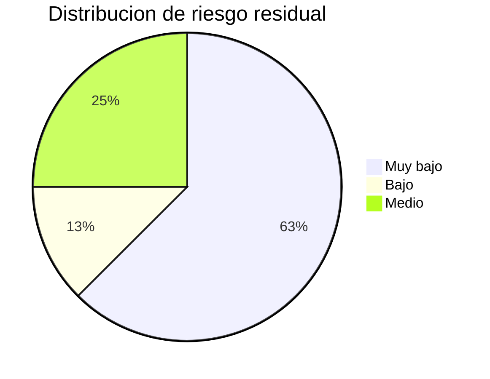

### Limitaciones reconocidas

- **Dispositivos no controlados:** Si un menor accede desde un dispositivo sin software que actúe como DA, AAVP no puede protegerle. El protocolo protege las puertas, no las ventanas.
- **Calidad de la implementación:** Una implementación deficiente del DA o del VG puede anular las garantías teóricas del protocolo.
- **Complemento, no sustituto:** AAVP es una herramienta técnica que complementa la educación digital y la supervisión familiar.

---

## 8. Trabajo Futuro y Líneas Abiertas

- **Especificación formal:** Desarrollar una especificación técnica completa en formato RFC, incluyendo formatos de mensaje, algoritmos específicos y procedimientos de prueba de conformidad.
- **Implementación de referencia:** Crear bibliotecas open source en múltiples lenguajes para Device Agent y Verification Gate.
- **Análisis formal de seguridad:** Verificación formal de las propiedades de privacidad y seguridad mediante herramientas como ProVerif o Tamarin.
- **Pruebas de usabilidad:** Evaluar la experiencia de usuario completa, especialmente la transparencia de la revalidación y la configuración inicial.
- **Evaluación de rendimiento:** Medir el impacto en latencia del handshake y optimizar para conexiones móviles de baja calidad.
- **Extensibilidad del token:** Explorar señales adicionales (preferencias de privacidad parentales, por ejemplo) manteniendo las garantías de anonimato.
- **Gobernanza del estándar:** Definir un modelo de gobernanza comunitaria para la evolución del protocolo, potencialmente bajo el W3C o el IETF.
- **Selección de esquemas criptográficos:** Evaluar formalmente los esquemas candidatos para firmas ciegas y ZKP, considerando rendimiento en dispositivos móviles, tamaño de prueba y madurez de las bibliotecas disponibles.

---

## Glosario

| Término | Definición |
|---------|-----------|
| **AAVP** | Anonymous Age Verification Protocol. El protocolo propuesto en este documento. |
| **Blind Signature** | Técnica criptográfica donde un firmante puede firmar un mensaje sin conocer su contenido. |
| **Certificate Pinning** | Técnica de seguridad que asocia un servicio con su certificado específico, previniendo ataques MITM. |
| **Device Agent (DA)** | Rol del protocolo AAVP: componente de software en el dispositivo del menor que genera y gestiona los tokens de edad. No es sinónimo de "control parental"; puede ser implementado por distintos tipos de software. |
| **Fingerprinting** | Técnica de rastreo que identifica usuarios por características únicas de su dispositivo o comportamiento. |
| **Implementador (IM)** | Organización que desarrolla software conforme al estándar AAVP, actuando como proveedor de la funcionalidad de Device Agent. |
| **TTL (Time To Live)** | Tiempo de vida máximo de un token antes de que expire y deba ser reemplazado. |
| **Unlinkability** | Propiedad criptográfica que impide correlacionar dos tokens como pertenecientes al mismo usuario o dispositivo. |
| **Verification Gate (VG)** | Endpoint dedicado de una plataforma que valida tokens AAVP y establece sesiones con franja de edad. |
| **ZKP** | Zero-Knowledge Proof. Prueba criptográfica que demuestra una afirmación sin revelar información adicional. |

---

**AAVP** · Anonymous Age Verification Protocol · Especificación Técnica · v0.2.0

*Documento de trabajo — Sujeto a revisión*

