# AAVP — Especificacion Tecnica del Protocolo

> **v0.2.0 — Borrador Inicial — Febrero 2026**
>
> Este documento describe la arquitectura, los fundamentos criptograficos y el modelo de seguridad del Anonymous Age Verification Protocol. Para una introduccion accesible, consultar [README.md](README.md).

---

## Indice

- [1. Arquitectura del Protocolo](#1-arquitectura-del-protocolo)
- [2. Estructura del Token AAVP](#2-estructura-del-token-aavp)
- [3. Rotacion de Tokens](#3-rotacion-de-tokens)
- [4. Fundamentos Criptograficos](#4-fundamentos-criptograficos)
- [5. Modelo de Confianza Descentralizado](#5-modelo-de-confianza-descentralizado)
- [6. Flujo Operativo Detallado](#6-flujo-operativo-detallado)
- [7. Modelo de Amenazas](#7-modelo-de-amenazas)
- [8. Trabajo Futuro y Lineas Abiertas](#8-trabajo-futuro-y-lineas-abiertas)
- [Glosario](#glosario)

---

## 1. Arquitectura del Protocolo

### 1.1 Roles del Protocolo

AAVP define tres roles con responsabilidades diferenciadas. El diseno garantiza que ninguno necesita confiar ciegamente en los otros: la verificabilidad criptografica sustituye a la confianza institucional.

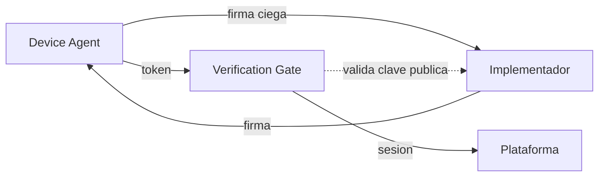

#### Device Agent (DA)

El Device Agent es un **rol abstracto del protocolo**: un componente de software que reside en el dispositivo del menor y es responsable de generar, custodiar y rotar los tokens de edad.

**Que es:** Una pieza de software que implementa la especificacion AAVP para la generacion y gestion de tokens. Es el unico componente del sistema que conoce la configuracion real de franja de edad.

**Que NO es:** El Device Agent no es sinonimo de "control parental". Es un rol del protocolo que puede ser implementado por distintos vehiculos:

| Vehiculo de implementacion | Ejemplo |
|---------------------------|---------|
| Sistema de control parental | Qustodio, Bark, software de operador |
| Componente nativo del SO | Modulo integrado en iOS, Android, Windows |
| Extension de navegador | Extension conforme a la especificacion |
| Firmware del dispositivo | Routers con control parental integrado |

La separacion entre el rol (Device Agent) y su vehiculo de implementacion es deliberada: permite que el ecosistema evolucione sin modificar el protocolo. Hoy, el vehiculo mas probable es el software de control parental existente; manana, podria ser un componente nativo del sistema operativo.

**Responsabilidades del DA:**
- Generar pares de claves locales en almacenamiento seguro (Secure Enclave, TPM, StrongBox).
- Generar tokens efimeros con la franja de edad configurada.
- Obtener firma ciega del Implementador sin revelar el contenido del token.
- Presentar tokens firmados al Verification Gate.
- Rotar tokens antes de su expiracion.
- Proteger la configuracion de franja mediante PIN parental o mecanismo equivalente a nivel de SO.

#### Verification Gate (VG)

Endpoint dedicado de la plataforma digital que actua como puerta de entrada al servicio. Valida el token AAVP y establece una sesion interna con la marca de franja de edad.

**Responsabilidades del VG:**
- Exponer un endpoint estandar (`.well-known/aavp`) o registro DNS para anunciar soporte AAVP.
- Validar la firma criptografica del token contra las claves publicas de Implementadores aceptados.
- Verificar el TTL del token.
- Extraer la franja de edad y establecer una sesion interna.
- Rechazar tokens expirados, malformados o firmados por Implementadores no confiables.

#### Implementador (IM)

Empresa u organizacion que desarrolla software que actua como Device Agent, conforme al estandar AAVP.

**Responsabilidades del IM:**
- Publicar su clave publica en el registro de Implementadores.
- Mantener codigo auditable (preferentemente open source).
- Proveer servicio de firma ciega al Device Agent.
- Cumplir con la especificacion abierta.

### 1.2 Modelo de Puerta de Entrada (Verification Gate)

Un enfoque ingenuo enviaria la credencial de edad en cada peticion HTTP, exponiendola continuamente a posibles interceptaciones. AAVP adopta un modelo diferente: la **puerta de entrada**.

El token de edad solo viaja una vez por sesion, durante un handshake inicial dedicado. Despues, la plataforma trabaja con su propio sistema de sesiones.

> **Idea clave:** El token de edad nunca convive con el trafico regular de la aplicacion. Es un canal separado, un handshake puntual. Despues, la informacion "este usuario es menor" es un flag interno de la plataforma, completamente desacoplado del token original.

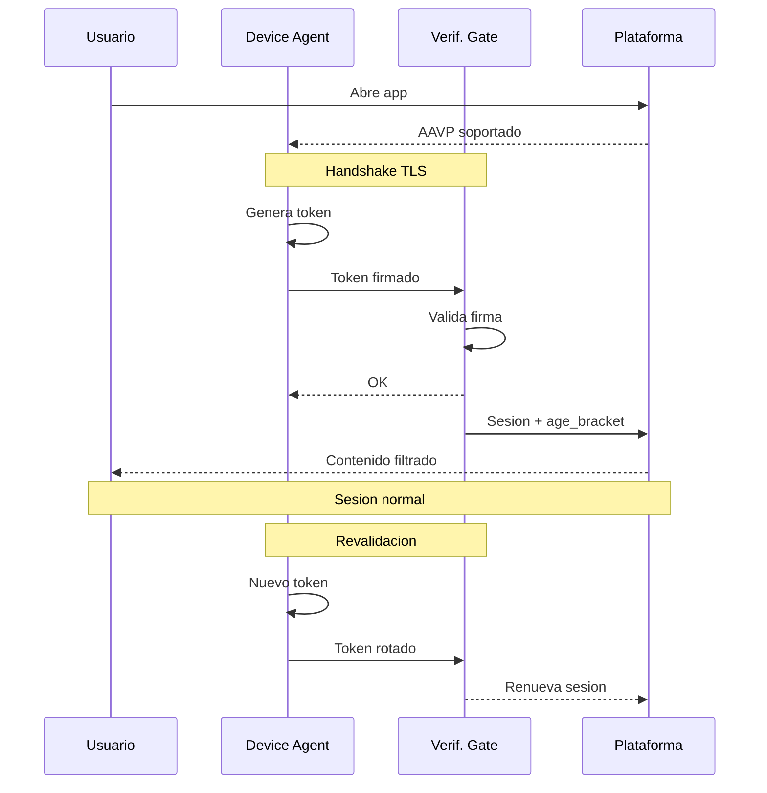

**Ventajas del modelo de puerta de entrada:**

- **Superficie de ataque reducida:** el token de edad solo viaja una vez por sesion, no en cada request.
- **Separacion de contextos:** la informacion de edad nunca convive con el trafico de datos de la aplicacion.
- **Compatibilidad:** las plataformas ya gestionan sesiones; AAVP solo anade un paso previo.
- **Ventana temporal minima para MITM:** interceptar el handshake inicial requiere comprometer TLS con certificate pinning en una ventana muy breve.

---

## 2. Estructura del Token AAVP

El token es una estructura criptografica disenada para ser minima. Cada campo tiene una justificacion especifica:

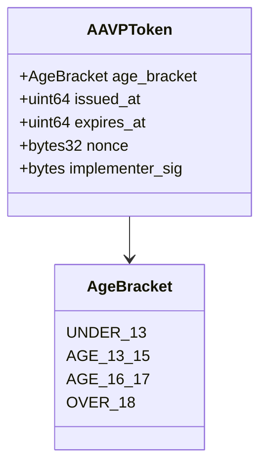

| Campo | Contenido | Proposito |
|-------|-----------|-----------|
| `age_bracket` | Enumeracion: `UNDER_13`, `AGE_13_15`, `AGE_16_17`, `OVER_18` | Senal de franja de edad para filtrado de contenido. |
| `issued_at` | Timestamp Unix con ruido aleatorio | Verificar frescura sin revelar el momento exacto de emision. |
| `expires_at` | Timestamp Unix | Ventana de validez. Fuerza la rotacion. |
| `nonce` | Valor aleatorio criptograficamente seguro (32 bytes) | Previene reutilizacion y asegura unicidad de cada token. |
| `implementer_sig` | Firma ciega (blind signature) | Demuestra que el token proviene de un IM legitimo sin vincular al usuario. |

### Campos explicitamente excluidos

El token **no contiene** y **no puede contener**:

- Identidad del usuario
- Identificador del dispositivo
- Direccion IP
- Localizacion geografica
- Version del software
- Sistema operativo
- Ningun otro dato que permita correlacion o rastreo

Cada dato adicional es un vector potencial de fingerprinting y debe justificarse rigurosamente antes de incluirse en futuras versiones del protocolo.

---

## 3. Rotacion de Tokens

Incluso sin datos personales, un token estatico podria convertirse en un pseudoidentificador persistente si se reutiliza. Por ello, AAVP implementa rotacion obligatoria:

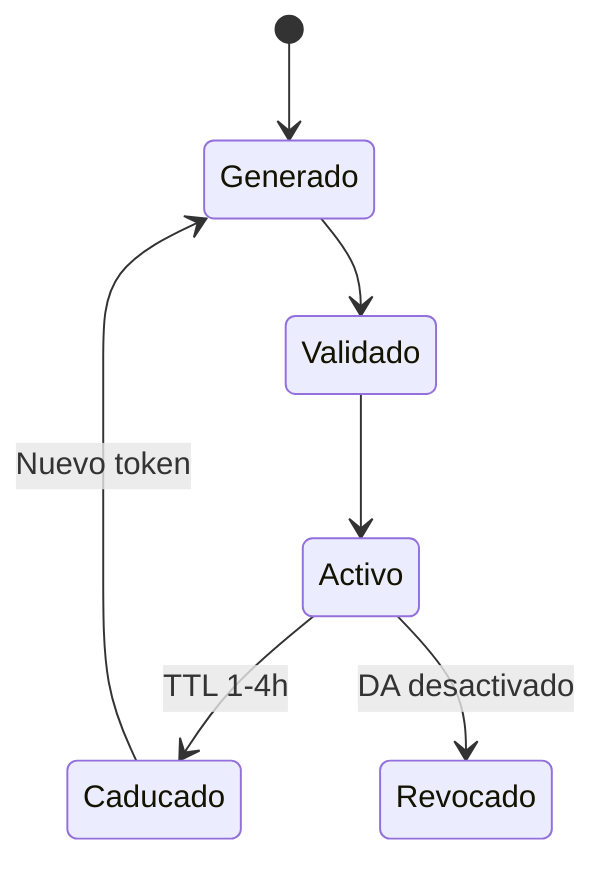

- **Tiempo de vida maximo (TTL):** Cada token tiene una validez configurable, recomendandose entre 1 y 4 horas.
- **Rotacion proactiva:** El Device Agent puede generar un nuevo token antes de la expiracion para mantener la continuidad de la sesion.
- **No vinculabilidad (*unlinkability*):** Dos tokens consecutivos del mismo dispositivo no son correlacionables entre si. Cada token es criptograficamente independiente del anterior.

---

## 4. Fundamentos Criptograficos

### 4.1 Firmas Ciegas (Blind Signatures)

El mecanismo central de AAVP para desacoplar la identidad del usuario de la senal de edad es el uso de **firmas ciegas**, una tecnica propuesta por David Chaum en 1983.

**Analogia:** Un sobre con papel carbon. El firmante estampa su firma sobre el sobre cerrado, y la firma se transfiere al documento interior sin que el firmante lo vea.

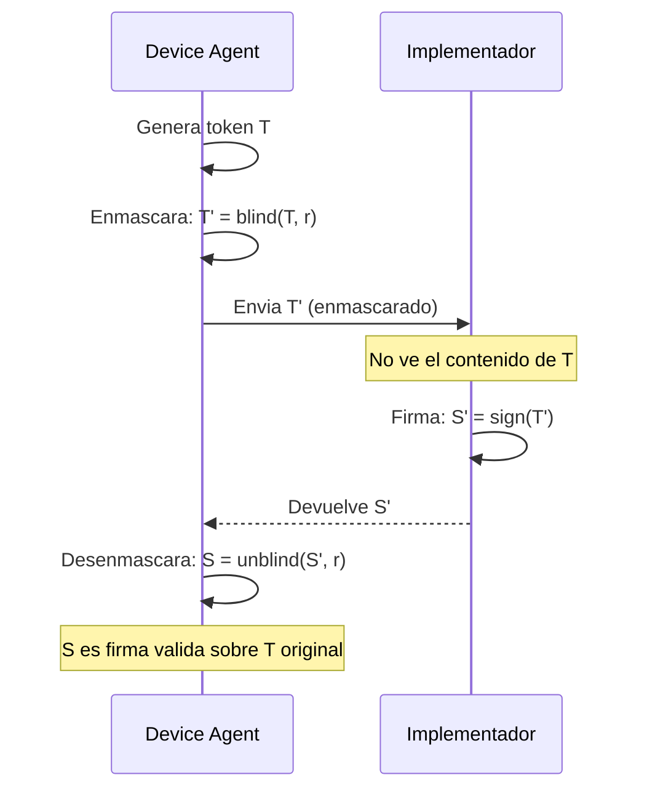

**Resultado:** El Implementador puede certificar que un token es legitimo (proviene de una instalacion real que actua como Device Agent) sin saber que token ha firmado. **Ni siquiera el Implementador puede vincular un token con un usuario o dispositivo.**

**Esquemas candidatos:**
- RSA Blind Signatures (RFC 9474)
- Blind BLS Signatures
- Partially Blind Signatures (para vincular la firma a la franja sin revelar el nonce)

### 4.2 Pruebas de Conocimiento Cero (ZKP)

Como alternativa o complemento a las firmas ciegas, AAVP contempla el uso de **pruebas de conocimiento cero** (Zero-Knowledge Proofs).

Un ZKP permite demostrar una afirmacion — "mi edad esta dentro de la franja X" — sin revelar ningun dato adicional. Esto es especialmente util en escenarios donde la verificacion inicial de la edad se realiza contra un documento oficial: el ZKP demostraria que la fecha de nacimiento cumple el criterio de franja sin exponer la fecha, el nombre ni ningun otro campo del documento.

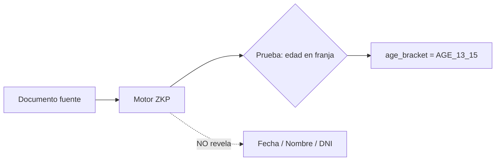

**Esquemas candidatos:**
- zk-SNARKs (Groth16, PLONK)
- zk-STARKs (sin trusted setup)
- Bulletproofs (para range proofs sobre edad)

### 4.3 Prevencion de Fingerprinting

Cada campo del token esta disenado para minimizar la informacion que podria usarse para identificar o rastrear al usuario:

| Medida | Campo afectado | Proposito |
|--------|---------------|-----------|
| Ruido temporal (jitter) | `issued_at` | Evita correlacion por momento de emision |
| Nonce criptografico | `nonce` | Generado sin derivacion de identificadores del dispositivo |
| Ausencia de metadatos | (todo el token) | No se incluye version de software, SO ni dato del entorno |
| Rotacion frecuente | `expires_at` | Tokens de corta vida impiden seguimiento longitudinal |
| Tamano fijo | (todo el token) | Todos los tokens tienen identico tamano en bytes |

---

## 5. Modelo de Confianza Descentralizado

### 5.1 Confianza sin Autoridad Central

AAVP rechaza explicitamente el modelo de Autoridad de Certificacion centralizada. La centralizacion de la certificacion crea:

- **Incentivos perversos:** la entidad central adquiere poder de veto.
- **Objetivo prioritario:** de presion politica y ataques.
- **Punto unico de fallo:** cuya compromision invalida todo el sistema.

AAVP adopta un **modelo de confianza distribuida**, inspirado en DMARC/DKIM para autenticacion de correo electronico.

**Modelo centralizado (rechazado):**

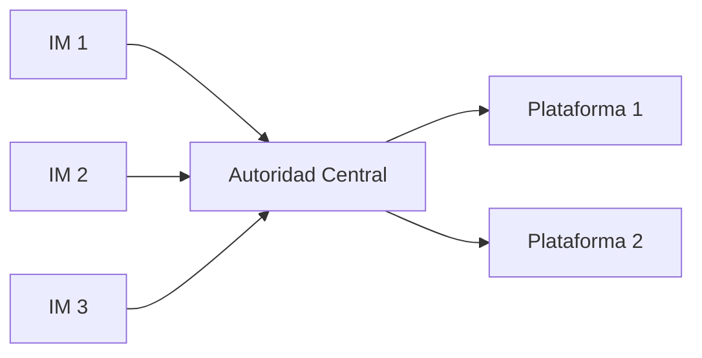

**Modelo AAVP (adoptado) — cada plataforma decide en quien confiar:**

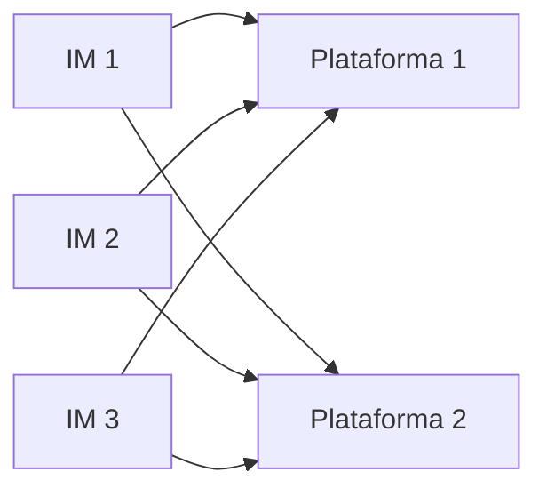

### 5.2 Mecanismos de Confianza

#### 5.2.1 Estandar abierto y verificable

Cualquier organizacion puede implementar AAVP. Sus tokens son verificables criptograficamente por cualquier plataforma que tambien implemente el estandar. No se necesita permiso de ningun tercero. La confianza proviene de la verificabilidad matematica, no de una autorizacion institucional.

#### 5.2.2 Codigo auditable

El estandar recomienda firmemente — y la regulacion podria exigir — que las implementaciones del Device Agent sean de codigo abierto o, como minimo, auditables por terceros independientes. Esto es analogo a los logs de Certificate Transparency: la comunidad puede verificar que el software cumple con la especificacion.

#### 5.2.3 Registro publico de Implementadores

Se propone un registro publico descentralizado (potencialmente basado en un log transparente) donde los Implementadores publican sus claves publicas y declaran conformidad con el estandar.

> **Importante:** Esto **no es una autoridad de aprobacion**. Es un directorio publico auditable, abierto a cualquiera.

#### 5.2.4 Confianza por reputacion

Las plataformas deciden individualmente en que Implementadores confian, del mismo modo que los navegadores deciden en que CAs confian para TLS. No hay una decision centralizada, sino multiples decisiones independientes que tienden a converger.

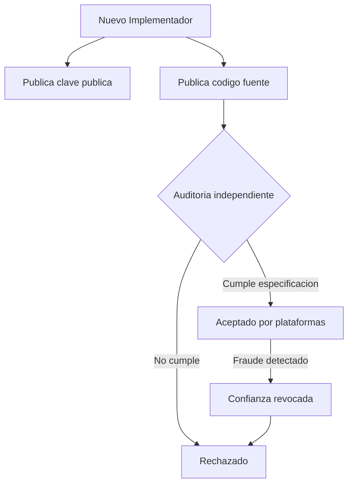

### 5.3 Analogia con DMARC/DKIM

| Aspecto | DMARC/DKIM | AAVP |
|---------|-----------|------|
| Autoridad central | No existe | No existe |
| Quien puede emitir | Cualquier servidor de correo | Cualquier Implementador |
| Quien decide confiar | Cada receptor (Gmail, Outlook...) | Cada plataforma digital |
| Base de la confianza | Cumplimiento del estandar + historial | Cumplimiento del estandar + auditoria |
| Consecuencia del fraude | Correos rechazados / spam | Tokens rechazados por plataformas |

---

## 6. Flujo Operativo Detallado

### 6.1 Configuracion Inicial (una sola vez)

Este paso lo realizan los padres o tutores. Es el unico momento que requiere intervencion humana consciente.

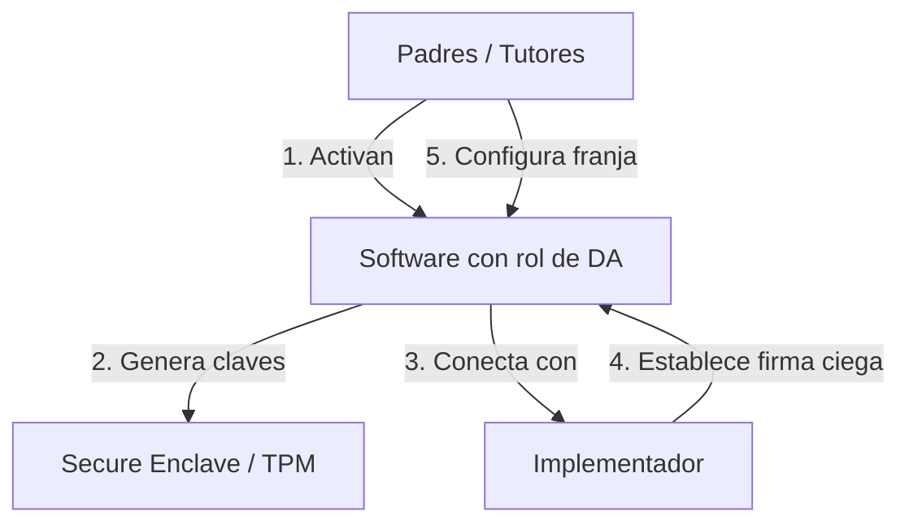

1. Los padres activan la funcionalidad AAVP en el dispositivo del menor. El vehiculo puede ser un sistema de control parental, una configuracion nativa del SO, u otro software conforme.
2. El software que actua como Device Agent genera un par de claves locales en el almacenamiento seguro del dispositivo (Secure Enclave en iOS, StrongBox/TEE en Android, TPM en Windows/Linux).
3. El DA establece una conexion unica con el servicio de firma del Implementador para obtener la capacidad de firma ciega.
4. Se configura la franja de edad correspondiente al menor.

### 6.2 Acceso a una Plataforma (cada sesion)

Este proceso es **completamente transparente** para el usuario:

1. El usuario abre la aplicacion o accede al sitio web.
2. El Device Agent detecta que la plataforma soporta AAVP (via registro DNS `_aavp` o endpoint `.well-known/aavp`).
3. El DA genera un token efimero, lo enmascara (blind), lo envia al Implementador para firma ciega, lo desenmascara y lo presenta al Verification Gate.
4. El VG valida la firma contra las claves publicas de los Implementadores aceptados, verifica el TTL y extrae la franja de edad.
5. La plataforma establece una sesion con un flag interno de franja de edad.
6. El contenido se filtra segun la politica de la plataforma para esa franja.
7. Al caducar el token, el DA genera uno nuevo y el VG renueva la sesion. El proceso es transparente.

### 6.3 Desactivacion

Si el software que actua como Device Agent se desactiva durante una sesion activa, deja de emitir tokens. En la siguiente revalidacion, la sesion no puede renovarse y transiciona a un estado "no verificado".

La politica de que hacer con sesiones no verificadas es decision exclusiva de cada plataforma. El protocolo es deliberadamente agnostico en este punto.

---

## 7. Modelo de Amenazas

Todo protocolo de seguridad debe analizar honestamente sus vectores de ataque:

| Amenaza | Mitigacion | Riesgo residual |
|---------|------------|-----------------|
| **Bypass por dispositivo sin DA** | Politica de plataforma para sesiones sin token | Medio |
| **Implementador fraudulento** | Auditoria open source, reputacion, exclusion por plataformas | Bajo |
| **MITM en handshake** | TLS con certificate pinning, ventana temporal minima | Muy bajo |
| **Correlacion de tokens** | Rotacion, nonces, ruido temporal, firmas ciegas, tamano fijo | Muy bajo |
| **Menor desactiva DA** | Proteccion a nivel de SO, PIN parental, politicas MDM | Medio |
| **Fabricacion de tokens** | Firma criptografica computacionalmente inviable de falsificar | Muy bajo |
| **Implementador colude con plataforma** | Firmas ciegas impiden al IM conocer el contenido del token | Muy bajo |
| **Replay de tokens** | Nonce unico + TTL corto + validacion de expiracion por el VG | Muy bajo |

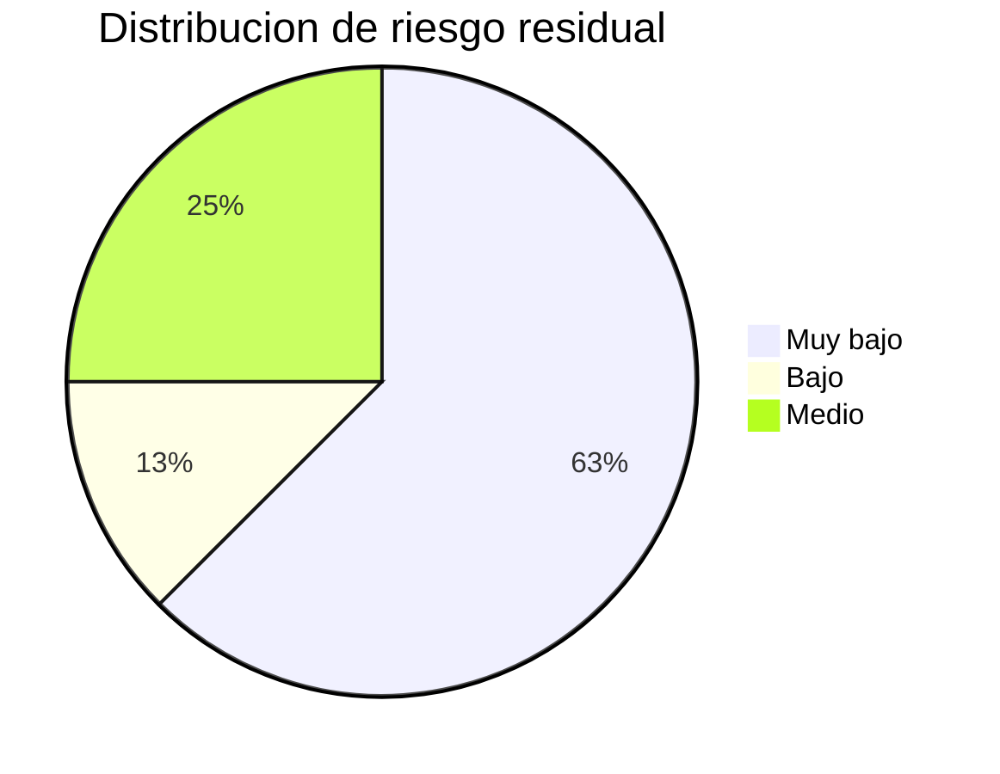

### Limitaciones reconocidas

- **Dispositivos no controlados:** Si un menor accede desde un dispositivo sin software que actue como DA, AAVP no puede protegerle. El protocolo protege las puertas, no las ventanas.
- **Calidad de la implementacion:** Una implementacion deficiente del DA o del VG puede anular las garantias teoricas del protocolo.
- **Complemento, no sustituto:** AAVP es una herramienta tecnica que complementa la educacion digital y la supervision familiar.

---

## 8. Trabajo Futuro y Lineas Abiertas

- **Especificacion formal:** Desarrollar una especificacion tecnica completa en formato RFC, incluyendo formatos de mensaje, algoritmos especificos y procedimientos de prueba de conformidad.
- **Implementacion de referencia:** Crear bibliotecas open source en multiples lenguajes para Device Agent y Verification Gate.
- **Analisis formal de seguridad:** Verificacion formal de las propiedades de privacidad y seguridad mediante herramientas como ProVerif o Tamarin.
- **Pruebas de usabilidad:** Evaluar la experiencia de usuario completa, especialmente la transparencia de la revalidacion y la configuracion inicial.
- **Evaluacion de rendimiento:** Medir el impacto en latencia del handshake y optimizar para conexiones moviles de baja calidad.
- **Extensibilidad del token:** Explorar senales adicionales (preferencias de privacidad parentales, por ejemplo) manteniendo las garantias de anonimato.
- **Gobernanza del estandar:** Definir un modelo de gobernanza comunitaria para la evolucion del protocolo, potencialmente bajo el W3C o el IETF.
- **Seleccion de esquemas criptograficos:** Evaluar formalmente los esquemas candidatos para firmas ciegas y ZKP, considerando rendimiento en dispositivos moviles, tamano de prueba y madurez de las bibliotecas disponibles.

---

## Glosario

| Termino | Definicion |
|---------|-----------|
| **AAVP** | Anonymous Age Verification Protocol. El protocolo propuesto en este documento. |
| **Blind Signature** | Tecnica criptografica donde un firmante puede firmar un mensaje sin conocer su contenido. |
| **Certificate Pinning** | Tecnica de seguridad que asocia un servicio con su certificado especifico, previniendo ataques MITM. |
| **Device Agent (DA)** | Rol del protocolo AAVP: componente de software en el dispositivo del menor que genera y gestiona los tokens de edad. No es sinonimo de "control parental"; puede ser implementado por distintos tipos de software. |
| **Fingerprinting** | Tecnica de rastreo que identifica usuarios por caracteristicas unicas de su dispositivo o comportamiento. |
| **Implementador (IM)** | Organizacion que desarrolla software conforme al estandar AAVP, actuando como proveedor de la funcionalidad de Device Agent. |
| **TTL (Time To Live)** | Tiempo de vida maximo de un token antes de que expire y deba ser reemplazado. |
| **Unlinkability** | Propiedad criptografica que impide correlacionar dos tokens como pertenecientes al mismo usuario o dispositivo. |
| **Verification Gate (VG)** | Endpoint dedicado de una plataforma que valida tokens AAVP y establece sesiones con franja de edad. |
| **ZKP** | Zero-Knowledge Proof. Prueba criptografica que demuestra una afirmacion sin revelar informacion adicional. |

---

**AAVP** · Anonymous Age Verification Protocol · Especificacion Tecnica · v0.2.0

*Documento de trabajo — Sujeto a revision*

