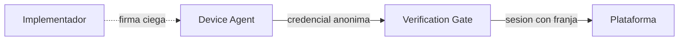
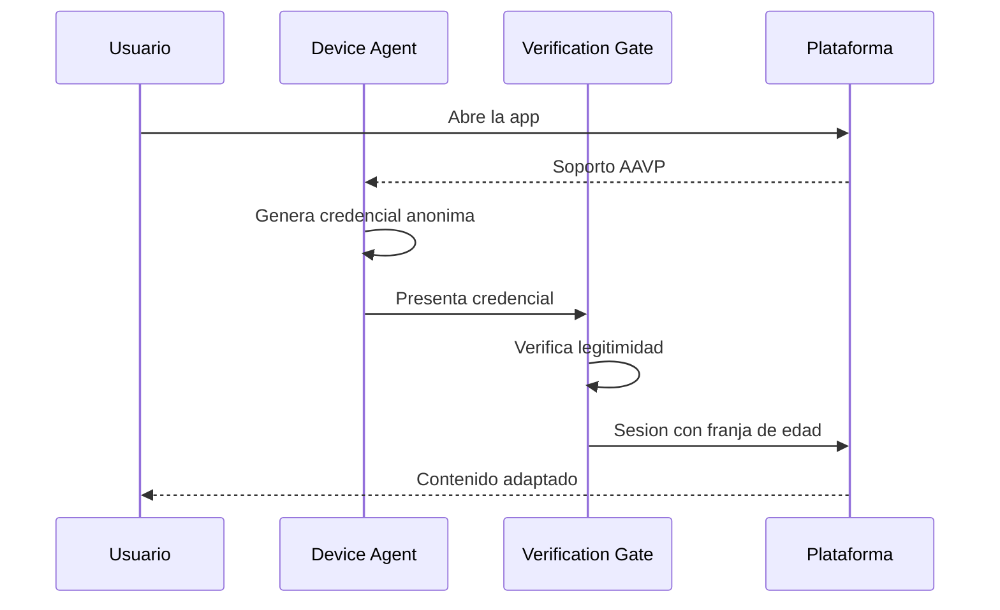
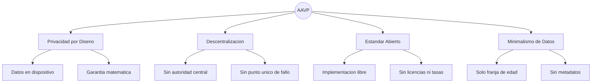
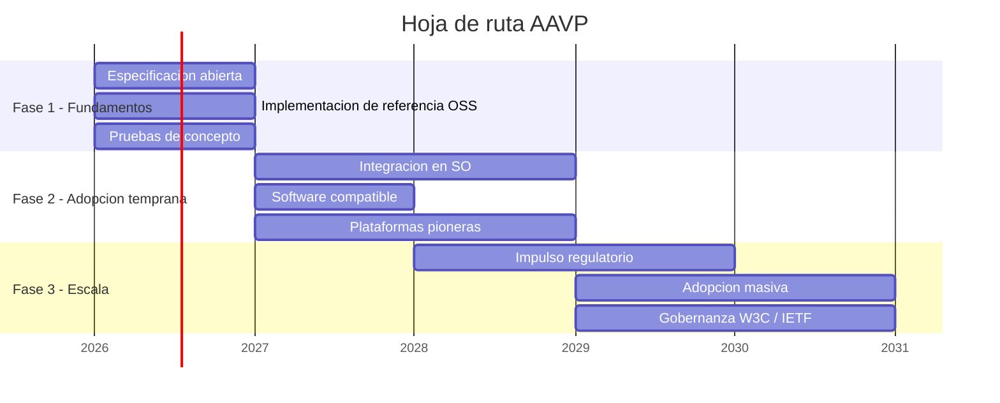

# AAVP — Anonymous Age Verification Protocol

> **White Paper v0.1.0 — Febrero 2026**
>
> Un protocolo abierto y descentralizado para la verificacion anonima de edad en plataformas digitales.

---

> [!NOTE]
> **Principio fundamental:** Es posible transmitir una senal fiable de franja de edad a las plataformas digitales sin recopilar datos personales, sin identificacion del usuario y sin posibilidad de rastreo inverso.

---

## Indice

- [1. El problema](#1-el-problema)
- [2. La propuesta](#2-la-propuesta)
- [3. Como funciona](#3-como-funciona)
- [4. Principios de diseno](#4-principios-de-diseno)
- [5. Comparativa con soluciones actuales](#5-comparativa-con-soluciones-actuales)
- [6. Compatibilidad regulatoria](#6-compatibilidad-regulatoria)
- [7. Hoja de ruta](#7-hoja-de-ruta)
- [8. Limitaciones](#8-limitaciones)
- [9. Conclusion](#9-conclusion)
- [Especificacion tecnica](#especificacion-tecnica)

---

## 1. El problema

Las plataformas digitales necesitan saber si un usuario es menor de edad para adaptar su contenido. Hoy, las soluciones disponibles obligan a elegir entre proteger a los menores y proteger la privacidad de todos:

- **Subir un documento de identidad** crea bases de datos de documentos sensibles que se convierten en objetivos para atacantes. Un DNI filtrado no puede "revocarse" como una contrasena.
- **El reconocimiento facial** recopila datos biometricos — la categoria mas protegida por la ley — y presenta sesgos documentados por genero, etnia e iluminacion.
- **Vincular una tarjeta de credito** asocia la identidad financiera del usuario con su actividad en plataformas, y ademas los menores ya pueden tener tarjetas prepago.
- **La autodeclaracion** ("tengo mas de 18 anos") es trivialmente eludible. Ningun menor que desee acceder a un contenido se detiene ante una casilla de verificacion.

> [!IMPORTANT]
> La tension entre verificar la edad y proteger la privacidad **no es una limitacion fundamental**: es un artefacto del diseno actual de los sistemas. Es posible transmitir una senal fiable de edad sin transmitir ningun dato que identifique al usuario.

---

## 2. La propuesta

AAVP propone un mecanismo analogo a como un portero de discoteca comprueba que tienes edad suficiente: verifica un dato concreto (la franja de edad) sin necesitar saber tu nombre, tu direccion ni ningun otro dato personal.

El protocolo funciona asi a grandes rasgos:

1. **El dispositivo del menor genera una credencial anonima de edad** — un sello digital que dice "este usuario tiene entre 13 y 15 anos" y nada mas. Sin nombre, sin identificador, sin posibilidad de rastreo.
2. **Cuando el menor accede a una plataforma compatible**, el dispositivo presenta el sello.
3. **La plataforma verifica que el sello es legitimo** (que proviene de un software fiable) y adapta el contenido segun la franja de edad.
4. **El sello se destruye y se regenera** cada pocas horas, para que nadie pueda usarlo como identificador persistente.

La clave criptografica: el software que emite el sello **puede certificar que es autentico sin saber que contiene**. Ni siquiera el proveedor del software puede vincular un sello con un usuario concreto.

### Franjas de edad

AAVP no transmite una edad exacta, sino una franja minima:

| Franja | Rango de edad |
|--------|---------------|
| Infantil | Menor de 13 |
| Adolescente temprano | Entre 13 y 15 |
| Adolescente tardio | Entre 16 y 17 |
| Adulto | Mayor de 18 |

---

## 3. Como funciona

### Roles del sistema

AAVP define tres roles claramente diferenciados:

| Rol | Que es | Que hace |
|-----|--------|----------|
| **Device Agent** | Un componente de software en el dispositivo del menor que implementa el protocolo AAVP. | Genera y gestiona las credenciales anonimas de edad. |
| **Verification Gate** | Un punto de entrada en la plataforma digital. | Verifica la credencial y establece la sesion con la franja de edad. |
| **Implementador** | La organizacion que desarrolla software conforme al estandar AAVP. | Publica su codigo, mantiene sus claves publicas y cumple la especificacion. |

> [!TIP]
> **Nota importante:** El Device Agent es un **rol definido por el protocolo**, no un producto concreto. Puede ser implementado por un sistema de control parental (como los que ya existen), por un componente nativo del sistema operativo, o por cualquier otro software que cumpla la especificacion. Lo relevante es que gestiona las credenciales de edad de forma local y anonima.

### Configuracion inicial (una sola vez)

Este es el unico paso que requiere intervencion de los padres o tutores:

1. Se activa la funcionalidad AAVP en el dispositivo del menor (a traves del control parental del sistema operativo, una aplicacion de control parental, u otro software compatible).
2. El software genera claves criptograficas locales en el almacenamiento seguro del dispositivo.
3. Se configura la franja de edad del menor.

A partir de aqui, todo es automatico y transparente.

### Acceso a una plataforma (cada sesion)

1. El usuario abre una aplicacion o sitio web.
2. El Device Agent detecta que la plataforma soporta AAVP.
3. Genera una credencial anonima y la presenta al Verification Gate.
4. La plataforma verifica la credencial y adapta el contenido.
5. La credencial se renueva automaticamente cada pocas horas.

**El usuario no percibe nada de este proceso.** Es completamente transparente.

---

## 4. Principios de diseno

AAVP se construye sobre cuatro principios no negociables. Cualquier implementacion que comprometa alguno de ellos no es conforme con el protocolo.

### Privacidad por Diseno

Ningun dato personal identificable abandona el dispositivo del usuario. La senal de edad es una afirmacion criptografica anonima, no un dato personal. Esto no es una politica de privacidad: es una **garantia matematica**. Ni siquiera con recursos computacionales ilimitados es posible vincular una credencial AAVP con la identidad de un usuario.

### Descentralizacion

No existe una autoridad central que certifique, autorice o controle el acceso al protocolo. Cada plataforma decide de forma independiente en que implementadores confia, de forma similar a como los servidores de correo deciden que remitentes son fiables.

Esto elimina tres riesgos criticos:
- **Incentivos perversos:** nadie tiene poder de veto sobre quien participa.
- **Punto unico de fallo:** no hay "la autoridad" que comprometer.
- **Captura regulatoria:** un gobierno no puede presionar a una entidad que no existe.

### Estandar Abierto

La especificacion es publica y libre. Cualquier organizacion puede desarrollar software que actue como Device Agent, y cualquier plataforma puede verificar credenciales AAVP, sin licencias, tasas ni permisos. La unica barrera es tecnica: implementar correctamente la especificacion. Esto es analogo a como cualquier servidor puede implementar SMTP para enviar correo.

### Minimalismo de Datos

La credencial transmite exclusivamente una franja de edad. No contiene — ni puede contener — identidad del usuario, identificador de dispositivo, direccion IP, ubicacion, version de software ni sistema operativo. Cada dato adicional seria un vector potencial de rastreo.

---

## 5. Comparativa con soluciones actuales

| Criterio | AAVP | DNI / Pasaporte | Biometria facial | Tarjeta de credito | Autodeclaracion |
|----------|:----:|:---------------:|:----------------:|:------------------:|:---------------:|
| **Privacidad** | Alta | Muy baja | Muy baja | Baja | Alta |
| **Fiabilidad** | Alta | Alta | Media | Media | Nula |
| **Descentralizado** | Si | No | No | No | Si |
| **Riesgo de filtracion** | Minimo | Critico | Critico | Alto | Ninguno |
| **Compatible con RGPD** | Si | No | No | No | Si |

---

## 6. Compatibilidad regulatoria

AAVP esta disenado para encajar en los marcos regulatorios existentes y emergentes:

| Regulacion | Compatibilidad con AAVP |
|------------|------------------------|
| **RGPD / GDPR** | Al no procesar datos personales, minimiza las obligaciones regulatorias. No requiere consentimiento especifico para la senal de edad. |
| **Digital Services Act (DSA)** | Proporciona la senal tecnica de proteccion de menores que la DSA exige, sin crear sistemas de vigilancia. |
| **COPPA (EE.UU.)** | Identifica menores de 13 sin recopilar datos personales de menores. |
| **Age Appropriate Design Code (UK)** | Proporciona la senal para adaptar la experiencia segun la edad, compatible con el enfoque de "diseno apropiado para la edad". |

---

## 7. Hoja de ruta

---

## 8. Limitaciones

AAVP no pretende ser una solucion completa. Es importante ser transparentes:

- **Dispositivos no controlados:** Si un menor accede desde un dispositivo sin software compatible con AAVP, el protocolo no puede protegerle. AAVP protege las puertas, no las ventanas.
- **Calidad de la implementacion:** Como cualquier protocolo criptografico, una implementacion deficiente puede anular las garantias teoricas.
- **Complemento, no sustituto:** AAVP es una herramienta tecnica que complementa la educacion digital y la supervision familiar. No las reemplaza.

---

## 9. Conclusion

La proteccion de menores en el entorno digital no tiene por que venir a costa de la privacidad de todos los usuarios. Los bloques criptograficos necesarios existen y estan probados. Lo que falta es la voluntad de articularlos en un estandar comun.

AAVP demuestra que es tecnicamente viable construir un sistema de verificacion de edad que sea simultaneamente fiable, anonimo, descentralizado y compatible con los marcos regulatorios existentes.

> [!IMPORTANT]
> Invitamos a la comunidad tecnica, a los reguladores, a las empresas de software y a las plataformas digitales a contribuir a la evolucion de AAVP hacia un estandar robusto, auditable y verdaderamente protector tanto de los menores como de la privacidad de todos.

---

## Especificacion tecnica

La descripcion tecnica completa del protocolo — arquitectura, fundamentos criptograficos, estructura del token, modelo de amenazas y flujo operativo detallado — se encuentra en [PROTOCOL.md](PROTOCOL.md).

---

**AAVP** · Anonymous Age Verification Protocol · v0.1.0

*Documento de trabajo — Sujeto a revision*

