# AAVP — Anonymous Age Verification Protocol

> **White Paper v0.1 — Borrador Inicial — Febrero 2026**
>
> Un protocolo abierto y descentralizado para la verificación anónima de edad en plataformas digitales.

---

> [!NOTE]
> **Principio fundamental:** Es posible transmitir una señal fiable de franja de edad a las plataformas digitales sin recopilar datos personales, sin identificación del usuario y sin posibilidad de rastreo inverso.

---

## Índice

- [1. Resumen Ejecutivo](#1-resumen-ejecutivo)
- [2. Definición del Problema](#2-definición-del-problema)
- [3. Visión y Principios de Diseño](#3-visión-y-principios-de-diseño)
- [4. Arquitectura del Protocolo](#4-arquitectura-del-protocolo)
- [5. Modelo de Confianza Descentralizado](#5-modelo-de-confianza-descentralizado)
- [6. Fundamentos Criptográficos](#6-fundamentos-criptográficos)
- [7. Flujo Operativo Detallado](#7-flujo-operativo-detallado)
- [8. Modelo de Amenazas](#8-modelo-de-amenazas)
- [9. Estrategia de Adopción](#9-estrategia-de-adopción)
- [10. Comparativa con Soluciones Existentes](#10-comparativa-con-soluciones-existentes)
- [11. Trabajo Futuro](#11-trabajo-futuro-y-líneas-abiertas)
- [12. Conclusión](#12-conclusión)
- [Glosario](#glosario)

---

## 1. Resumen Ejecutivo

La protección de menores en el entorno digital se enfrenta a lo que parece un dilema irresoluble. Los sistemas de verificación de edad actuales —documentos de identidad, biometría facial, tarjetas de crédito— exigen la recolección de datos personales sensibles, creando nuevos riesgos de privacidad y vigilancia que afectan a todos los usuarios, incluidos los propios menores a los que se pretende proteger.

Este documento presenta el **Anonymous Age Verification Protocol (AAVP)**, un protocolo abierto, descentralizado y respetuoso con la privacidad que permite a las plataformas digitales adaptar su contenido y funcionalidades según la franja de edad del usuario, sin recopilar datos personales identificables y sin posibilidad de rastreo inverso.

AAVP se apoya en tres pilares:

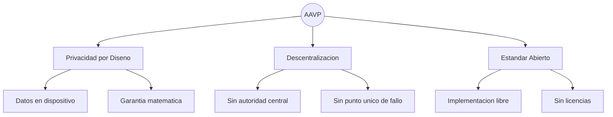

Los bloques de construcción criptográficos necesarios —firmas ciegas, pruebas de conocimiento cero, almacenamiento seguro en hardware— existen y están probados. Lo que falta es la voluntad de articularlos en un estándar común. Este white paper es un primer paso hacia esa articulación.

---

## 2. Definición del Problema

### 2.1 Situación Actual

Las redes sociales y plataformas digitales se enfrentan a una presión regulatoria creciente para verificar la edad de sus usuarios. Las soluciones desplegadas hasta la fecha presentan deficiencias significativas:

| Solucion | Privacidad | Fiabilidad | Problema principal |
|----------|:----------:|:----------:|:-------------------|
| DNI / Pasaporte | Muy baja | Alta | Bases de datos de documentos sensibles |
| Biometria facial | Muy baja | Media | Datos RGPD categoria especial, sesgos |
| Tarjeta de credito | Baja | Media | Vincula identidad financiera |
| Autodeclaracion | Alta | Nula | Trivialmente eludible |
| **AAVP** | **Alta** | **Alta** | Requiere adopcion del estandar |

- **Verificación por documento de identidad.** El usuario sube una copia de su DNI o pasaporte. Esto crea bases de datos de documentos sensibles que se convierten en objetivos de alto valor para atacantes. Las filtraciones de este tipo de datos —ya documentadas en múltiples incidentes— tienen consecuencias especialmente graves porque un documento de identidad no puede «revocarse» como una contraseña.

- **Verificación biométrica.** El análisis facial para estimar la edad implica la recolección de datos biométricos, que el RGPD clasifica como categoría especial con la protección más estricta. Además, estos sistemas presentan sesgos documentados por género, etnia y condiciones de iluminación.

- **Verificación por tarjeta de crédito.** Asume que solo los adultos poseen tarjetas de crédito, lo cual es incorrecto (las tarjetas prepago y las cuentas juveniles son habituales). Además, vincula la identidad financiera del usuario con su actividad en plataformas digitales.

- **Autodeclaración.** El sistema más extendido («tengo más de 18 años») es trivialmente eludible. Ningún menor que desee acceder a un contenido se detiene ante una casilla de verificación.

### 2.2 El Dilema Privacidad vs. Protección

Existe una tensión aparente entre verificar la edad de un usuario y proteger su privacidad: cuanto más fiable es la verificación, más datos personales parece exigir.

> [!IMPORTANT]
> Este white paper sostiene que **dicha tensión es un artefacto del diseño actual de los sistemas, no una limitación fundamental**. Es posible —y este documento describe cómo— transmitir una señal fiable de franja de edad sin transmitir ningún dato que identifique al usuario.

---

## 3. Visión y Principios de Diseño

AAVP se construye sobre cuatro principios no negociables. Cualquier implementación que comprometa alguno de ellos no es conforme con el protocolo.

### 3.1 Privacidad por Diseño (Privacy by Design)

Ningún dato personal identificable abandona el dispositivo del usuario en ningún punto del protocolo. La señal de edad es una afirmación criptográfica anónima, no un dato personal. Esto no es una política de privacidad: es una **garantía matemática**. No es posible, ni siquiera con recursos computacionales ilimitados, vincular un token AAVP con la identidad de un usuario específico.

### 3.2 Descentralización

No existe una autoridad central que certifique, autorice o controle el acceso al protocolo. La confianza emerge de la adopción del estándar abierto, la auditoría pública del código y la reputación de los implementadores. Esto elimina tres riesgos críticos: **incentivos perversos** (nadie tiene poder de veto), **puntos únicos de fallo** (no hay «la autoridad» que comprometer) y **captura regulatoria** (un gobierno no puede presionar a una entidad que no existe).

### 3.3 Estándar Abierto

La especificación del protocolo es pública y libre. Cualquier empresa de control parental puede emitir tokens AAVP y cualquier plataforma digital puede verificarlos, sin licencias, tasas ni permisos. La única barrera de entrada es técnica: implementar correctamente la especificación. Esto es análogo a cómo cualquier servidor puede implementar SMTP para enviar correo electrónico.

### 3.4 Minimalismo de Datos

El token transmite la mínima información necesaria: una **franja de edad**, no una edad exacta. Las franjas propuestas inicialmente son:

| Franja | Codigo | Rango de edad |
|--------|--------|---------------|
| Infantil | `UNDER_13` | Menor de 13 |
| Adolescente temprano | `AGE_13_15` | Entre 13 y 15 |
| Adolescente tardio | `AGE_16_17` | Entre 16 y 17 |
| Adulto | `OVER_18` | Mayor de 18 |

Cada dato adicional es un vector potencial de fingerprinting y debe justificarse rigurosamente antes de incluirse.

---

## 4. Arquitectura del Protocolo

### 4.1 Actores del Sistema

AAVP define tres actores con roles diferenciados. El diseño garantiza que ninguno de ellos necesita confiar ciegamente en los otros: la verificabilidad criptográfica sustituye a la confianza institucional.

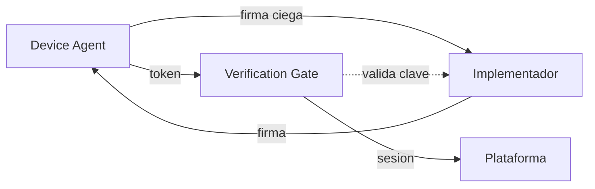

| Actor | Descripción | Responsabilidad |
|-------|-------------|-----------------|
| **Device Agent (DA)** | Sistema de control parental o componente del SO instalado en el dispositivo del menor. | Genera, custodia y rota los tokens de edad. Es el único componente que conoce la configuración real. |
| **Verification Gate (VG)** | Endpoint dedicado de la plataforma digital que actúa como puerta de entrada al servicio. | Valida el token AAVP y establece una sesión interna con la marca de franja de edad. |
| **Implementador (IM)** | Empresa u organización que desarrolla software de control parental conforme al estándar. | Publica su clave pública, mantiene código auditable y cumple con la especificación abierta. |

### 4.2 Modelo de Puerta de Entrada (Verification Gate)

Un enfoque ingenuo enviaría la credencial de edad en cada petición HTTP, exponiéndola continuamente a posibles interceptaciones. AAVP adopta un modelo diferente: la **puerta de entrada**. El token de edad solo viaja una vez por sesión, durante un handshake inicial dedicado. Después, la plataforma trabaja con su propio sistema de sesiones.

> [!TIP]
> **Idea clave:** El token de edad nunca convive con el tráfico regular de la aplicación. Es un canal separado, un handshake puntual. Después, la información «este usuario es menor» es un flag interno de la plataforma, completamente desacoplado del token original.

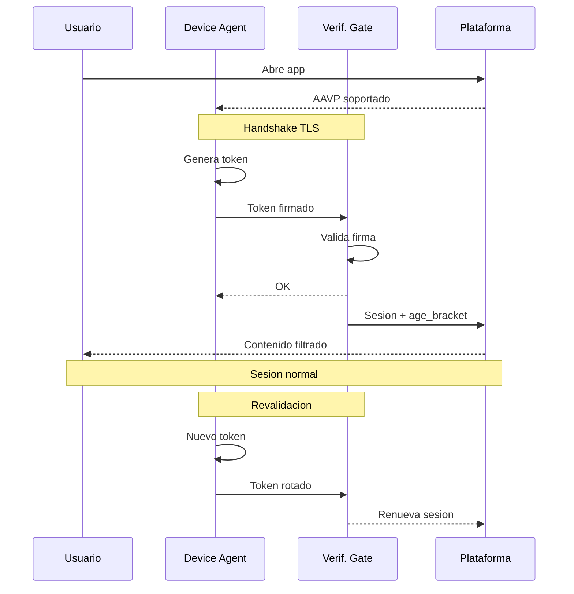

**Ventajas del modelo de puerta de entrada:**

- **Superficie de ataque reducida:** el token de edad solo viaja una vez por sesión, no en cada request.
- **Separación de contextos:** la información de edad nunca convive con el tráfico de datos de la aplicación.
- **Compatibilidad:** las plataformas ya gestionan sesiones; AAVP solo añade un paso previo.
- **Ventana temporal mínima para MITM:** interceptar el handshake inicial requiere comprometer TLS con certificate pinning en una ventana muy breve.

### 4.3 Estructura del Token AAVP

El token es una estructura criptográfica diseñada para ser mínima. Cada campo tiene una justificación específica:

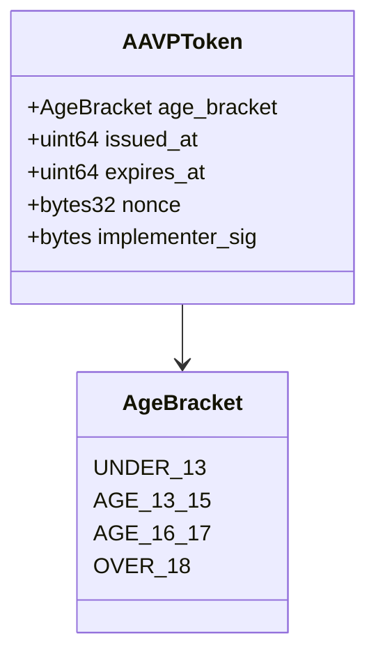

> **Explícitamente excluido del token:** identidad del usuario, ID de dispositivo, dirección IP, localización, versión de software, sistema operativo.

| Campo | Contenido | Propósito |
|-------|-----------|-----------|
| `age_bracket` | Enumeración: `UNDER_13`, `AGE_13_15`, `AGE_16_17`, `OVER_18` | Señal de franja de edad para filtrado de contenido. |
| `issued_at` | Timestamp Unix con ruido aleatorio | Verificar frescura sin revelar el momento exacto de emisión. |
| `expires_at` | Timestamp Unix | Ventana de validez. Fuerza la rotación. |
| `nonce` | Valor aleatorio criptográficamente seguro | Previene reutilización y asegura unicidad de cada token. |
| `implementer_sig` | Firma ciega (blind signature) | Demuestra que el token proviene de un IM legítimo sin vincular al usuario. |

Es igualmente importante lo que el token **no contiene**: identidad del usuario, identificador del dispositivo, dirección IP, localización geográfica, versión del software, ni ningún otro dato que permita correlación o rastreo.

### 4.4 Rotación de Tokens

Incluso sin datos personales, un token estático podría convertirse en un pseudoidentificador persistente si se reutiliza. Por ello, AAVP implementa rotación obligatoria:

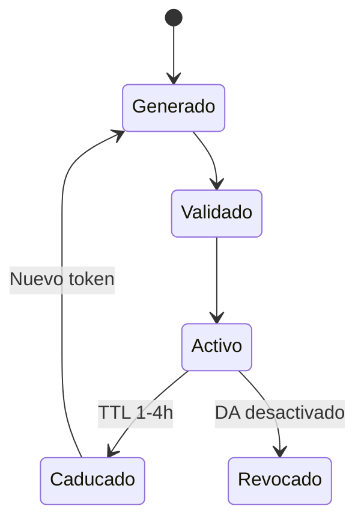

- **Tiempo de vida máximo (TTL):** Cada token tiene una validez configurable, recomendándose entre 1 y 4 horas.
- **Rotación proactiva:** El Device Agent puede generar un nuevo token antes de la expiración para mantener la continuidad.
- **No vinculabilidad (*unlinkability*):** Dos tokens consecutivos del mismo dispositivo no son correlacionables entre sí. Cada token es criptográficamente independiente del anterior.

---

## 5. Modelo de Confianza Descentralizado

### 5.1 Confianza sin Autoridad Central

AAVP rechaza explícitamente el modelo de Autoridad de Certificación centralizada. ¿Por qué? Porque la centralización de la certificación crea incentivos perversos: la entidad central adquiere poder de veto sobre quién participa en el ecosistema, se convierte en objetivo prioritario de presión política, y genera un punto único de fallo cuya compromisión invalida todo el sistema.

AAVP adopta un **modelo de confianza distribuida**, inspirado en protocolos como DMARC/DKIM para autenticación de correo electrónico.

**Modelo centralizado (rechazado):**

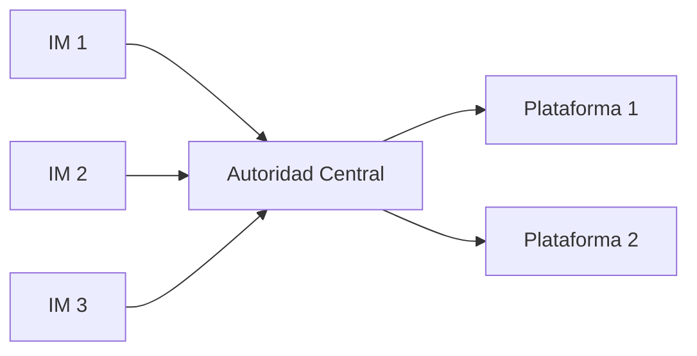

**Modelo AAVP (adoptado) — cada plataforma decide en quién confiar:**

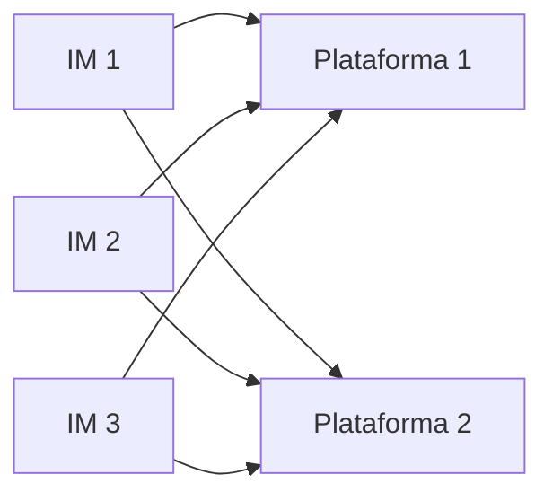

### 5.2 Mecanismos de Confianza

#### 5.2.1 Estándar abierto y verificable

Cualquier empresa puede implementar AAVP. Al hacerlo, sus tokens son verificables criptográficamente por cualquier plataforma que también implemente el estándar. No se necesita permiso de ningún tercero. La confianza proviene de la verificabilidad matemática, no de una autorización institucional.

#### 5.2.2 Código auditable

El estándar recomienda firmemente —y la regulación podría exigir— que las implementaciones de Device Agent sean de código abierto o, como mínimo, auditables por terceros independientes. Esto es análogo a los logs de Certificate Transparency: la comunidad puede verificar que el software cumple con la especificación.

#### 5.2.3 Registro público de Implementadores

Se propone un registro público descentralizado (potencialmente basado en un log transparente) donde los Implementadores publican sus claves públicas y declaran conformidad con el estándar. Es importante subrayar que esto **no es una autoridad de aprobación**: es un directorio público auditable, abierto a cualquiera.

#### 5.2.4 Confianza por reputación

Las plataformas digitales deciden individualmente en qué Implementadores confían, del mismo modo que los navegadores web deciden en qué CAs confían para TLS. No hay una decisión centralizada, sino múltiples decisiones independientes que tienden a converger.

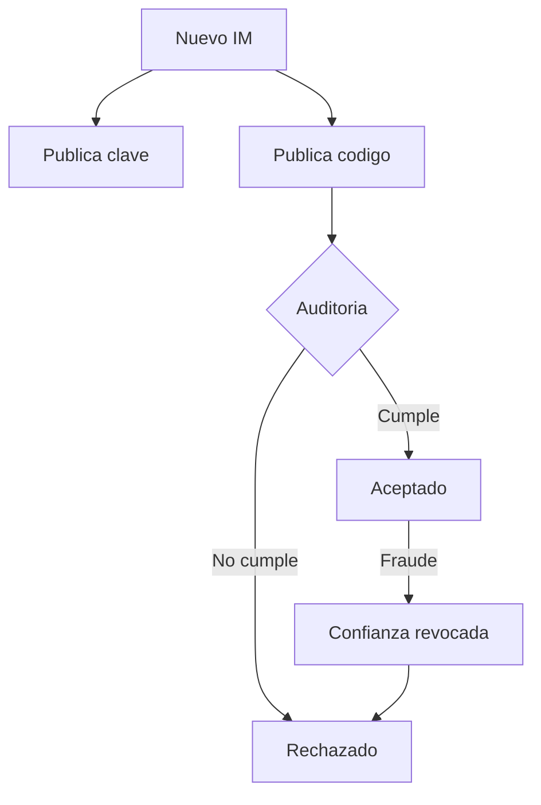

### 5.3 Analogía con DMARC/DKIM

Para entender intuitivamente cómo funciona este modelo, resulta útil compararlo con DMARC/DKIM, el sistema de autenticación de correo electrónico:

| Aspecto | DMARC/DKIM | AAVP |
|---------|-----------|------|
| Autoridad central | No existe | No existe |
| Quién puede emitir | Cualquier servidor de correo | Cualquier Implementador |
| Quién decide confiar | Cada receptor (Gmail, Outlook...) | Cada plataforma digital |
| Base de la confianza | Cumplimiento del estandar + historial | Cumplimiento del estandar + auditoria |
| Consecuencia del fraude | Correos rechazados / spam | Tokens rechazados por plataformas |

---

## 6. Fundamentos Criptográficos

### 6.1 Firmas Ciegas (Blind Signatures)

El mecanismo central de AAVP para desacoplar la identidad del usuario de la señal de edad es el uso de **firmas ciegas**, una técnica propuesta por David Chaum en 1983. La analogía clásica: un sobre con papel carbón. El firmante estampa su firma sobre el sobre cerrado, y la firma se transfiere al documento interior sin que el firmante lo vea.

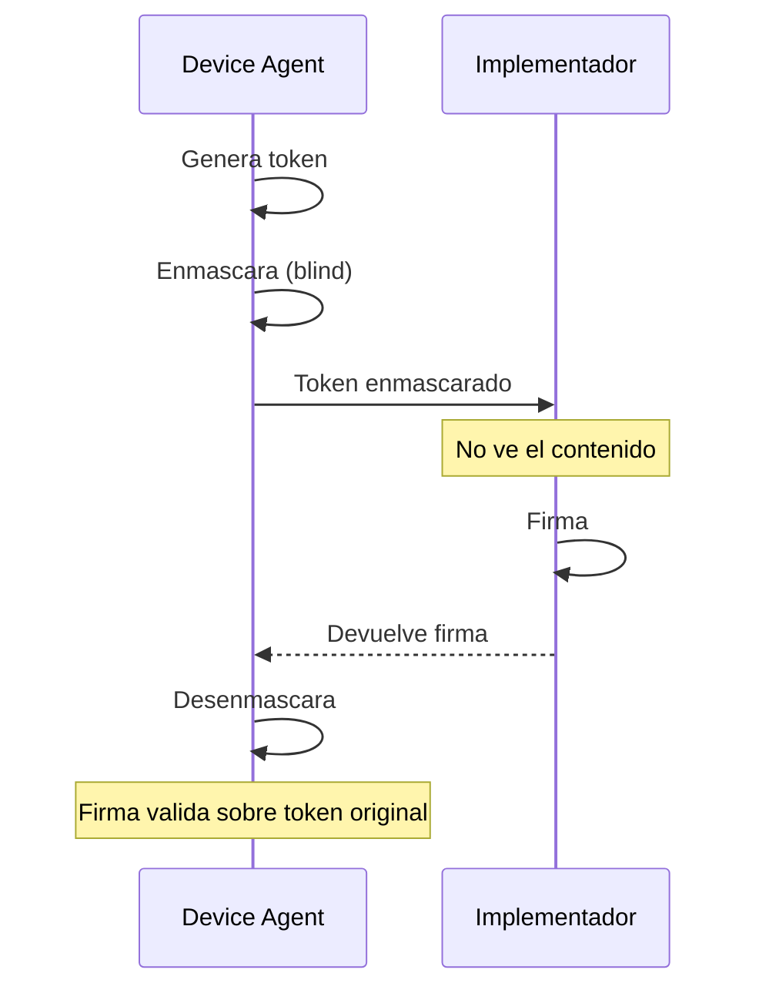

El resultado práctico: el Implementador puede certificar que un token es legítimo (proviene de una instalación real de control parental) sin saber qué token ha firmado. **Ni siquiera el Implementador puede vincular un token con un usuario.**

### 6.2 Pruebas de Conocimiento Cero (ZKP)

Como alternativa o complemento a las firmas ciegas, AAVP contempla el uso de **pruebas de conocimiento cero** (Zero-Knowledge Proofs). Un ZKP permite demostrar una afirmación —por ejemplo, «mi edad está dentro de la franja X»— sin revelar ningún dato adicional. Esto sería especialmente útil en escenarios donde la verificación inicial de la edad se realiza contra un documento oficial: el ZKP demostraría que la fecha de nacimiento cumple el criterio de franja sin exponer la fecha.

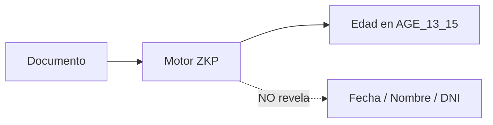

### 6.3 Prevención de Fingerprinting

Cada campo del token está diseñado para minimizar la información que podría usarse para identificar o rastrear al usuario:

- **Ruido temporal:** El campo `issued_at` incluye un jitter aleatorio para evitar correlación por momento de emisión.
- **Nonce único:** Generado criptográficamente sin derivación de ningún identificador del dispositivo.
- **Sin metadatos:** No se incluye versión del software, sistema operativo ni ningún dato del entorno.
- **Rotación frecuente:** Tokens de corta vida que impiden el seguimiento longitudinal.

---

## 7. Flujo Operativo Detallado

### 7.1 Configuración Inicial (una sola vez)

Este paso lo realizan los padres o tutores y es el único momento en que se requiere intervención humana consciente:

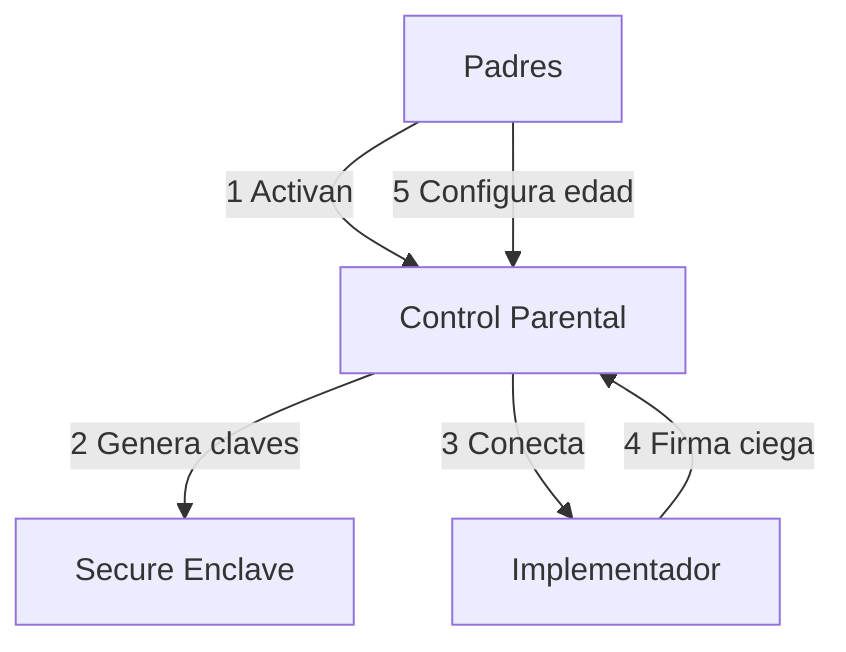

1. Los padres activan el control parental en el dispositivo del menor.
2. El Device Agent genera un par de claves locales en el almacenamiento seguro del dispositivo (Secure Enclave, TPM o equivalente).
3. El DA establece una conexión única con el servicio de firma del Implementador para obtener la capacidad de firma ciega.
4. Se configura la franja de edad correspondiente al menor.

### 7.2 Acceso a una Plataforma (cada sesión)

Este proceso es **completamente transparente** para el usuario:

1. El usuario abre la aplicación o accede al sitio web.
2. El Device Agent detecta que la plataforma soporta AAVP (vía un registro DNS bien conocido o un endpoint estándar tipo `.well-known/aavp`).
3. El DA genera un token efímero, lo firma ciegamente y lo presenta al Verification Gate.
4. El VG valida la firma, verifica el TTL y extrae la franja de edad.
5. La plataforma establece una sesión con un flag interno de franja.
6. El contenido se filtra según la política de la plataforma para esa franja.
7. Al caducar la sesión, el proceso se repite automáticamente con un nuevo token.

### 7.3 Desactivación del Control Parental

Si el control parental se desactiva durante una sesión activa, el Device Agent deja de emitir tokens. En la siguiente revalidación, la sesión no puede renovarse y transiciona a un estado «no verificado». La política de qué hacer con sesiones no verificadas es decisión exclusiva de cada plataforma —el protocolo es deliberadamente agnóstico en este punto.

---

## 8. Modelo de Amenazas

Todo protocolo de seguridad debe analizar honestamente sus vectores de ataque:

| Amenaza | Mitigacion | Riesgo |
|---------|------------|--------|
| **Bypass por dispositivo sin DA** | Politica de plataforma para sesiones sin token | Medio |
| **Implementador fraudulento** | Auditoria open source, reputacion, exclusion | Bajo |
| **MITM en handshake** | TLS con certificate pinning, ventana minima | Muy bajo |
| **Correlacion de tokens** | Rotacion, nonces, ruido temporal, firmas ciegas | Muy bajo |
| **Menor desactiva DA** | Proteccion a nivel de SO, PIN parental | Medio |
| **Fabricacion de tokens** | Firma criptografica computacionalmente inviable | Muy bajo |

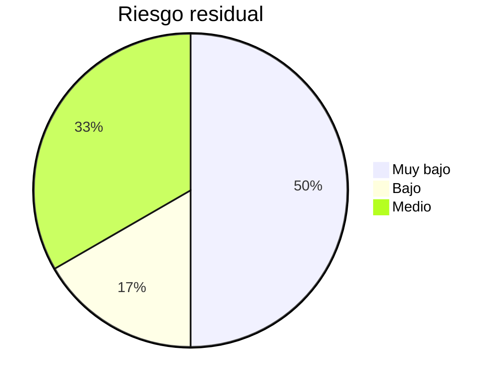

### Limitaciones Reconocidas

AAVP no pretende ser una solución completa. Es importante ser transparentes:

- **Dispositivos no controlados:** Si un menor accede desde un dispositivo sin control parental, AAVP no puede protegerle. El protocolo protege las puertas, no las ventanas.
- **Calidad de la implementación:** Como cualquier protocolo criptográfico, una implementación deficiente puede anular las garantías teóricas.
- **Complemento, no sustituto:** AAVP es una herramienta técnica que complementa la educación digital y la supervisión familiar, no las reemplaza.

---

## 9. Estrategia de Adopción

### El Problema del Bootstrapping

Todo protocolo de dos lados enfrenta el clásico dilema del huevo y la gallina. Para superarlo se propone una estrategia en tres fases:

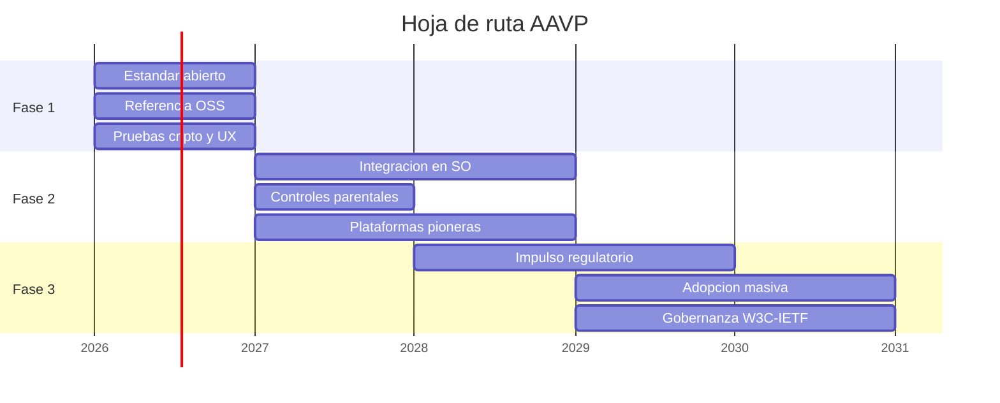

### Compatibilidad Regulatoria

AAVP está diseñado para encajar en los marcos regulatorios existentes y emergentes:

| Regulacion | Compatibilidad con AAVP |
|------------|------------------------|
| **RGPD / GDPR** | Al no procesar datos personales, AAVP minimiza las obligaciones regulatorias. No se requiere consentimiento específico. |
| **Digital Services Act (DSA)** | La DSA exige medidas de protección de menores. AAVP proporciona la señal técnica sin crear sistemas de vigilancia. |
| **COPPA (EE.UU.)** | Facilita el cumplimiento al identificar menores de 13 sin recopilar datos personales de menores. |
| **Age Appropriate Design Code (UK)** | Compatible con el enfoque de «diseño apropiado para la edad» al proporcionar la señal para adaptar la experiencia. |

---

## 10. Comparativa con Soluciones Existentes

| Criterio | AAVP | DNI | Biometria | Tarjeta | Autodeclaracion |
|----------|:----:|:---:|:---------:|:-------:|:---------------:|
| **Privacidad** | Alta | Muy baja | Muy baja | Baja | Alta |
| **Fiabilidad** | Alta | Alta | Media | Media | Nula |
| **Descentralizado** | Si | No | No | No | Si |
| **Riesgo filtracion** | Minimo | Critico | Critico | Alto | Ninguno |
| **Coste** | Medio | Alto | Muy alto | Medio | Bajo |
| **RGPD nativo** | Si | No | No | No | Si |

---

## 11. Trabajo Futuro y Líneas Abiertas

- **Especificación formal:** Desarrollar una especificación técnica completa en formato RFC, incluyendo formatos de mensaje, algoritmos específicos y procedimientos de prueba de conformidad.
- **Implementación de referencia:** Crear bibliotecas open source en múltiples lenguajes para Device Agent y Verification Gate.
- **Análisis formal de seguridad:** Verificación formal de las propiedades de privacidad y seguridad mediante herramientas como ProVerif o Tamarin.
- **Pruebas de usabilidad:** Evaluar la experiencia de usuario completa, especialmente la transparencia de la revalidación y la configuración inicial.
- **Evaluación de rendimiento:** Medir el impacto en latencia del handshake y optimizar para conexiones móviles de baja calidad.
- **Extensibilidad del token:** Explorar señales adicionales (preferencias de privacidad parentales, por ejemplo) manteniendo las garantías de anonimato.
- **Gobernanza del estándar:** Definir un modelo de gobernanza comunitaria para la evolución del protocolo, potencialmente bajo el W3C o el IETF.

---

## 12. Conclusión

La protección de menores en el entorno digital no tiene por qué venir a costa de la privacidad de todos los usuarios. AAVP demuestra que es técnicamente viable construir un sistema de verificación de edad que sea simultáneamente fiable, anónimo, descentralizado y compatible con los marcos regulatorios existentes.

Los bloques de construcción criptográficos necesarios existen y están probados. Lo que falta es la voluntad de articularlos en un estándar abierto y la presión regulatoria y social para impulsar su adopción.

> [!IMPORTANT]
> Invitamos a la comunidad técnica, a los reguladores, a las empresas de control parental y a las plataformas digitales a contribuir a la evolución de AAVP hacia un estándar robusto, auditable y verdaderamente protector tanto de los menores como de la privacidad de todos.

---

## Glosario

| Termino | Definicion |
|---------|-----------|
| **AAVP** | Anonymous Age Verification Protocol. El protocolo propuesto en este documento. |
| **Blind Signature** | Técnica criptográfica donde un firmante puede firmar un mensaje sin conocer su contenido. |
| **Certificate Pinning** | Técnica de seguridad que asocia un servicio con su certificado específico, previniendo ataques MITM. |
| **Device Agent (DA)** | Software de control parental o componente del SO que genera y gestiona los tokens AAVP. |
| **Fingerprinting** | Técnica de rastreo que identifica usuarios por características únicas de su dispositivo o comportamiento. |
| **Implementador (IM)** | Empresa que desarrolla software conforme al estándar AAVP. |
| **TTL (Time To Live)** | Tiempo de vida máximo de un token antes de que expire y deba ser reemplazado. |
| **Verification Gate (VG)** | Endpoint dedicado de una plataforma que valida tokens AAVP y establece sesiones. |
| **ZKP** | Zero-Knowledge Proof. Prueba criptográfica que demuestra una afirmación sin revelar información adicional. |

---

**AAVP** · Anonymous Age Verification Protocol · v0.1

*Documento de trabajo — Sujeto a revision*

