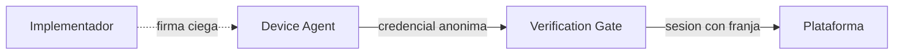
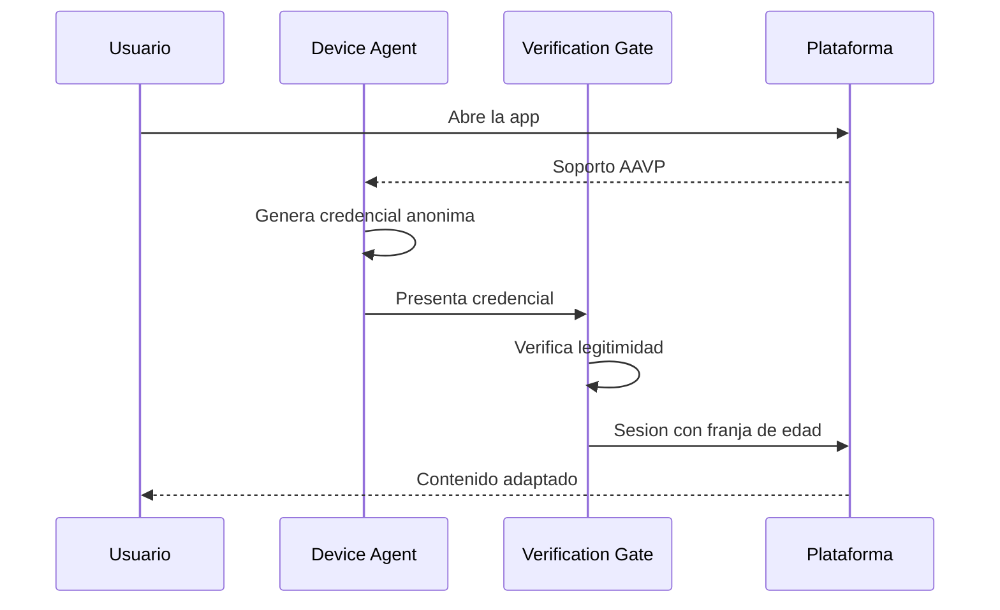
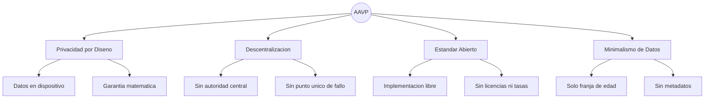
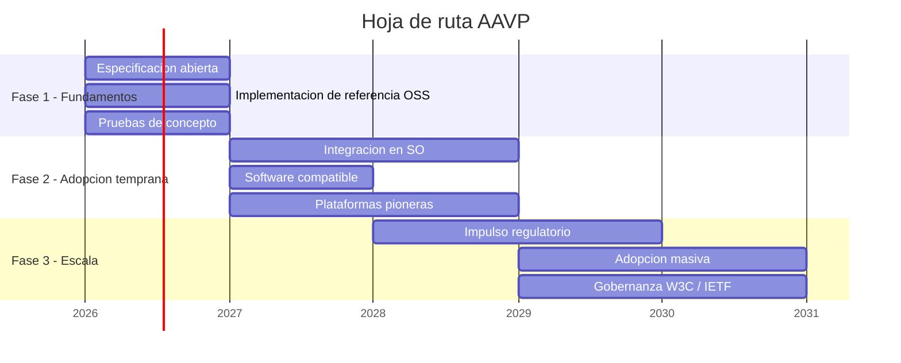

# AAVP — Anonymous Age Verification Protocol

> **White Paper v0.2.0 — Febrero 2026**
>
> Un protocolo abierto y descentralizado para la verificación anónima de edad en plataformas digitales.

---

> [!NOTE]
> **Principio fundamental:** Es posible transmitir una señal fiable de franja de edad a las plataformas digitales sin recopilar datos personales, sin identificación del usuario y sin posibilidad de rastreo inverso.

---

## Índice

- [1. El problema](#1-el-problema)
- [2. La propuesta](#2-la-propuesta)
- [3. Cómo funciona](#3-como-funciona)
- [4. Principios de diseño](#4-principios-de-diseno)
- [5. Comparativa con soluciones actuales](#5-comparativa-con-soluciones-actuales)
- [6. Compatibilidad regulatoria](#6-compatibilidad-regulatoria)
- [7. Hoja de ruta](#7-hoja-de-ruta)
- [8. Limitaciones](#8-limitaciones)
- [9. Conclusión](#9-conclusion)
- [Especificación técnica](#especificacion-tecnica)

---

## 1. El problema

Las plataformas digitales necesitan saber si un usuario es menor de edad para adaptar su contenido. Hoy, las soluciones disponibles obligan a elegir entre proteger a los menores y proteger la privacidad de todos:

- **Subir un documento de identidad** crea bases de datos de documentos sensibles que se convierten en objetivos para atacantes. Un DNI filtrado no puede "revocarse" como una contraseña.
- **El reconocimiento facial** recopila datos biométricos — la categoría más protegida por la ley — y presenta sesgos documentados por género, etnia e iluminación.
- **Vincular una tarjeta de crédito** asocia la identidad financiera del usuario con su actividad en plataformas, y además los menores ya pueden tener tarjetas prepago.
- **La autodeclaración** ("tengo más de 18 años") es trivialmente eludible. Ningún menor que desee acceder a un contenido se detiene ante una casilla de verificación.

> [!IMPORTANT]
> La tensión entre verificar la edad y proteger la privacidad **no es una limitación fundamental**: es un artefacto del diseño actual de los sistemas. Es posible transmitir una señal fiable de edad sin transmitir ningún dato que identifique al usuario.

---

## 2. La propuesta

AAVP propone un mecanismo análogo a cómo un portero de discoteca comprueba que tienes edad suficiente: verifica un dato concreto (la franja de edad) sin necesitar saber tu nombre, tu dirección ni ningún otro dato personal.

El protocolo funciona así a grandes rasgos:

1. **El dispositivo del menor genera una credencial anónima de edad** — un sello digital que dice "este usuario tiene entre 13 y 15 años" y nada más. Sin nombre, sin identificador, sin posibilidad de rastreo.
2. **Cuando el menor accede a una plataforma compatible**, el dispositivo presenta el sello.
3. **La plataforma verifica que el sello es legítimo** (que proviene de un software fiable) y adapta el contenido según la franja de edad.
4. **El sello se destruye y se regenera** cada pocas horas, para que nadie pueda usarlo como identificador persistente.

La clave criptográfica: el software que emite el sello **puede certificar que es auténtico sin saber qué contiene**. Ni siquiera el proveedor del software puede vincular un sello con un usuario concreto.

### Franjas de edad

AAVP no transmite una edad exacta, sino una franja mínima:

| Franja | Rango de edad |
|--------|---------------|
| Infantil | Menor de 13 |
| Adolescente temprano | Entre 13 y 15 |
| Adolescente tardío | Entre 16 y 17 |
| Adulto | Mayor de 18 |

---

## 3. Cómo funciona

### Roles del sistema

AAVP define tres roles claramente diferenciados:

| Rol | Qué es | Qué hace |
|-----|--------|----------|
| **Device Agent** | Un componente de software en el dispositivo del menor que implementa el protocolo AAVP. | Genera y gestiona las credenciales anónimas de edad. |
| **Verification Gate** | Un punto de entrada en la plataforma digital. | Verifica la credencial y establece la sesión con la franja de edad. |
| **Implementador** | La organización que desarrolla software conforme al estándar AAVP. | Publica su código, mantiene sus claves públicas y cumple la especificación. |

> [!TIP]
> **Nota importante:** El Device Agent es un **rol definido por el protocolo**, no un producto concreto. Puede ser implementado por un sistema de control parental (como los que ya existen), por un componente nativo del sistema operativo, o por cualquier otro software que cumpla la especificación. Lo relevante es que gestiona las credenciales de edad de forma local y anónima.

### Configuración inicial (una sola vez)

Este es el único paso que requiere intervención de los padres o tutores:

1. Se activa la funcionalidad AAVP en el dispositivo del menor (a través del control parental del sistema operativo, una aplicación de control parental, u otro software compatible).
2. El software genera claves criptográficas locales en el almacenamiento seguro del dispositivo.
3. Se configura la franja de edad del menor.

A partir de aquí, todo es automático y transparente.

### Acceso a una plataforma (cada sesión)

1. El usuario abre una aplicación o sitio web.
2. El Device Agent detecta que la plataforma soporta AAVP.
3. Genera una credencial anónima y la presenta al Verification Gate.
4. La plataforma verifica la credencial y adapta el contenido.
5. La credencial se renueva automáticamente cada pocas horas.

**El usuario no percibe nada de este proceso.** Es completamente transparente.

---

## 4. Principios de diseño

AAVP se construye sobre cuatro principios no negociables. Cualquier implementación que comprometa alguno de ellos no es conforme con el protocolo.

### Privacidad por Diseño

Ningún dato personal identificable abandona el dispositivo del usuario. La señal de edad es una afirmación criptográfica anónima, no un dato personal. Esto no es una política de privacidad: es una **garantía matemática**. Ni siquiera con recursos computacionales ilimitados es posible vincular una credencial AAVP con la identidad de un usuario.

### Descentralización

No existe una autoridad central que certifique, autorice o controle el acceso al protocolo. Cada plataforma decide de forma independiente en qué implementadores confía, de forma similar a cómo los servidores de correo deciden qué remitentes son fiables.

Esto elimina tres riesgos críticos:
- **Incentivos perversos:** nadie tiene poder de veto sobre quién participa.
- **Punto único de fallo:** no hay "la autoridad" que comprometer.
- **Captura regulatoria:** un gobierno no puede presionar a una entidad que no existe.

### Estándar Abierto

La especificación es pública y libre. Cualquier organización puede desarrollar software que actúe como Device Agent, y cualquier plataforma puede verificar credenciales AAVP, sin licencias, tasas ni permisos. La única barrera es técnica: implementar correctamente la especificación. Esto es análogo a cómo cualquier servidor puede implementar SMTP para enviar correo.

### Minimalismo de Datos

La credencial transmite exclusivamente una franja de edad. No contiene — ni puede contener — identidad del usuario, identificador de dispositivo, dirección IP, ubicación, versión de software ni sistema operativo. Cada dato adicional sería un vector potencial de rastreo.

---

## 5. Comparativa con soluciones actuales

| Criterio | AAVP | DNI / Pasaporte | Biometría facial | Tarjeta de crédito | Autodeclaración |
|----------|:----:|:---------------:|:----------------:|:------------------:|:---------------:|
| **Privacidad** | Alta | Muy baja | Muy baja | Baja | Alta |
| **Fiabilidad** | Alta | Alta | Media | Media | Nula |
| **Descentralizado** | Sí | No | No | No | Sí |
| **Riesgo de filtración** | Mínimo | Crítico | Crítico | Alto | Ninguno |
| **Compatible con RGPD** | Sí | No | No | No | Sí |

---

## 6. Compatibilidad regulatoria

AAVP está diseñado para encajar en los marcos regulatorios existentes y emergentes:

| Regulación | Compatibilidad con AAVP |
|------------|------------------------|
| **RGPD / GDPR** | Al no procesar datos personales, minimiza las obligaciones regulatorias. No requiere consentimiento específico para la señal de edad. |
| **Digital Services Act (DSA)** | Proporciona la señal técnica de protección de menores que la DSA exige, sin crear sistemas de vigilancia. |
| **COPPA (EE.UU.)** | Identifica menores de 13 sin recopilar datos personales de menores. |
| **Age Appropriate Design Code (UK)** | Proporciona la señal para adaptar la experiencia según la edad, compatible con el enfoque de "diseño apropiado para la edad". |

---

## 7. Hoja de ruta

---

## 8. Limitaciones

AAVP no pretende ser una solución completa. Es importante ser transparentes:

- **Dispositivos no controlados:** Si un menor accede desde un dispositivo sin software compatible con AAVP, el protocolo no puede protegerle. AAVP protege las puertas, no las ventanas.
- **Calidad de la implementación:** Como cualquier protocolo criptográfico, una implementación deficiente puede anular las garantías teóricas.
- **Complemento, no sustituto:** AAVP es una herramienta técnica que complementa la educación digital y la supervisión familiar. No las reemplaza.

---

## 9. Conclusión

La protección de menores en el entorno digital no tiene por qué venir a costa de la privacidad de todos los usuarios. Los bloques criptográficos necesarios existen y están probados. Lo que falta es la voluntad de articularlos en un estándar común.

AAVP demuestra que es técnicamente viable construir un sistema de verificación de edad que sea simultáneamente fiable, anónimo, descentralizado y compatible con los marcos regulatorios existentes.

> [!IMPORTANT]
> Invitamos a la comunidad técnica, a los reguladores, a las empresas de software y a las plataformas digitales a contribuir a la evolución de AAVP hacia un estándar robusto, auditable y verdaderamente protector tanto de los menores como de la privacidad de todos.

---

## Especificación técnica

La descripción técnica completa del protocolo — arquitectura, fundamentos criptográficos, estructura del token, modelo de amenazas y flujo operativo detallado — se encuentra en [PROTOCOL.md](PROTOCOL.md).

---

**AAVP** · Anonymous Age Verification Protocol · v0.2.0

*Documento de trabajo — Sujeto a revisión*

