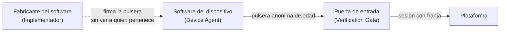
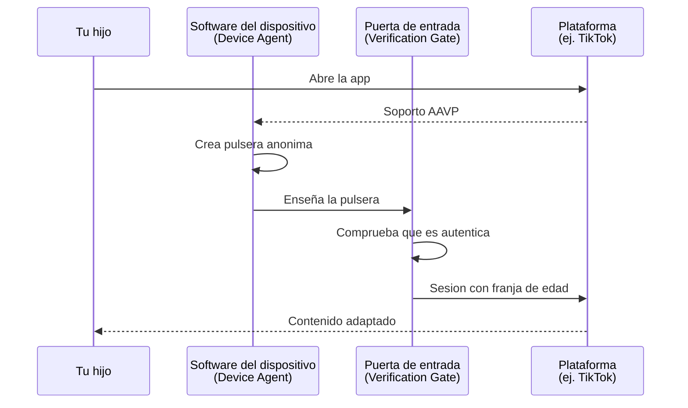
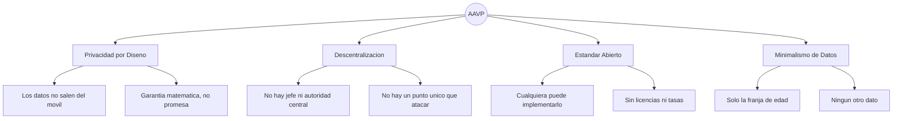
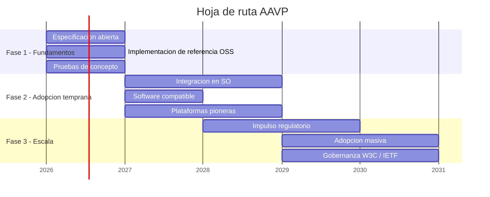

# AAVP — Anonymous Age Verification Protocol

> **White Paper v0.8.1 — Febrero 2026**
>
> Un protocolo abierto y descentralizado para la verificación anónima de edad en plataformas digitales.

---

> [!NOTE]
> **Principio fundamental:** Es posible que las plataformas digitales sepan si un usuario es menor o adulto sin necesidad de conocer su nombre, su cara ni ningún otro dato personal.

---

## Índice

- [1. El problema](#1-el-problema)
- [2. La propuesta](#2-la-propuesta)
- [3. Cómo funciona](#3-como-funciona)
- [4. Principios de diseño](#4-principios-de-diseno)
- [5. Comparativa con soluciones actuales](#5-comparativa-con-soluciones-actuales)
- [6. Compatibilidad regulatoria](#6-compatibilidad-regulatoria)
- [7. Hoja de ruta](#7-hoja-de-ruta)
- [8. Limitaciones](#8-limitaciones)
- [9. Preguntas frecuentes](#9-preguntas-frecuentes)
- [10. Conclusión](#10-conclusion)
- [Especificación técnica](#especificacion-tecnica)

---

## 1. El problema

Las plataformas digitales necesitan saber si un usuario es menor de edad para adaptar su contenido. Hoy, las soluciones disponibles obligan a elegir entre proteger a los menores y proteger la privacidad de todos:

- **Subir un documento de identidad** crea almacenes de documentos que los hackers intentan robar. Un DNI filtrado no puede "revocarse" como una contraseña.
- **El reconocimiento facial** exige entregar una foto de tu cara — el dato más protegido por la ley — y además funciona peor con determinados tonos de piel.
- **Vincular una tarjeta de crédito** asocia la identidad financiera del usuario con su actividad en plataformas, y además los menores ya pueden tener tarjetas prepago.
- **La autodeclaración** ("tengo más de 18 años") no funciona. Ningún menor que desee acceder a un contenido se detiene ante una casilla de verificación.

> [!IMPORTANT]
> La tensión entre verificar la edad y proteger la privacidad **no es inevitable**: es una consecuencia de cómo están hechos los sistemas actuales. Es posible que una plataforma sepa la franja de edad de un usuario sin saber nada más sobre él.

---

## 2. La propuesta

AAVP propone un mecanismo análogo a cómo un portero de discoteca comprueba que tienes edad suficiente: verifica un dato concreto (la franja de edad) sin necesitar saber tu nombre, tu dirección ni ningún otro dato personal.

Imagina que cada vez que tu hijo entra en una plataforma digital, le ponen una **pulsera de color** — como las del cine o un festival — que indica su franja de edad. La plataforma ve el color de la pulsera (por ejemplo, "entre 13 y 15 años") y adapta el contenido. Pero la pulsera no lleva nombre, no tiene código de barras ni ningún dato que permita saber quién la lleva.

El protocolo funciona así a grandes rasgos:

1. **El dispositivo del menor crea una pulsera anónima de edad** — una credencial digital que dice "este usuario tiene entre 13 y 15 años" y nada más. Sin nombre, sin identificador, sin posibilidad de rastreo.
2. **Cuando el menor accede a una plataforma compatible**, el dispositivo enseña la pulsera.
3. **La plataforma comprueba que la pulsera es legítima** (que proviene de un software fiable) y adapta el contenido según la franja de edad.
4. **La pulsera se destruye y se cambia por una nueva** cada pocas horas, para que nadie pueda usarla como identificador persistente.

Pero, ¿cómo puede una pulsera ser legítima sin que nadie sepa a quién pertenece? Aquí viene la parte ingeniosa. Imagina un **sobre opaco con papel carbón**: tu hijo mete la pulsera dentro del sobre y se lo entrega a un notario. El notario firma encima del sobre sin poder ver lo que hay dentro, pero gracias al papel carbón la firma queda marcada en la pulsera. Cuando tu hijo saca la pulsera del sobre, esta lleva la firma del notario — lo que demuestra que es auténtica — pero el notario nunca llegó a verla. Esto, en el mundo de la criptografía, se llama **firma parcialmente ciega**, y es lo que permite que la credencial sea verificable sin ser rastreable.

### Franjas de edad

AAVP no transmite una edad exacta, sino una franja mínima:

| Franja | Rango de edad |
|--------|---------------|
| Infantil | Menor de 13 |
| Adolescente temprano | Entre 13 y 15 |
| Adolescente tardío | Entre 16 y 17 |
| Adulto | Mayor de 18 |

---

## 3. Cómo funciona

### Roles del sistema

AAVP define tres roles claramente diferenciados:

| Rol | Qué es | Qué hace | Ejemplo |
|-----|--------|----------|---------|
| **Device Agent** (DA) | El software que vive en el dispositivo del menor y gestiona las pulseras de edad. | Crea las credenciales anónimas, las presenta a las plataformas y las renueva periódicamente. | Un componente integrado en iOS o Android, un sistema de control parental, o cualquier aplicación compatible. |
| **Verification Gate** (VG) | La puerta de entrada de una plataforma digital. | Comprueba que la pulsera es legítima y le dice a la plataforma la franja de edad del usuario. | El sistema de acceso de TikTok, YouTube o cualquier plataforma que adopte AAVP. |
| **Implementador** (IM) | La empresa u organización que fabrica el software. Como un fabricante de cerraduras: diseña y mantiene las piezas, pero no controla quién abre cada puerta. | Publica su software, mantiene sus claves públicas y cumple la especificación. | Apple, Google, un desarrollador de software de control parental, o cualquier empresa que cree software compatible. |

> [!TIP]
> **Nota importante:** El Device Agent es una **función que puede cumplir cualquier software**, no un producto concreto. Puede ser parte de las herramientas de familia de Apple o Google, un sistema de control parental independiente, o cualquier otro software que cumpla las reglas de AAVP. Lo relevante es que gestiona las credenciales de edad de forma local y anónima.

### Configuración inicial (una sola vez)

Este es el único paso que requiere intervención de los padres o tutores:

1. Se activa la funcionalidad AAVP en el dispositivo del menor (a través del control parental del sistema operativo, una aplicación de control parental, u otro software compatible).
2. El software genera unas claves que quedan guardadas en el dispositivo y nunca salen de él — como la combinación de una caja fuerte que solo existe en tu casa.
3. Se configura la franja de edad del menor.

A partir de aquí, todo es automático y transparente.

### Acceso a una plataforma (cada sesión)

1. Tu hijo abre una aplicación o sitio web.
2. El software del dispositivo (Device Agent) detecta que la plataforma soporta AAVP.
3. Crea una pulsera anónima de edad y la presenta a la puerta de entrada (Verification Gate).
4. La plataforma comprueba la pulsera y adapta el contenido. Por ejemplo, si tu hijo tiene 14 años y entra en TikTok, la plataforma sabe que es un adolescente temprano y puede limitar ciertos contenidos o desactivar los mensajes directos con desconocidos.
5. La pulsera se renueva automáticamente cada pocas horas.

**Tu hijo no percibe nada de este proceso.** Es completamente transparente.

---

## 4. Principios de diseño

AAVP se construye sobre cuatro principios no negociables. Si un software no cumple alguno de ellos, no es AAVP.

### Privacidad por Diseño

Ningún dato personal identificable abandona el dispositivo del usuario. La credencial de edad no contiene ningún dato personal: es una pulsera de color, no un carné de identidad. Muchos servicios prometen proteger tu privacidad en sus políticas — textos legales que nadie lee y que pueden cambiar en cualquier momento. AAVP es diferente: los datos personales sencillamente **no están ahí**. Es una **garantía matemática**: ni siquiera con recursos computacionales ilimitados es posible vincular una credencial AAVP con la identidad de un usuario. Es como si fuera físicamente imposible escribir un nombre en la pulsera.

### Descentralización

No existe una autoridad central que certifique, autorice o controle el acceso al protocolo. Cada plataforma decide de forma independiente en qué implementadores confía. Es como los idiomas: nadie es dueño del español, nadie puede prohibirte hablarlo y nadie necesita un permiso para enseñarlo.

Esto elimina tres riesgos:
- **Nadie tiene poder de veto** sobre quién participa.
- **No hay un punto único que atacar:** no existe "la sede central" que comprometer.
- **Ningún gobierno puede presionar** a una entidad que no existe.

### Estándar Abierto

La especificación es pública y libre. Cualquier organización puede desarrollar software que actúe como Device Agent, y cualquier plataforma puede verificar credenciales AAVP, sin licencias, tasas ni permisos. La única barrera es técnica: implementar correctamente la especificación. Es como el correo electrónico: Gmail, Outlook y Yahoo son empresas diferentes, pero todas usan las mismas reglas para enviarse mensajes entre sí.

### Minimalismo de Datos

La credencial transmite exclusivamente una franja de edad. No contiene — ni puede contener — identidad del usuario, identificador de dispositivo, dirección IP, ubicación, versión de software ni sistema operativo. Cada dato adicional sería una pista que alguien podría usar para identificar o rastrear al usuario.

---

## 5. Comparativa con soluciones actuales

Piensa en un portero de discoteca. Su trabajo es comprobar que tienes edad suficiente para entrar. Hay muchas formas de hacerlo: puede pedirte el DNI, hacerte una foto, exigirte una tarjeta de crédito, o simplemente preguntarte y fiarse de tu respuesta. Cada método tiene un equilibrio distinto entre fiabilidad y privacidad. AAVP es como un portero que puede comprobar tu edad con solo ver la pulsera que llevas, sin necesidad de saber quién eres.

| Criterio | AAVP | DNI / Pasaporte | Biometría facial | Tarjeta de crédito | Autodeclaración |
|----------|:----:|:---------------:|:----------------:|:------------------:|:---------------:|
| **Privacidad** | Alta | Muy baja | Muy baja | Baja | Alta |
| **Fiabilidad** | Alta | Alta | Media | Media | Nula |
| **Descentralizado** | Sí | No | No | No | Sí |
| **Riesgo de filtración** | Mínimo | Crítico | Crítico | Alto | Ninguno |
| **Compatible con RGPD** | Sí | No | No | No | Sí |

---

## 6. Compatibilidad regulatoria

AAVP está diseñado para encajar en los marcos regulatorios que ya existen o que están en proceso de aprobación:

| Regulación | Compatibilidad con AAVP |
|------------|------------------------|
| **RGPD** (Reglamento General de Protección de Datos, Europa) | Al no procesar datos personales, minimiza las obligaciones regulatorias. No requiere consentimiento específico para la señal de edad. |
| **DSA** (Digital Services Act, Europa) | Proporciona la señal de protección de menores que la DSA exige, sin crear sistemas de vigilancia. |
| **COPPA** (Children's Online Privacy Protection Act, EE.UU.) | Identifica menores de 13 sin recopilar datos personales de menores. |
| **Age Appropriate Design Code** (Reino Unido) | Proporciona la señal para adaptar la experiencia según la edad, compatible con el enfoque de "diseño apropiado para la edad". |

---

## 7. Hoja de ruta

---

## 8. Limitaciones

AAVP no pretende ser una solución completa. Es importante ser transparentes:

- **Dispositivos no controlados:** Si un menor accede desde un dispositivo sin software compatible con AAVP, el protocolo no puede protegerle. AAVP protege las puertas, no las ventanas: si alguien entra por otro lado, la cerradura no sirve.
- **Calidad de la implementación:** Una cerradura bien diseñada puede fallar si está mal instalada. Del mismo modo, un software que implemente AAVP de forma deficiente puede anular las garantías del protocolo. Por eso la especificación es detallada y la verificación rigurosa.
- **Complemento, no sustituto:** AAVP es una herramienta técnica que complementa la educación digital y la supervisión familiar. No las reemplaza.

---

## 9. Preguntas frecuentes

**¿Tienen que instalar algo mis hijos?**
Depende de cómo lo implemente el fabricante del dispositivo. Lo más probable es que venga integrado en el sistema operativo (como las herramientas de familia de Apple o Google) y solo haga falta activarlo. En otros casos, podría ser una aplicación de control parental que ya tengas instalada.

**¿Puede una plataforma saber quién es mi hijo?**
No. La credencial que recibe la plataforma es como una pulsera de color: indica la franja de edad, pero no lleva nombre, foto ni ningún otro dato personal. Matemáticamente, es imposible vincular la credencial con la identidad de tu hijo.

**¿Y si mi hijo usa el ordenador de un amigo?**
AAVP solo funciona en dispositivos donde esté configurado. Si tu hijo usa un dispositivo ajeno sin software AAVP, la plataforma no recibirá la señal de edad. AAVP protege las puertas, no las ventanas.

**¿Quién controla AAVP?**
Nadie. AAVP es un protocolo abierto, como el correo electrónico. No hay una empresa detrás, ni una autoridad que lo gobierne. Cualquiera puede implementarlo y nadie necesita permiso para hacerlo.

**¿Es gratis?**
El protocolo es libre y gratuito. Cualquier empresa puede implementarlo sin pagar licencias ni tasas. El coste para los usuarios dependerá del software concreto que utilicen, pero la especificación en sí no impone ningún coste.

---

## 10. Conclusión

La protección de menores en el entorno digital no tiene por qué venir a costa de la privacidad de todos los usuarios. Las herramientas técnicas necesarias existen y están probadas. Lo que falta es la voluntad de organizarlas en un estándar común — como en su día se hizo con el correo electrónico o los pagos con tarjeta.

AAVP demuestra que es técnicamente viable construir un sistema de verificación de edad que sea simultáneamente fiable, anónimo, descentralizado y compatible con los marcos regulatorios existentes.

> [!IMPORTANT]
> Invitamos a la comunidad técnica, a los reguladores, a las empresas de software y a las plataformas digitales a contribuir a la evolución de AAVP hacia un estándar robusto, auditable y verdaderamente protector tanto de los menores como de la privacidad de todos.

---

## Especificación técnica

La descripción técnica completa del protocolo — arquitectura, fundamentos criptográficos, estructura del token, modelo de amenazas y flujo operativo detallado — se encuentra en [PROTOCOL.md](PROTOCOL.md).

---

**AAVP** · Anonymous Age Verification Protocol · v0.8.1

*Documento de trabajo — Sujeto a revisión*

