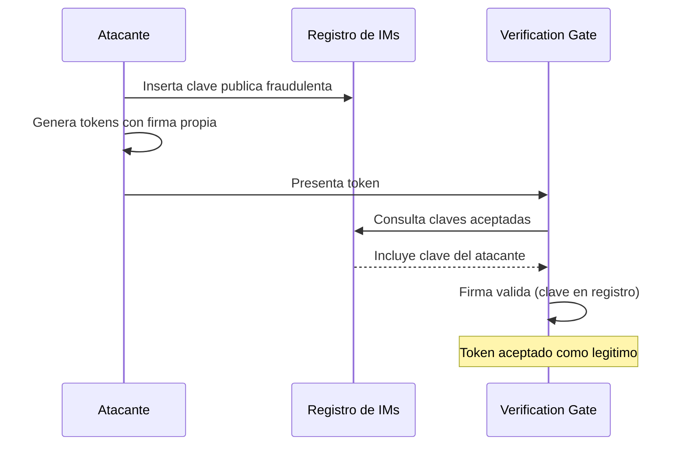
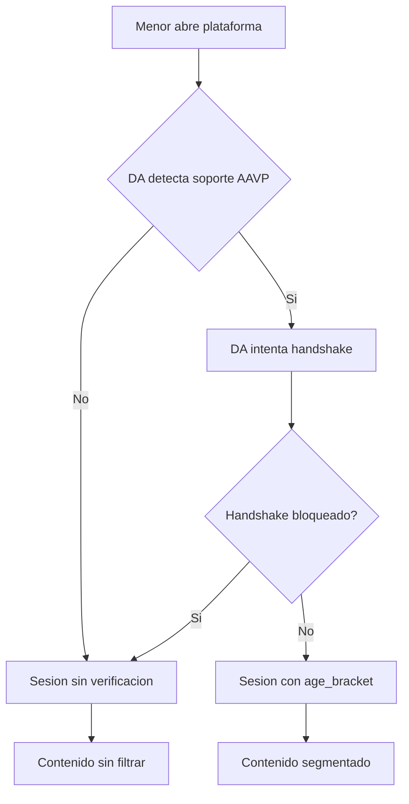
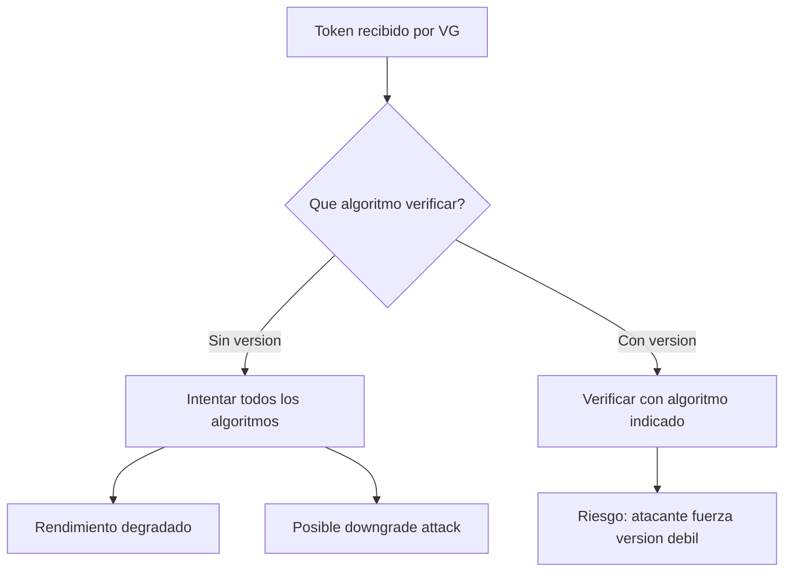
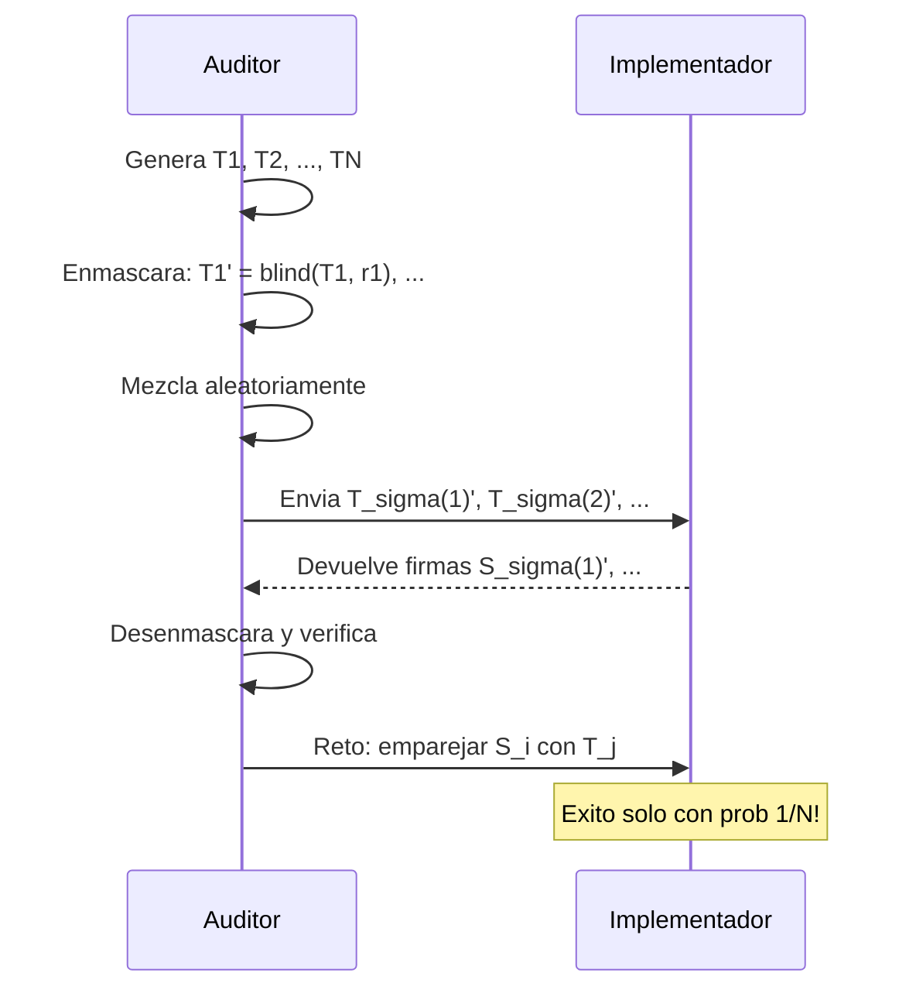
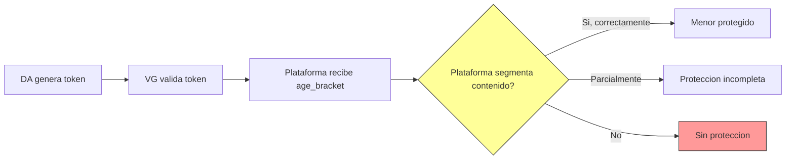
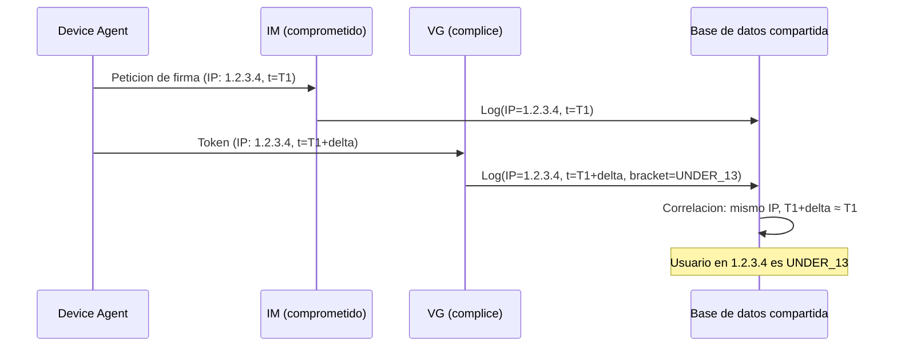
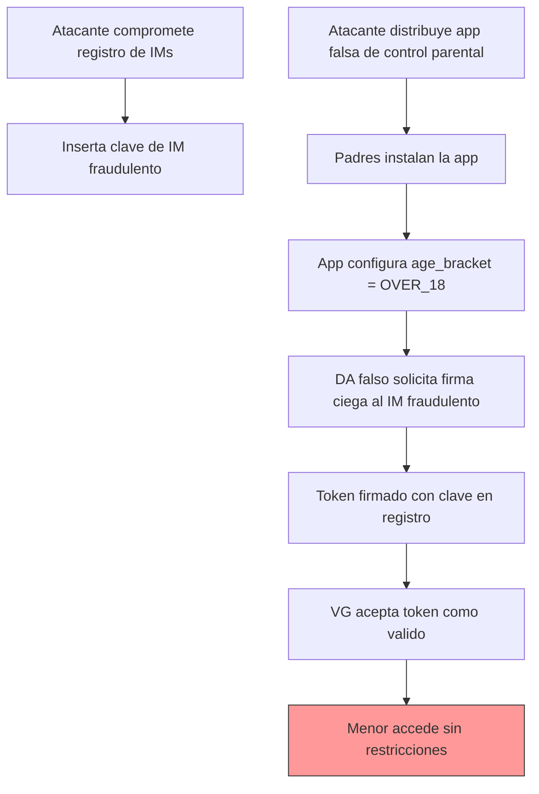

# AAVP — Estudio de Vulnerabilidades y Análisis de Seguridad

> **v0.5.0 — Documento de trabajo — Febrero 2026**
>
> Análisis exhaustivo de seguridad del Anonymous Age Verification Protocol. Para la especificación técnica, consultar [PROTOCOL.md](PROTOCOL.md). Para una introducción accesible, consultar [README.md](README.md).

---

## Índice

- [Resumen ejecutivo de vulnerabilidades](#resumen-ejecutivo-de-vulnerabilidades)
- [1. Supuestos de seguridad](#1-supuestos-de-seguridad)
- [2. Vectores de ataque no documentados](#2-vectores-de-ataque-no-documentados)
- [3. Análisis de esquemas criptográficos](#3-análisis-de-esquemas-criptográficos)
- [4. Vulnerabilidades de la estructura del token](#4-vulnerabilidades-de-la-estructura-del-token)
- [5. Modelo de implementación para plataformas (VG)](#5-modelo-de-implementación-para-plataformas-vg)
- [6. Protocolo de auditoría de implementaciones](#6-protocolo-de-auditoría-de-implementaciones)
- [7. Verificación de la segmentación de contenido](#7-verificación-de-la-segmentación-de-contenido)
- [8. Escenarios de ataque compuestos](#8-escenarios-de-ataque-compuestos)
- [9. Recomendaciones y trabajo pendiente](#9-recomendaciones-y-trabajo-pendiente)

---

## Resumen ejecutivo de vulnerabilidades

> [!IMPORTANT]
> **Este documento es una hoja de ruta viva.** AAVP está en fase de borrador (v0.x) y su modelo de seguridad evoluciona con cada iteración de la especificación. Las evaluaciones de esta sección se actualizan a medida que PROTOCOL.md incorpora mitigaciones. El objetivo no es declarar el protocolo "seguro" o "inseguro", sino identificar con precisión dónde hay que trabajar.

### Estado general de seguridad del protocolo

| Área | Estado | Vulnerabilidades abiertas | Resumen |
|------|:------:|--------------------------|---------|
| **Estructura del token** | 🟡 | 1 media (abierta), 5 resueltas | Formato binario fijo de 331 bytes definido. Campo `token_type` para agilidad criptográfica. Canonicalización implícita. `issued_at` eliminado. Pendiente: especificar API criptográfica del SO para calidad del nonce (T-4.6). |
| **Modelo de confianza (registro de IMs)** | 🔴 | 3 críticas | El registro de Implementadores no tiene mecanismo definido, ni procedimiento de revocación, ni protección contra envenenamiento. Pilar fundamental sin especificar. |
| **Criptografía (firmas parcialmente ciegas)** | 🟡 | 1 alta (futura) | Esquema seleccionado: RSAPBSSA-SHA384 (RFC 9474 + draft-irtf-cfrg-partially-blind-rsa). Campo `token_type` permite migración post-cuántica. Sin riesgo inmediato. |
| **Protección del dispositivo** | 🟡 | 3 críticas/altas | Los supuestos sobre integridad del dispositivo (root/jailbreak, TEE, PIN parental) son razonables pero frágiles. Mitigaciones parciales disponibles con tradeoffs. |
| **Gestión de sesiones (VG)** | 🔴 | 3 altas | Comportamiento post-handshake no especificado: qué almacenar, cuánto tiempo, qué hacer sin token. Cada plataforma improvisa. |
| **Segmentación de contenido** | 🔴 | 1 alta | AAVP entrega la señal pero no define cómo verificar que las plataformas la usan. Sin framework de auditoría, la eficacia real es desconocida. |
| **Resistencia a análisis de tráfico** | 🟡 | 1 media, 1 resuelta | Canal DA-IM especificado (TLS 1.3 + CT). Fuga residual de metadatos de red (IP, timing) mitigable con OHTTP opcional. |

| | Significado |
|:---:|-------------|
| 🔴 | Carencias de especificación críticas que impiden implementaciones seguras e interoperables. Requiere trabajo antes del Internet-Draft. |
| 🟡 | Riesgos identificados con mitigaciones viables propuestas o parcialmente implementadas. Aceptable para la fase actual de borrador. |
| 🟢 | Garantías criptográficas sólidas y especificación suficiente. Ninguna área alcanza este nivel todavía. |

**Distribución actual:** 3 áreas en rojo, 4 en amarillo, 0 en verde. La adopción de Partially Blind RSA y la definición del formato binario del token (331 bytes) resuelven las carencias críticas de la estructura del token. Quedan pendientes el registro de IMs y la gestión de sesiones.

---

Esta tabla consolida todas las debilidades, vectores de ataque y carencias de especificación identificados en este documento. Para cada entrada se indica la sección donde se analiza en profundidad, las precondiciones necesarias para la explotación, la severidad y las mitigaciones propuestas.

### Supuestos frágiles y carencias de especificación

| ID | Problema | Sección | Precondiciones | Severidad | Mitigación propuesta |
|----|----------|---------|----------------|-----------|---------------------|
| S2 | Hardware seguro (Enclave/TPM) no disponible o vulnerable en dispositivos de gama baja | [1.1](#s2-secure-enclave--tpm--strongbox-protegen-las-claves-del-da) | Dispositivo sin TEE certificado o con TEE vulnerable (CVEs conocidos en TrustZone) | Crítica | Requerir operaciones criptográficas dentro del enclave; *key attestation*; rotación periódica de claves del DA |
| S6 | Auditoría de código abierto insuficiente para prevenir IMs maliciosos | [1.1](#s6-la-auditoría-de-código-abierto-previene-implementadores-maliciosos) | IM publica código conforme pero ejecuta versión modificada en producción | Crítica | *Reproducible builds*; atestación de binario; auditorías periódicas con test de caja negra |
| S7 | PIN parental fácilmente eludible | [1.1](#s7-pin-parental-o-protección-a-nivel-de-so-impide-la-desactivación-por-el-menor) | Menor observa el PIN (*shoulder surfing*) o manipula al padre | Alta | Autenticación biométrica del SO; *cooldown* de 24h tras cambio de franja; notificaciones proactivas |
| S8 | Dispositivo comprometido (root/jailbreak) no documentado como supuesto | [1.2](#s8-el-dispositivo-no-está-comprometido-a-nivel-de-so-root--jailbreak) | Dispositivo rooteado (~2-5% de Android) | Crítica | *Device attestation*; documentar el supuesto en PROTOCOL.md |
| S9 | ~~Canal DA-IM no especificado~~ | [1.2](#s9-el-canal-entre-da-e-im-es-confidencial-e-íntegro) | ~~Atacante con posición de red entre DA e IM~~ | ~~Media~~ **Resuelta** | Canal DA-IM especificado en PROTOCOL.md: TLS 1.3 + CT. OHTTP recomendado como medida opcional de máxima privacidad |
| S10 | ~~Tolerancia de reloj (*clock skew*) no definida~~ | [1.2](#s10-los-relojes-del-da-y-el-vg-están-razonablemente-sincronizados) | ~~Reloj del dispositivo manipulado (posible sin privilegios)~~ | ~~Media~~ **Resuelta** | Tolerancia asimétrica definida en PROTOCOL.md: 300s pasado, 60s futuro. Coherente con Kerberos (RFC 4120) y JWT (RFC 7519) |
| S11 | Registro de IMs sin mecanismo definido | [1.2](#s11-el-registro-de-implementadores-es-resistente-a-manipulación) | Compromiso del registro (credenciales, DNS poisoning, BGP hijack) | Crítica | Log *append-only* tipo CT; *grace period* de 72h; firma cruzada M-of-N |
| S12 | Segmentación de contenido no verificable | [1.2](#s12-las-plataformas-implementan-correctamente-la-política-de-segmentación) | Plataforma ignora o aplica mal la señal de `age_bracket` | Alta | Framework de auditoría; protocolo de certificación en 3 niveles; crawlers de verificación |
| S14 | Revocación de IMs sin mecanismo definido | [1.2](#s14-la-revocación-de-implementadores-se-propaga-a-tiempo) | IM comprometido sigue activo en plataformas que no actualizan | Alta | Definir mecanismo de revocación con TTL máximo de propagación |

### Vectores de ataque

| ID | Vector de ataque | Sección | Precondiciones | Severidad | Mitigación propuesta |
|----|-----------------|---------|----------------|-----------|---------------------|
| V-2.1 | Suplantación de `age_bracket` | [2.1](#21-suplantación-de-age_bracket) | DA comprometido (root, malware) o acceso al PIN parental | Crítica (parcialmente mitigada) | *Device attestation*; **Partially Blind RSA adoptado**: el IM puede verificar coherencia de `age_bracket` con la configuración del DA, actuando como segunda barrera; verificación de integridad del binario |
| V-2.2 | Colusión entre múltiples IMs | [2.2](#22-colusión-entre-múltiples-implementadores) | ≥2 IMs con acuerdo de intercambio de metadatos de firma | Alta | OHTTP para canal DA-IM; prohibir retención de logs; minimizar interacciones DA-IM |
| V-2.3 | *Timing side-channels* | [2.3](#23-timing-side-channels) | Observador con acceso a timestamps de presentación de tokens | Media | Rotación en momentos aleatorios (no intervalos fijos); jitter uniforme ±300s; VGs no logean timestamps exactos |
| V-2.4 | Ataque al registro de IMs | [2.4](#24-ataque-al-registro-de-implementadores) | Acceso de escritura al registro o envenenamiento del canal de distribución | Crítica | Log CT-like; *grace period* 72h; firma cruzada M-of-N; pinning de claves por VGs |
| V-2.5 | Exfiltración de claves del DA | [2.5](#25-exfiltración-de-claves-del-da) | Acceso físico al dispositivo o control remoto con root | Alta | Operaciones criptográficas dentro del enclave; *key attestation*; rotación semanal de claves |
| V-2.6 | Degradación de protocolo (*fail-open*) | [2.6](#26-degradación-de-protocolo) | Bloqueo selectivo del handshake AAVP (firewall, proxy, DNS sinkhole) | Alta | Política *fail-closed* (contenido restringido por defecto); señalización al usuario; directrices RFC 2119 para sesiones no verificadas |
| V-2.7 | Análisis de tráfico | [2.7](#27-análisis-de-tráfico) | Observador de red (ISP, estado) con visibilidad DA-IM y DA-VG | Media | *Traffic padding*; pre-firma de tokens; OHTTP (RFC 9458) para DA-IM |
| V-2.8 | *Token harvesting* | [2.8](#28-token-harvesting) | VG que retiene tokens completos (operador de plataforma popular) | Media | VG debe destruir token tras extraer `age_bracket`; tokens de un solo uso |
| V-2.9 | Manipulación del reloj del dispositivo | [2.9](#29-manipulación-del-reloj-del-dispositivo) | Capacidad de modificar hora del sistema (sin privilegios en la mayoría de SO) | Media | VG valida `expires_at` contra su propio reloj; rechazar tokens con `expires_at` excesivamente futuro |
| V-2.10 | *Social engineering* parental | [2.10](#210-social-engineering-parental) | Relación de confianza con los padres; capacidad persuasiva del menor | Alta | Autenticación fuerte (biometría del SO); *cooldown* 24h tras cambio de franja; notificaciones al padre |

### Vulnerabilidades de la estructura del token

| ID | Problema | Sección | Precondiciones | Severidad | Mitigación propuesta |
|----|----------|---------|----------------|-----------|---------------------|
| T-4.1 | ~~Formato de codificación no definido~~ | [4.1](#41-formato-de-codificación-no-definido) | ~~Dos implementaciones con codificaciones diferentes~~ | ~~Crítica~~ **Resuelta** | Formato binario fijo de 331 bytes definido en PROTOCOL.md |
| T-4.2 | ~~Tamaño fijo no especificado~~ | [4.2](#42-tamaño-fijo-no-especificado) | ~~Implementaciones con tokens de distinto tamaño por franja~~ | ~~Crítica~~ **Resuelta** | 331 bytes fijos especificados |
| T-4.3 | ~~Sin versionado de algoritmo~~ | [4.3](#43-versionado-del-algoritmo) | ~~Migración criptográfica futura (post-cuántica)~~ | ~~Alta~~ **Resuelta** | Campo `token_type` de 2 bytes incluido en el token |
| T-4.4 | ~~Sin canonicalización definida~~ | [4.4](#44-canonicalización) | ~~Misma estructura con codificaciones binarias diferentes~~ | ~~Alta~~ **Resuelta** | Formato fijo con offsets determinísticos; canonicalización implícita |
| T-4.5 | ~~Jitter de `issued_at` no cuantificado~~ | [4.5](#45-precisión-del-timestamp-y-jitter) | ~~Jitter insuficiente o predecible permite correlación temporal~~ | ~~Alta~~ **Resuelta** | `issued_at` eliminado. `expires_at` con precisión gruesa (redondeo a la hora) |
| T-4.6 | Calidad de la fuente de aleatoriedad del nonce | [4.6](#46-espacio-del-nonce-análisis-de-birthday-attack) | DA usa PRNG débil (espacio efectivo ≪ 256 bits) | Media | Requerir API criptográfica del SO; test de entropía en auditoría de conformidad |

### Carencias del modelo de implementación

| ID | Problema | Sección | Precondiciones | Severidad | Mitigación propuesta |
|----|----------|---------|----------------|-----------|---------------------|
| I-5.1 | Descubrimiento de servicio vulnerable | [5.1](#51-descubrimiento-del-servicio) | DNS spoofing o proxy TLS malicioso | Media | `.well-known/aavp` como primario (con TLS); DNS como fallback; DNSSEC |
| I-5.2 | Gestión de sesiones post-handshake no especificada | [5.2](#52-gestión-de-sesiones-post-handshake) | VG almacena token completo o sesión excede TTL del token | Alta | Exigir descarte del token tras validación; sesión ≤ TTL del token |
| I-5.3 | Política de contenido no verificado ausente | [5.3](#53-política-de-contenido-no-verificado) | Plataforma permite acceso sin restricciones a sesiones sin token | Alta | Directrices RFC 2119: *fail-closed* (SHOULD), señalización (MUST), contenido explícito sin token (MUST NOT) |
| I-5.4 | Impacto en latencia del handshake | [5.4](#542-impacto-en-latencia) | Conexiones lentas (3G); primera sesión | Media | Pre-firma de tokens en background; VG como middleware en edge |

### Escenarios de ataque compuestos

| ID | Escenario | Sección | Vectores combinados | Severidad | Mitigación propuesta |
|----|-----------|---------|---------------------|-----------|---------------------|
| C-A | IM comprometido + plataforma cómplice | [8.1](#81-escenario-a-im-comprometido--plataforma-cómplice) | Correlación de metadatos de red entre IM y VG por IP + timing | Crítica | Pre-firma temporal; OHTTP para DA-IM; auditorías cruzadas |
| C-B | Dispositivo rooteado + replay de tokens | [8.2](#82-escenario-b-dispositivo-rooteado--replay-de-tokens) | Extracción de claves del TEE emulado + generación de tokens arbitrarios | Crítica | *Device attestation*; *key attestation*; rotación forzada con verificación |
| C-C | Registro envenenado + phishing parental | [8.3](#83-escenario-c-ataque-al-registro-de-ims--phishing-parental) | IM fraudulento en registro + app falsa de control parental | Crítica | *Grace period* 72h; KYC organizacional; verificación en tiendas de apps |
| C-D | Análisis de tráfico + correlación temporal | [8.4](#84-escenario-d-análisis-de-tráfico--correlación-temporal) | Observación de flujos DA-IM y DA-VG sin comprometer componentes | Media | Pre-firma; *traffic mixing*; OHTTP (RFC 9458) |

### Debilidades criptográficas transversales

| ID | Problema | Sección | Precondiciones | Severidad | Mitigación propuesta |
|----|----------|---------|----------------|-----------|---------------------|
| K-3.1 | Ningún esquema de firma ciega candidato es post-cuántico | [3.3](#331-resistencia-post-cuántica) | Ordenador cuántico criptográficamente relevante (~3000-4000 qubits lógicos) | Alta (futura) | *Algorithm agility* en el token; plan de migración a esquemas basados en retículos; monitorizar estandarización NIST |
| K-3.2 | *Trusted setup* de zk-SNARKs como punto de fallo | [3.2](#321-zk-snarks-groth16--plonk) | Compromiso de la ceremonia (ningún participante honesto destruye su parte) | Crítica | Preferir PLONK (setup universal); ceremonia MPC con muchos participantes; considerar STARKs/Bulletproofs sin setup |
| K-3.3 | Rendimiento de ZKP en dispositivos de gama baja | [3.3](#332-rendimiento-en-hardware-móvil) | Dispositivos ARM Cortex-A55 (2-3x más lentos) | Media | RSA Blind como esquema principal (3-5 ms); Bulletproofs como alternativa ZKP (30-80 ms); evitar STARKs en handshake |

---

## 1. Supuestos de seguridad

Todo protocolo criptográfico descansa sobre un conjunto de supuestos. Si un supuesto falla, las garantías que dependen de él se desmoronan. Esta sección distingue entre supuestos que AAVP documenta explícitamente y supuestos que el protocolo asume de forma implícita sin declararlos.

### 1.1 Supuestos explícitos

Estos supuestos están documentados en PROTOCOL.md y constituyen las bases declaradas del modelo de seguridad.

#### S1. TLS 1.3 con Certificate Transparency protege los canales

**Supuesto:** Todos los canales del protocolo (DA-VG y DA-IM) están protegidos por TLS 1.3 o superior. La integridad de los certificados se respalda con Certificate Transparency (RFC 9162), que exige el registro público de todos los certificados emitidos.

**Análisis de robustez:**
- TLS 1.3 elimina suites de cifrado débiles y reduce la superficie de ataque del handshake respecto a versiones anteriores. Es el estándar de transporte mínimo aceptable en 2025+.
- Certificate Transparency (CT) ha reemplazado al *certificate pinning* (deprecado; Chrome lo eliminó en 2018, OWASP lo desaconseja salvo excepciones) como mecanismo principal de detección de certificados fraudulentos. CT no requiere mantenimiento de pines por parte del DA.
- En entornos corporativos o educativos con proxies TLS de inspección, la verificación de CT puede fallar, dejando al DA sin capacidad de presentar el token. Este escenario es análogo al fallo de pinning pero con menor frecuencia de falsos positivos.
- **Si falla:** Un atacante con posición de red privilegiada y un certificado fraudulento (no registrado en CT) podría interceptar el token durante el handshake. Dado que el token no contiene datos personales, el impacto directo es limitado, pero el atacante podría intentar un *replay attack* en otra sesión.

#### S2. Secure Enclave / TPM / StrongBox protegen las claves del DA

**Supuesto:** Las claves criptográficas del Device Agent se almacenan en hardware seguro resistente a extracción.

**Análisis de robustez:**
- La disponibilidad de hardware seguro varía significativamente entre dispositivos. Los dispositivos de gama baja pueden carecer de StrongBox o TEE adecuado.
- Existen ataques documentados contra implementaciones específicas de TEE (TrustZone): *Clkscrew* (2017), *PLATYPUS* (2020), ataques de *glitching* físico.
- Los emuladores y dispositivos rooteados pueden exponer un TEE emulado que no ofrece las mismas garantías.
- **Si falla:** Un atacante con acceso físico al dispositivo podría extraer las claves del DA, generar tokens arbitrarios con cualquier `age_bracket` y utilizarlos en plataformas compatibles. El impacto se limita a ese dispositivo concreto, pero es crítico para su usuario.

#### S3. Las firmas parcialmente ciegas impiden al IM vincular el token con el usuario

**Supuesto:** El protocolo de firma parcialmente ciega (RSAPBSSA-SHA384) garantiza que el Implementador firma el token conociendo los metadatos públicos (`age_bracket`, `expires_at`) pero sin poder vincular el token resultante con el DA que lo solicitó.

**Análisis de robustez:**
- Las firmas parcialmente ciegas (RSAPBSSA) tienen demostración matemática de la propiedad de ceguera parcial. El IM ve los metadatos públicos pero no el `nonce`. La garantía es fuerte siempre que el esquema se implemente correctamente.
- El IM conoce la franja de edad, lo que constituye una excepción controlada respecto a las firmas ciegas puras. Esta fuga es aceptable: la franja no es un dato personal y el VG también la conoce.
- El riesgo principal no es la criptografía sino la implementación: *side-channel leaks* durante el proceso de firma, logs del servicio de firma que capturen datos de la petición, o metadatos de red que el IM pueda correlacionar.
- Dentro de una misma franja, todos los tokens son indistinguibles para el IM. La *unlinkability* se preserva dentro de la franja.
- **Si falla:** Si la implementación del IM filtra la correlación entre la petición de firma y el token resultante, el IM podría vincular tokens con usuarios específicos, comprometiendo la privacidad y potencialmente la *unlinkability*.

#### S4. La rotación de tokens impide el rastreo longitudinal

**Supuesto:** La generación frecuente de tokens nuevos (TTL de 1-4 horas) impide que un observador correlacione la actividad del mismo usuario a lo largo del tiempo.

**Análisis de robustez:**
- La rotación es necesaria pero no suficiente para garantizar *unlinkability*. Si los tokens consecutivos se presentan desde la misma sesión TCP/IP, la dirección IP y las cookies de sesión ya proporcionan un mecanismo de correlación independiente del token.
- El momento de la rotación es en sí mismo una señal: si un VG observa que un token nuevo aparece exactamente cuando otro expira, puede inferir que ambos pertenecen al mismo usuario.
- **Si falla:** Un observador pasivo con acceso a los logs del VG podría reconstruir cadenas de sesiones, reduciendo la *unlinkability* efectiva del sistema.

#### S5. Las plataformas gestionan sesiones de forma segura tras el handshake

**Supuesto:** Una vez que el VG valida el token y establece una sesión interna con `age_bracket`, la plataforma gestiona esa sesión con las mismas garantías de seguridad que cualquier otra sesión autenticada.

**Análisis de robustez:**
- AAVP delega completamente la gestión de sesiones post-handshake a la plataforma. Esto es una decisión de diseño deliberada (separación de responsabilidades) pero introduce un punto ciego en el modelo de seguridad.
- Si la plataforma almacena el token completo en la sesión (en lugar de solo `age_bracket`), podría estar creando un identificador persistente inadvertidamente.
- Las sesiones web tienen vulnerabilidades conocidas: *session fixation*, *session hijacking* via XSS, *CSRF*.
- **Si falla:** Un atacante que comprometa la sesión post-handshake podría suplantar la franja de edad del usuario o, peor, acceder a contenido restringido con la sesión de un adulto.

#### S6. La auditoría de código abierto previene implementadores maliciosos

**Supuesto:** El código abierto y la auditoría independiente son suficientes para garantizar que los Implementadores cumplen la especificación.

**Análisis de robustez:**
- El código abierto es necesario pero no suficiente. La historia de la seguridad informática demuestra que vulnerabilidades críticas pueden persistir en código abierto durante años (Heartbleed en OpenSSL, 2 años sin detección).
- No hay garantía de que el código publicado sea el mismo que se ejecuta en producción. Un IM podría publicar código conforme pero ejecutar una versión modificada.
- Las auditorías independientes son costosas y puntuales. Un IM podría pasar una auditoría y modificar su comportamiento después.
- **Si falla:** Un IM malicioso podría registrar correlaciones entre peticiones de firma y tokens, comprometiendo la privacidad de todos los usuarios que utilicen su servicio.

#### S7. PIN parental o protección a nivel de SO impide la desactivación por el menor

**Supuesto:** El menor no puede desactivar el Device Agent ni modificar la franja de edad configurada por los padres.

**Análisis de robustez:**
- La efectividad de esta protección depende enteramente del vehículo de implementación del DA. Un componente nativo del SO (como *Screen Time* en iOS) ofrece mayor resistencia que una aplicación de terceros.
- Técnicas conocidas de evasión: *shoulder surfing* del PIN, restauración de fábrica del dispositivo, uso de un segundo dispositivo, *social engineering* para obtener el PIN de los padres.
- En dispositivos Android, la diversidad de fabricantes y versiones de SO dificulta una protección uniforme.
- **Si falla:** El menor puede configurar la franja como `OVER_18` y acceder sin restricciones a todo el contenido. Este es uno de los vectores más probables en la práctica.

### 1.2 Supuestos implícitos

Estos supuestos son necesarios para que el protocolo funcione correctamente pero no están documentados en PROTOCOL.md.

#### S8. El dispositivo no está comprometido a nivel de SO (root / jailbreak)

**Descripción:** AAVP asume que el sistema operativo del dispositivo es íntegro y que los mecanismos de seguridad del SO (sandboxing, permisos, almacenamiento seguro) funcionan correctamente.

**Análisis:**
- En un dispositivo con root (Android) o jailbreak (iOS), el atacante tiene control total sobre el espacio de usuario y potencialmente sobre el TEE.
- Un dispositivo rooteado puede interceptar las llamadas del DA al almacenamiento seguro, modificar la franja de edad en memoria antes de la generación del token, o inyectar tokens fabricados.
- Según datos de la industria, entre el 2% y el 5% de los dispositivos Android en circulación están rooteados. El porcentaje es menor en iOS pero no despreciable.
- **Impacto si falla:** Compromisión total del DA en ese dispositivo. El atacante puede generar tokens con cualquier `age_bracket`.

> [!IMPORTANT]
> La detección de root/jailbreak es un juego del gato y el ratón. Las soluciones existentes (*SafetyNet/Play Integrity* en Android, *DeviceCheck* en iOS) requieren verificación remota contra servidores del fabricante del SO, lo que introduce una dependencia centralizada en conflicto con los principios de AAVP.

#### S9. El canal entre DA e IM es confidencial e íntegro

**Descripción:** La comunicación entre el Device Agent y el Implementador para la firma parcialmente ciega se produce sobre un canal seguro que impide la interceptación o modificación de los mensajes.

**Análisis:**
- PROTOCOL.md especifica TLS 1.3 para ambos canales (DA-VG y DA-IM), respaldado por Certificate Transparency (RFC 9162).
- Si el canal DA-IM no está protegido, un atacante podría interceptar el token enmascarado (*blinded*) y, aunque no puede descifrarlo (por la ceguera), podría bloquear la firma, forzando un fallo en la generación del token.
- Un atacante activo podría sustituir la respuesta del IM con una firma inválida, causando un *denial of service* selectivo.
- **Impacto si falla:** Denegación de servicio (bloqueo de firma) o, en el peor caso, correlación de metadatos de red entre la petición de firma y el uso posterior del token.
- **Estado:** Resuelta en PROTOCOL.md v0.5.0. El canal DA-IM requiere TLS 1.3 con verificación de cadena de certificados respaldada por Certificate Transparency (RFC 9162). OHTTP (RFC 9458) se recomienda como medida opcional para ocultar la IP del DA al IM. La fuga de metadatos de red (IP, TLS fingerprint, patrones temporales) se documenta como riesgo residual aceptable para el alcance mínimo del protocolo.

#### S10. Los relojes del DA y el VG están razonablemente sincronizados

**Descripción:** El campo `expires_at` del token depende de una noción compartida del tiempo. Si los relojes del DA y el VG divergen significativamente, la validación se vuelve incoherente. Con la eliminación de `issued_at`, el VG solo valida `expires_at` contra su propio reloj.

**Análisis:**
- Los dispositivos móviles típicamente sincronizan su reloj vía NTP con los servidores del fabricante. Sin embargo, un dispositivo comprometido o sin conectividad puede tener un reloj manipulado.
- Un usuario podría adelantar el reloj del dispositivo para generar tokens con un `expires_at` en el futuro lejano, extendiendo artificialmente su validez.
- El VG necesita definir una tolerancia (*clock skew*) aceptable, pero PROTOCOL.md no especifica este valor.
- La precisión gruesa de `expires_at` (redondeo a la hora) simplifica la validación pero no elimina la necesidad de una tolerancia definida.
- **Impacto si falla:** Tokens prematuramente rechazados (si el DA está adelantado) o tokens que deberían haber expirado aceptados (si el DA está atrasado o el VG es tolerante en exceso).
- **Estado:** Resuelta en PROTOCOL.md v0.5.0. Se define una tolerancia asimétrica: 300 segundos para tokens recién expirados (*clock skew* del DA por detrás) y 60 segundos para tokens del futuro (*clock skew* del DA por delante). La asimetría se justifica porque las distribuciones de *clock skew* no son simétricas (RFC 8446) y un token del futuro es más sospechoso que uno recién expirado. El redondeo a la hora de `expires_at` limita el riesgo de *fingerprinting* por reloj.

#### S11. El registro de Implementadores es resistente a manipulación

**Descripción:** PROTOCOL.md propone un "registro público descentralizado" donde los Implementadores publican sus claves públicas. El protocolo asume que este registro es íntegro y que las claves publicadas corresponden a Implementadores legítimos.

**Análisis:**
- El mecanismo concreto del registro no está especificado. Sin una implementación definida, no se puede evaluar su resistencia a manipulación.
- Si el registro es un simple repositorio Git (como en muchos registros de claves públicas), está sujeto a los controles de acceso del hosting (GitHub, GitLab), introduciendo una dependencia centralizada de facto.
- Si se implementa sobre una cadena de bloques, hereda los costes y la latencia de esa infraestructura.
- Un registro basado en DNS (`_aavp` TXT records) hereda las debilidades de DNS: *cache poisoning*, *BGP hijacking*, latencia de propagación.
- **Impacto si falla:** Un atacante podría insertar claves de un IM fraudulento, permitiendo la generación de tokens con firmas que serían aceptadas por los VGs que consulten el registro envenenado.

#### S12. Las plataformas implementan correctamente la política de segmentación

**Descripción:** AAVP entrega una señal de `age_bracket` fiable, pero asume que la plataforma la utiliza correctamente para restringir el contenido inapropiado.

**Análisis:**
- PROTOCOL.md declara que el protocolo es "deliberadamente agnóstico" respecto a la política de contenido. Esto deja la eficacia real del sistema enteramente en manos de cada plataforma.
- No existe ningún mecanismo dentro del protocolo para verificar que la segmentación se aplica correctamente.
- Las plataformas tienen incentivos económicos para maximizar el *engagement*, lo que puede entrar en conflicto con una segmentación restrictiva.
- **Impacto si falla:** El protocolo funciona correctamente a nivel criptográfico, pero no cumple su objetivo práctico de proteger a los menores. La señal de edad se convierte en un *rubber stamp* sin efecto real.

#### S13. El menor no tiene acceso a un segundo dispositivo sin DA

**Descripción:** AAVP protege el acceso desde el dispositivo donde el DA está instalado. Si el menor accede desde otro dispositivo sin DA, el protocolo no puede intervenir.

**Análisis:**
- En hogares con múltiples dispositivos (tablets, ordenadores, smart TVs, consolas), es probable que no todos tengan un DA configurado.
- Un menor con motivación puede acceder a contenido restringido desde el dispositivo de un amigo, un ordenador público o cualquier dispositivo no controlado.
- PROTOCOL.md reconoce esta limitación ("AAVP protege las puertas, no las ventanas"), pero no la cuantifica.
- **Impacto si falla:** Evasión trivial del protocolo sin necesidad de ningún ataque técnico.

#### S14. La revocación de Implementadores se propaga a tiempo

**Descripción:** Cuando un IM es comprometido o detectado como fraudulento, las plataformas deben dejar de aceptar sus tokens. El protocolo asume que este proceso de revocación es oportuno.

**Análisis:**
- Sin un mecanismo de revocación definido, cada plataforma gestiona su lista de IMs aceptados de forma independiente. No hay garantía de que la revocación se propague uniformemente.
- Un IM comprometido podría seguir emitiendo tokens válidos mientras alguna plataforma mantenga su clave pública como aceptada.
- En el modelo DMARC/DKIM que AAVP toma como referencia, la revocación se basa en DNS TTL, que puede tardar horas o días en propagarse.
- **Impacto si falla:** Tokens fraudulentos aceptados durante la ventana de propagación. La gravedad depende de la velocidad de la revocación y del número de plataformas afectadas.

### 1.3 Tabla resumen de supuestos

| ID | Supuesto | Tipo | Robustez | Impacto si falla |
|----|----------|------|----------|-----------------|
| S1 | TLS 1.3 + Certificate Transparency | Explícito | Alta | Bajo |
| S2 | Hardware seguro (Enclave/TPM) | Explícito | Media-Alta | Crítico (por dispositivo) |
| S3 | Ceguera de las firmas ciegas | Explícito | Alta | Crítico |
| S4 | Rotación impide rastreo | Explícito | Media | Medio |
| S5 | Sesiones post-handshake seguras | Explícito | Media | Alto |
| S6 | Auditoría previene IMs maliciosos | Explícito | Baja-Media | Crítico |
| S7 | PIN parental impide desactivación | Explícito | Baja | Alto |
| S8 | Dispositivo no comprometido | Implícito | Media | Crítico (por dispositivo) |
| S9 | Canal DA-IM confidencial | Implícito | No evaluable | Medio |
| S10 | Sincronización de relojes | Implícito | Media | Medio |
| S11 | Registro de IMs íntegro | Implícito | No evaluable | Crítico |
| S12 | Segmentación correcta por plataformas | Implícito | Baja | Alto |
| S13 | Sin segundo dispositivo sin DA | Implícito | Muy baja | Medio |
| S14 | Revocación oportuna de IMs | Implícito | No evaluable | Alto |

---

## 2. Vectores de ataque no documentados

PROTOCOL.md documenta 8 amenazas con sus mitigaciones. Esta sección amplía el modelo de amenazas con vectores adicionales no contemplados.

### 2.1 Suplantación de `age_bracket`

**Descripción:** Un Device Agent comprometido (por root/jailbreak, malware o manipulación del usuario) genera tokens con `age_bracket` = `OVER_18` para un menor.

**Precondiciones:**
- Control sobre el DA a nivel de software (root, debug mode, modificación del binario).
- O bien: acceso al PIN/contraseña parental para reconfigurar la franja.

**Impacto:** Crítico. El menor accede sin restricciones a contenido para adultos. La plataforma no tiene forma de distinguir un token legítimo de uno con franja suplantada, ya que la firma parcialmente ciega es válida en ambos casos (el IM firma lo que el DA le solicita si la franja es coherente con la configuración).

**Mitigaciones propuestas:**
- Atestación remota del dispositivo (*device attestation*) para verificar la integridad del DA. Conflicto: introduce una dependencia en el fabricante del SO.
- Verificación periódica de la integridad del DA vía hash del binario publicado por el IM. Limitación: no protege contra modificación en memoria.
- Detección de anomalías estadísticas: si un IM observa un cambio repentino en la distribución de franjas solicitadas, podría señalar un problema. Conflicto: requiere que el IM tenga visibilidad sobre las franjas, lo que viola la ceguera de las firmas.

**Mitigación parcial (Partially Blind RSA):** Con la adopción de firmas parcialmente ciegas, el IM puede verificar la coherencia del `age_bracket` con la configuración del DA durante el proceso de firma. Esto añade una segunda barrera: el IM rechaza solicitudes de firma cuya franja no coincida con la configuración establecida. Sin embargo, esta mitigación no protege contra un DA comprometido que modifique tanto la franja como la solicitud de firma.

**Riesgo residual:** Alto (reducido parcialmente). La adopción de Partially Blind RSA mitiga el caso de manipulación en memoria del token post-generación, pero no protege contra un dispositivo rooteado que reemplace completamente el DA. La protección depende en última instancia de la integridad del dispositivo (supuesto S8).

### 2.2 Colusión entre múltiples Implementadores

**Descripción:** Varios Implementadores comparten metadatos de sus servicios de firma (timestamps, direcciones IP de origen, patrones de peticiones) para correlacionar usuarios a través de distintos IMs.

**Precondiciones:**
- Al menos dos IMs con acuerdos de intercambio de datos.
- Usuarios que cambien de IM o utilicen dispositivos con distintos IMs.

**Impacto:** Alto. Aunque las firmas ciegas impiden que un IM individual vincule un token con un usuario, la correlación de metadatos de red entre múltiples IMs podría reducir significativamente el anonimato.

**Mitigaciones propuestas:**
- Exigir que el protocolo de firma ciega se realice sobre una capa de anonimización de red (tipo Tor o *oblivious HTTP* — OHTTP, RFC 9458). Coste: latencia adicional, complejidad de implementación.
- Establecer en la especificación que los IMs no deben retener logs de peticiones de firma más allá de lo estrictamente necesario para la operación. Limitación: no es verificable técnicamente.
- Diseñar el protocolo para que un DA solo necesite contactar con un IM una vez (en la configuración inicial), minimizando las interacciones correlacionables.

**Riesgo residual:** Medio. La mitigación depende de la honestidad de los IMs y de mecanismos de auditoría externos.

### 2.3 *Timing side-channels*

**Descripción:** Un observador pasivo (plataforma, ISP, entidad de red) correlaciona tokens de un mismo usuario analizando los patrones temporales de emisión, renovación y presentación.

**Precondiciones:**
- Acceso a los timestamps de presentación de tokens al VG (disponible para la plataforma).
- Múltiples sesiones del mismo usuario observables.

**Impacto:** Medio. No compromete el contenido del token, pero puede degradar la *unlinkability* entre sesiones.

**Análisis detallado:**
- Si el DA rota tokens a intervalos regulares (ej: cada 2 horas exactas), el patrón de rotación es un identificador de hecho.
- Si el DA rota basándose en actividad del usuario (ej: al abrir la app), el patrón de uso se convierte en señal.
- La precisión gruesa de `expires_at` (redondeo a la hora) agrupa los tokens temporalmente, lo que incrementa el *anonymity set* y dificulta la correlación.

**Mitigaciones propuestas:**
- Especificar que la rotación debe producirse en momentos aleatorios dentro de una ventana, no en intervalos fijos.
- La precisión gruesa de `expires_at` (adoptada en PROTOCOL.md) mitiga la correlación por timestamps.
- Las plataformas (VG) no deben loguear el timestamp exacto de validación de cada token.

**Riesgo residual:** Bajo con mitigaciones implementadas. Medio sin ellas.

### 2.4 Ataque al registro de Implementadores

**Descripción:** Un atacante compromete el registro público de Implementadores para insertar claves de un IM fraudulento o modificar las claves de un IM legítimo.

**Precondiciones:**
- Acceso de escritura al registro (compromiso de credenciales, vulnerabilidad en la infraestructura del registro).
- O bien: capacidad de envenenamiento del mecanismo de distribución (DNS poisoning, BGP hijacking).

**Impacto:** Crítico. Si el atacante inserta una clave propia, puede actuar como un IM aceptado por todas las plataformas que consulten el registro envenenado, emitiendo tokens con cualquier franja.



**Mitigaciones propuestas:**
- *Certificate Transparency*-like log: todas las adiciones y modificaciones de claves se registran en un log *append-only* público y auditable. Las plataformas pueden monitorizar el log y detectar inserciones sospechosas.
- Periodo de espera (*grace period*): una nueva clave no es activa hasta pasado un periodo configurable (ej: 72 horas), dando tiempo a la detección.
- Firma cruzada: las claves nuevas deben estar co-firmadas por al menos N Implementadores existentes (*M-of-N* multisig).
- Pinning de claves por parte de las plataformas: cada VG mantiene una lista local de claves aceptadas y solo consulta el registro para descubrir nuevos IMs.

**Riesgo residual:** Medio con mitigaciones. Crítico sin un mecanismo de registro definido.

### 2.5 Exfiltración de claves del DA

**Descripción:** Extracción de las claves criptográficas del Device Agent del almacenamiento seguro del dispositivo.

**Precondiciones:**
- Acceso físico al dispositivo o control remoto con privilegios elevados (root/jailbreak).
- Vulnerabilidad en la implementación del TEE/Secure Enclave del dispositivo específico.

**Impacto:** Alto. Con las claves del DA, el atacante puede generar tokens arbitrarios desde cualquier otro dispositivo, suplantando al usuario original.

**Análisis detallado:**
- Los TEE modernos (Apple Secure Enclave, Android StrongBox con certificación *strongbox*) están diseñados para que las claves privadas nunca abandonen el hardware. Las operaciones criptográficas se realizan dentro del enclave.
- Sin embargo, el DA necesita generar el token, enmascararlo y presentarlo al IM y al VG. Si la generación del token ocurre fuera del enclave (en espacio de usuario), las claves o los tokens en claro son accesibles para un atacante con privilegios suficientes.
- Ataques documentados contra TEE específicos: *TrustZone* de Qualcomm (CVE-2015-6639, CVE-2016-2431), *Checkm8* en procesadores Apple A5-A11.

**Mitigaciones propuestas:**
- La especificación debe requerir que toda operación criptográfica del DA (generación de nonce, construcción del token, enmascaramiento) se realice dentro del enclave seguro cuando esté disponible.
- *Key attestation*: el DA puede demostrar que sus claves residen en hardware seguro, lo que permite al IM rechazar peticiones de firma desde dispositivos sin TEE verificable. Conflicto: introduce una barrera de acceso para dispositivos de gama baja.
- Rotación de claves del DA: las claves locales deben rotarse periódicamente (ej: semanalmente), limitando la ventana de utilidad de claves exfiltradas.

**Riesgo residual:** Medio. La seguridad está limitada por el hardware del dispositivo, que está fuera del control del protocolo.

### 2.6 Degradación de protocolo

**Descripción:** Un actor (menor, malware, proxy de red) fuerza un *fallback* a sesión sin verificación de edad para evadir las restricciones.

**Precondiciones:**
- La plataforma permite sesiones no verificadas (que es el comportamiento actual de la mayoría de plataformas y la posición por defecto si AAVP no es obligatorio).
- El atacante puede bloquear selectivamente la comunicación del DA con el VG o el IM.

**Impacto:** Alto. El menor accede sin restricciones simplemente impidiendo que el handshake AAVP se complete.



**Análisis detallado:**
- Un menor técnicamente sofisticado podría utilizar un firewall local, un proxy o un DNS sinkhole para bloquear las conexiones del DA sin afectar al resto de la navegación.
- En redes con inspección TLS (corporativas, educativas), la verificación de Certificate Transparency puede fallar legítimamente, creando un escenario de degradación no malicioso pero con el mismo efecto.

**Mitigaciones propuestas:**
- Las plataformas que implementen AAVP deben definir una política para sesiones no verificadas. La recomendación mínima: aplicar las restricciones de la franja más restrictiva (`UNDER_13`) a sesiones sin token.
- El protocolo debe especificar un mecanismo de señalización inversa: la plataforma informa al usuario de que la verificación de edad no se completó y que el contenido está restringido.
- *Fail-closed* vs. *fail-open*: la especificación debe recomendar *fail-closed* (contenido restringido por defecto) pero reconocer que la decisión final es de cada plataforma.

**Riesgo residual:** Alto. La mitigación depende enteramente de la política de cada plataforma, que está fuera del control del protocolo.

### 2.7 Análisis de tráfico

**Descripción:** Un observador de red (ISP, proxy, entidad estatal) correlaciona sesiones del mismo usuario analizando patrones de tráfico (dirección IP, tamaños de paquete, timing, volumen) sin necesidad de comprometer ningún componente del protocolo.

**Precondiciones:**
- Posición de red privilegiada (ISP, *backbone*, red local).
- Capacidad de observar el tráfico entre DA-IM y DA-VG.

**Impacto:** Medio. El contenido del token permanece protegido (cifrado por TLS), pero la correlación de tráfico puede revelar qué usuarios utilizan AAVP y potencialmente vincular sesiones.

**Análisis detallado:**
- El tamaño del handshake AAVP es distinto del tráfico HTTP regular. Un observador puede identificar que se está usando AAVP por el patrón de paquetes, incluso sin descifrar el contenido.
- Si el DA contacta al IM inmediatamente antes de presentar el token al VG, la secuencia temporal (petición al IM → petición al VG) es una señal correlacionable.
- La dirección IP del DA es visible tanto para el IM como para el VG (a menos que se use una capa de anonimización).

**Mitigaciones propuestas:**
- *Traffic padding*: el handshake AAVP debe ser indistinguible en tamaño de otros intercambios HTTP estándar.
- Desacoplar temporalmente la firma del IM de la presentación al VG: el DA podría pre-firmar tokens en momentos aleatorios y almacenarlos localmente para presentarlos después.
- Considerar *oblivious HTTP* (OHTTP, RFC 9458) como capa de transporte para el canal DA-IM.

**Riesgo residual:** Bajo-Medio. Las mitigaciones de análisis de tráfico son costosas y complejas. El riesgo residual es aceptable para la mayoría de los modelos de amenazas, pero relevante frente a adversarios con capacidad de vigilancia masiva.

### 2.8 *Token harvesting*

**Descripción:** Interceptación masiva de tokens para análisis estadístico. Incluso sin poder descifrar tokens individuales, un corpus grande permite identificar patrones.

**Precondiciones:**
- Acceso a un gran volumen de tokens (ej: operador de una plataforma popular que actúe como VG para millones de usuarios).
- Capacidad de análisis estadístico.

**Impacto:** Medio. El análisis estadístico de un corpus grande podría revelar distribuciones de `age_bracket` por hora, zona geográfica (via IP) o plataforma, lo que constituye información de inteligencia sobre la demografía de los usuarios.

**Mitigaciones propuestas:**
- El token cifrado en tránsito (TLS) impide la interceptación por terceros. El riesgo se limita al propio VG, que legítimamente recibe los tokens.
- Definir en la especificación que el VG debe destruir el token tras extraer `age_bracket` y no almacenar ni retransmitir el token completo.
- Considerar que el token sea de un solo uso (*one-time token*) con un mecanismo de invalidación tras la primera validación.

**Riesgo residual:** Bajo con la política de destrucción del token. Medio si los VGs retienen tokens.

### 2.9 Manipulación del reloj del dispositivo

**Descripción:** El usuario manipula el reloj del dispositivo para generar tokens con un `expires_at` en el futuro lejano, extendiendo artificialmente la validez del token.

**Precondiciones:**
- Capacidad de modificar la hora del sistema (posible en la mayoría de SO sin privilegios especiales).

**Impacto:** Medio. Un token con TTL extendido reduce la frecuencia de rotación, degradando la *unlinkability*. En combinación con otros vectores, podría servir para mantener una identidad persistente.

**Mitigaciones propuestas:**
- El VG debe validar `expires_at` contra su propio reloj. Un `expires_at` demasiado lejano en el futuro debe rechazarse. Se propone rechazar tokens cuyo `expires_at` exceda el tiempo actual del VG en más del TTL máximo permitido (ej: 4 horas + tolerancia).
- La precisión gruesa de `expires_at` (redondeo a la hora) limita la granularidad de la manipulación: el atacante solo puede extender el token en incrementos de 1 hora.
- La especificación debe definir estos valores de tolerancia para garantizar un comportamiento uniforme entre VGs.

**Riesgo residual:** Bajo con validación del VG implementada.

### 2.10 *Social engineering* parental

**Descripción:** El menor manipula psicológicamente a los padres o tutores para obtener el PIN de configuración del DA, la contraseña del sistema de control parental o el consentimiento para modificar la franja de edad.

**Precondiciones:**
- Relación de confianza con los padres (inherente).
- Capacidad persuasiva del menor (variable pero frecuente).

**Impacto:** Alto. El menor reconfigura su franja como `OVER_18` de forma legítima para el protocolo (la autenticación parental fue exitosa), pero ilegítima en intención.

**Análisis detallado:**
- Este vector es común en todos los sistemas de control parental. No es específico de AAVP pero afecta directamente a su eficacia.
- Variantes: *shoulder surfing*, pregunta directa ("¿cuál es el PIN?"), invención de excusas ("necesito cambiarlo para una tarea del colegio").
- La biometría parental (huella, cara) para la autenticación del DA reduciría este vector pero introduce datos biométricos, en tensión con el minimalismo de datos.

**Mitigaciones propuestas:**
- La especificación debe recomendar que los cambios de franja de edad requieran una autenticación fuerte del padre/tutor (biometría del SO, no un simple PIN).
- *Cooldown* tras cambio de franja: un cambio de `UNDER_13` a `OVER_18` podría requerir un periodo de espera (ej: 24 horas) durante el cual el padre recibe una notificación.
- Notificaciones proactivas: el DA notifica al padre/tutor cada vez que se intenta modificar la franja.

**Riesgo residual:** Medio. Ninguna solución técnica elimina completamente la ingeniería social dentro de una familia.

### 2.11 Tabla resumen de vectores de ataque

| # | Vector | Impacto | Riesgo residual |
|---|--------|---------|----------------|
| 2.1 | Suplantación de `age_bracket` | Crítico | Alto |
| 2.2 | Colusión entre IMs | Alto | Medio |
| 2.3 | *Timing side-channels* | Medio | Bajo-Medio |
| 2.4 | Ataque al registro de IMs | Crítico | Medio-Crítico |
| 2.5 | Exfiltración de claves del DA | Alto | Medio |
| 2.6 | Degradación de protocolo | Alto | Alto |
| 2.7 | Análisis de tráfico | Medio | Bajo-Medio |
| 2.8 | *Token harvesting* | Medio | Bajo |
| 2.9 | Manipulación del reloj | Medio | Bajo |
| 2.10 | *Social engineering* parental | Alto | Medio |

---

## 3. Análisis de esquemas criptográficos

PROTOCOL.md lista esquemas criptográficos candidatos para firmas ciegas y ZKP sin una evaluación comparativa detallada. Esta sección proporciona ese análisis.

### 3.1 Firmas ciegas

#### 3.1.1 RSA Blind Signatures (RFC 9474)

**Descripción:** Esquema clásico de firma ciega basado en RSA. Formalizado en RFC 9474 (*RSA Blind Signatures*), publicado en 2023.

| Propiedad | Valor |
|-----------|-------|
| Tamaño de firma | 256 bytes (RSA-2048), 512 bytes (RSA-4096) |
| Tamaño de clave pública | 256-512 bytes |
| Tiempo de firma (servidor) | ~1 ms (RSA-2048) |
| Tiempo de verificación (móvil) | ~0.3 ms (RSA-2048, ARM Cortex-A78) |
| Tiempo de *blinding/unblinding* (móvil) | ~3-5 ms (total handshake DA) |
| Madurez | Alta. RFC publicado (2023), múltiples implementaciones |
| Resistencia post-cuántica | No. Vulnerable a algoritmo de Shor (~4000 qubits lógicos) |

**Ventajas:**
- Esquema más estudiado y auditado de los tres candidatos.
- RFC 9474 proporciona una especificación formal directamente utilizable.
- Amplia disponibilidad de librerías: *blind-rsa-signatures* (Rust, sigue RFC 9474), Cloudflare *blind-rsa* (TypeScript), BoringSSL/ring (RSA-PSS base).
- Rendimiento adecuado para dispositivos móviles.

**Desventajas:**
- Tamaño de firma relativamente grande (256-512 bytes).
- No soporta agregación de firmas.
- Sin resistencia post-cuántica. Requiere plan de migración a largo plazo.

**Evaluación para AAVP:** Candidato principal por madurez y disponibilidad. El tamaño de firma es aceptable dado que el token solo se transmite una vez por sesión.

#### 3.1.2 Blind BLS Signatures

**Descripción:** Firmas BLS (Boneh-Lynn-Shacham) con extensión de ceguera, basadas en *pairing-based cryptography* sobre curvas elípticas.

| Propiedad | Valor |
|-----------|-------|
| Tamaño de firma | 48 bytes (BLS12-381, comprimida) |
| Tamaño de clave pública | 96 bytes |
| Tiempo de firma (servidor) | ~1-2 ms |
| Tiempo de verificación (móvil) | ~3 ms (2 pairings, ARM Cortex-A78) |
| Tiempo de *blinding/unblinding* (móvil) | ~1-1.5 ms (1 multiplicación escalar) |
| Madurez | Media. Esquema bien estudiado, draft-irtf-cfrg-bls-signature en progreso |
| Resistencia post-cuántica | No. Vulnerable a algoritmo de Shor (~3000 qubits lógicos) |

**Ventajas:**
- Firmas extremadamente cortas (48 bytes vs. 256 de RSA).
- Soporta agregación: múltiples firmas pueden combinarse en una sola, útil para futuros escenarios de multi-IM.
- *Threshold signatures* nativas: la clave de firma puede distribuirse entre N partes, de modo que se necesiten M para firmar.

**Desventajas:**
- El *pairing* criptográfico es computacionalmente costoso, especialmente en dispositivos móviles de gama baja.
- Menor disponibilidad de librerías auditadas. Principales: *blst* (C/assembly + Rust/Go/Python/JS bindings, Supranational, con optimización ARM), *noble-bls12-381* (JavaScript, auditada), *arkworks* (Rust).
- Las curvas de pairing son más complejas de implementar correctamente. Mayor superficie de ataque por errores de implementación.
- Sin RFC publicado todavía (draft en IRTF).

**Evaluación para AAVP:** Candidato alternativo. Las firmas cortas son atractivas para minimizar el tamaño del token, pero la madurez y el rendimiento en móvil son inferiores a RSA.

#### 3.1.3 Partially Blind Signatures (esquema adoptado)

**Descripción:** Variante de las firmas ciegas donde parte del mensaje es visible para el firmante (la parte "pública") mientras el resto permanece oculto. En AAVP, los metadatos públicos son `age_bracket` y `expires_at`, y el contenido oculto es el `nonce`.

**Esquema adoptado:** RSAPBSSA-SHA384 (*RSA Partially Blind Signature Scheme with Appendix*), basado en RFC 9474 y draft-irtf-cfrg-partially-blind-rsa.

| Propiedad | Valor |
|-----------|-------|
| Esquema concreto | RSAPBSSA-SHA384 (RFC 9474 + draft-irtf-cfrg-partially-blind-rsa) |
| Tamaño de firma | 256 bytes (RSA-2048) |
| Metadatos públicos | `age_bracket` (1 byte), `expires_at` (8 bytes) |
| Contenido cegado | `nonce` (32 bytes) |
| Madurez | Media-Alta. Basado en RFC 9474 (RSA Blind Signatures). Extensión parcialmente ciega en draft IRTF |
| Resistencia post-cuántica | No (esquema clásico). Campo `token_type` permite migración futura |

**Ventajas:**
- Permite al IM verificar que la franja de edad en el token es legítima sin ver el `nonce`. Esto mitiga parcialmente el vector de suplantación de `age_bracket` (sección 2.1).
- El IM puede implementar políticas (ej: solo firmar tokens cuya franja coincida con la configuración del DA) sin comprometer la *unlinkability* del usuario.
- La derivación de clave por metadato (HKDF) vincula criptográficamente los metadatos a la firma.

**Desventajas:**
- El IM conoce la franja de edad del token, lo que es una fuga de información respecto a las firmas ciegas puras.
- La combinación de la franja visible con metadatos de red podría permitir correlación (ej: "IP X solicita firma para `UNDER_13`" → probablemente un menor).

**Justificación de la adopción:** La fuga de `age_bracket` al IM es aceptable porque: (1) la franja no es un dato personal, es la señal que el protocolo transmite; (2) el VG también la conoce; (3) el IM no puede vincular un token con un DA concreto dentro de la misma franja; (4) permite al IM actuar como segunda barrera de validación.

> [!IMPORTANT]
> La elección de firmas parcialmente ciegas sobre firmas ciegas puras es una decisión arquitectónica deliberada. La fuga controlada de `age_bracket` al IM se justifica por la mitigación parcial de V-2.1 (suplantación de franja) y por el hecho de que la franja es la señal mínima del protocolo, no un dato personal.

### 3.2 Pruebas de conocimiento cero (ZKP)

#### 3.2.1 zk-SNARKs (Groth16 / PLONK)

**Descripción:** *Succinct Non-interactive Arguments of Knowledge*. Permiten demostrar una afirmación sin revelar información adicional, con pruebas de tamaño constante y verificación rápida.

| Propiedad | Groth16 | PLONK |
|-----------|---------|-------|
| Tamaño de prueba | ~260 bytes (3 elementos de grupo, constante) | ~868 bytes |
| Tiempo de verificación (móvil) | ~5-10 ms (3 pairings) | ~10-15 ms |
| Tiempo de generación (móvil, circuito simple ~10K constraints) | 100-500 ms (*rapidsnark*) | 200-1200 ms |
| *Trusted setup* | Sí (por circuito, MPC ceremony) | Sí (universal, SRS reutilizable) |
| Madurez | Alta (Zcash, Hermez) | Media-Alta |
| Resistencia post-cuántica | No | No |

**Trusted setup: punto de fallo crítico**

El *trusted setup* es el principal riesgo de los zk-SNARKs para AAVP:

- **Groth16** requiere un *trusted setup* específico para cada circuito. Si los parámetros del setup son comprometidos, un atacante puede generar pruebas falsas indistinguibles de las legítimas. El protocolo pierde toda garantía.
- **PLONK** requiere un *setup* universal (Structured Reference String) reutilizable para múltiples circuitos. El riesgo es menor pero no nulo.
- Las ceremonias de *trusted setup* (como la de Zcash "Powers of Tau") requieren que al menos un participante sea honesto. La coordinación de la ceremonia introduce complejidad logística y un punto de confianza social.

**Rendimiento en móvil:**

- La generación de pruebas (*proving*) es la operación más costosa. Para un circuito simple (~10K constraints, demostrar que una fecha pertenece a una franja), Groth16 con *rapidsnark* (C++/ARM assembly) tarda 100-500 ms en un procesador ARM moderno. Con *snarkjs* (JavaScript/WASM), 5-15x más lento.
- 100-500 ms es aceptable para la rotación de tokens. Para circuitos más complejos (~1M constraints), el tiempo sube a 2-5 segundos.

**Librerías disponibles:**
- *rapidsnark* (C++/ARM assembly): rendimiento optimizado para móvil (Android NDK, iOS).
- *snarkjs* (JavaScript/WASM): funcional en browser/React Native pero lento.
- *circom* (DSL): compilador de circuitos, ecosistema maduro.
- *arkworks* (Rust): framework modular, compilable para móvil vía FFI.
- *IMP1* (Ingonyama, C++/CUDA): hasta 3x más rápido que *rapidsnark* en iOS/Android.

**Evaluación para AAVP:** Los zk-SNARKs son adecuados para la verificación inicial de edad (ej: demostrar que la fecha de nacimiento de un documento pertenece a una franja) pero no para la generación rutinaria de tokens. El *trusted setup* es un riesgo aceptable si se usa un esquema universal (PLONK) y se realiza una ceremonia pública verificable.

#### 3.2.2 zk-STARKs

**Descripción:** *Scalable Transparent Arguments of Knowledge*. Similar a SNARKs pero sin *trusted setup*. Seguridad basada en funciones hash, no en criptografía de curvas elípticas.

| Propiedad | Valor |
|-----------|-------|
| Tamaño de prueba | ~40-200 KB (100-500x mayor que SNARKs). Circle STARKs: ~20-50 KB |
| Tiempo de verificación (móvil) | ~20-100 ms (logarítmico en tamaño del circuito) |
| Tiempo de generación (móvil, circuito simple) | 500 ms - 2 s (*S-two prover*). Circuitos complejos: 5-30 s |
| *Trusted setup* | No (transparente, basado en funciones hash) |
| Madurez | Media. StarkWare en producción (StarkEx, StarkNet). *S-two prover* (Rust, 2025) |
| Resistencia post-cuántica | Sí (basado en SHA-256/BLAKE3, resistentes con duplicación de tamaño de hash) |

**Ventajas:**
- Sin *trusted setup*: eliminan el principal riesgo de los SNARKs.
- Resistencia post-cuántica: basados en funciones hash (SHA-256, BLAKE2/3), que se consideran resistentes a ataques cuánticos con la duplicación del tamaño de hash.
- Escalabilidad: el tiempo de verificación crece logarítmicamente con el tamaño del circuito.

**Desventajas:**
- Tamaño de prueba entre 100x y 1000x mayor que SNARKs. Para AAVP, una prueba de 40-200 KB en cada handshake es problemática en conexiones móviles lentas.
- Verificación más lenta que SNARKs (50-100 ms vs. 5-10 ms).
- Menor ecosistema de herramientas y librerías fuera del mundo blockchain.

**Librerías disponibles:**
- *S-two* (Rust, StarkWare): optimizado para móvil, Circle STARK protocol.
- *winterfell* (Rust): framework STARK de propósito general.
- *Stone* (C++, StarkWare): prover de producción, no optimizado para móvil.
- *Miden VM* (Rust): VM con proving STARK integrado.

**Evaluación para AAVP:** Los STARKs son atractivos por la ausencia de *trusted setup* y la resistencia post-cuántica, pero el tamaño de la prueba los hace inadecuados como mecanismo principal de cada handshake. Podrían usarse para la verificación inicial de edad (evento puntual donde el tamaño es tolerable).

#### 3.2.3 Bulletproofs

**Descripción:** Sistema de *range proofs* sin *trusted setup*, diseñado específicamente para demostrar que un valor se encuentra en un rango determinado — exactamente lo que AAVP necesita para franjas de edad.

| Propiedad | Valor |
|-----------|-------|
| Tamaño de prueba | ~672 bytes (range proof de 64 bits). Crecimiento logarítmico: 2 proofs = 738 bytes |
| Tiempo de verificación (móvil) | ~3-6 ms |
| Tiempo de generación (móvil) | ~30-80 ms |
| *Trusted setup* | No (Pedersen commitments, *information-theoretically hiding*) |
| Madurez | Media-Alta. Usado en Monero, Mimblewimble. Bulletproofs+ (Tari) mejora eficiencia |
| Resistencia post-cuántica | No (basado en logaritmo discreto en curvas elípticas) |

**Ventajas:**
- Diseñados para *range proofs*: "la edad está entre X e Y" es el caso de uso ideal.
- Tamaño de prueba razonable (672 bytes), mucho menor que STARKs.
- Sin *trusted setup*.
- Rendimiento de generación aceptable para rotación de tokens (100-500 ms en ARM moderno).

**Desventajas:**
- Sin resistencia post-cuántica.
- Verificación no constante (crece logarítmicamente con el rango).
- Menores garantías de *zero-knowledge* en comparación con SNARKs (la prueba es *honest-verifier zero-knowledge*, no *full zero-knowledge* sin transformaciones adicionales).

**Librerías disponibles:**
- *dalek-bulletproofs* (Rust, dalek-cryptography): implementación de referencia, auditada, usa Ristretto.
- *secp256k1-zkp* (C): extensión de libsecp256k1, usada en Monero/Mimblewimble.
- *Bulletproofs+* (Tari, Rust): versión mejorada con menor tiempo de verificación.

**Evaluación para AAVP:** Los Bulletproofs son el candidato más natural para ZKP en AAVP si se decide usar ZKP para la verificación de franja. El tamaño de prueba y el rendimiento son compatibles con uso en cada handshake.

### 3.3 Análisis transversal

#### 3.3.1 Resistencia post-cuántica

| Esquema | Resistente | Plan de migración |
|---------|------------|-------------------|
| RSA Blind Signatures | No | Migrar a esquemas basados en retículos. Hauck et al. (2020), Agrawal et al. (CCS 2022). Firmas de ~1.5-10 KB. Sin estándar. |
| Blind BLS | No | Sin análogo post-cuántico con propiedades de agregación. La criptografía de pairing no tiene equivalente. |
| zk-SNARKs (Groth16/PLONK) | No | Migrar a STARKs o usar compresión STARK→SNARK (prueba STARK envuelta en SNARK para tamaño reducido). |
| zk-STARKs | Sí | Ya resistente (basado en SHA-256/BLAKE3). Sin migración necesaria. |
| Bulletproofs | No | Migrar a *range proofs* basados en retículos. Investigación activa, sin implementaciones maduras. |

> [!NOTE]
> Ninguno de los esquemas de firma ciega candidatos es post-cuántico. Los estándares NIST PQC finalizados (FIPS 203 ML-KEM, FIPS 204 ML-DSA, FIPS 205 SLH-DSA — agosto 2024) cubren cifrado y firmas digitales estándar, pero no incluyen firmas ciegas. La especificación debe incluir un mecanismo de *algorithm agility* que permita la transición cuando se estandaricen esquemas post-cuánticos de firma ciega.

#### 3.3.2 Rendimiento en hardware móvil

| Operación | RSA Blind | BLS Blind | Bulletproofs | Groth16 |
|-----------|-----------|-----------|--------------|---------|
| *Blinding* (DA) | ~3-5 ms | ~1-1.5 ms | N/A | N/A |
| Generación de prueba (DA) | N/A | N/A | 30-80 ms | 100-500 ms |
| Verificación (VG) | ~0.3 ms | ~3 ms | ~3-6 ms | ~5-10 ms |
| Total handshake (DA) | ~3-5 ms | ~1-1.5 ms | ~30-80 ms | ~100-500 ms |

Mediciones estimadas para ARM Cortex-A78 (gama media-alta). Los dispositivos de gama baja (ARM Cortex-A55) pueden ser 2-3x más lentos. Fuentes: *rapidsnark*, *blst*, *dalek-bulletproofs* benchmarks.

#### 3.3.3 Tamaño de firma/prueba y su impacto en el handshake

| Esquema | Tamaño | Impacto en handshake (3G: ~1 Mbps) |
|---------|--------|-------------------------------------|
| RSA-2048 Blind | 256 bytes | < 1 ms |
| BLS12-381 Blind | 48 bytes | < 1 ms |
| Bulletproofs | 672 bytes | < 1 ms |
| Groth16 | ~260 bytes | < 1 ms |
| STARK | 20-200 KB | 20-200 ms |

Todos los esquemas excepto STARKs tienen un impacto en latencia de red despreciable. El *overhead* de STARKs es significativo en conexiones lentas.

### 3.4 Recomendación

**Esquema adoptado:** RSAPBSSA-SHA384 (*RSA Partially Blind Signature Scheme with Appendix*, basado en RFC 9474 + draft-irtf-cfrg-partially-blind-rsa). Fundamento: máxima madurez del esquema base, RFC publicado, rendimiento adecuado, amplia disponibilidad de librerías. El tamaño de firma (256 bytes) es aceptable. Los metadatos públicos (`age_bracket`, `expires_at`) permiten al IM actuar como segunda barrera de validación.

**Esquema secundario (opcional, para ZKP de verificación inicial):** Bulletproofs para *range proofs* sobre la fecha de nacimiento. Fundamento: diseñados para este caso de uso, rendimiento compatible con móvil, sin *trusted setup*.

**Plan de migración post-cuántica:** El campo `token_type` (uint16) en el token permite identificar el esquema criptográfico y facilita la migración futura a esquemas basados en retículos (*lattice-based blind signatures*) cuando estén estandarizados.

---

## 4. Vulnerabilidades de la estructura del token

PROTOCOL.md define la estructura del token AAVP con cinco campos, pero la especificación deja aspectos críticos sin definir. Esta sección analiza cada carencia y su impacto en la seguridad.

### 4.1 Formato de codificación no definido

> **Estado: Resuelta.** PROTOCOL.md define un formato binario fijo de 331 bytes con offsets determinísticos.

**Estado anterior:** PROTOCOL.md describía los campos del token pero no especificaba cómo se codifican en bytes. Sin un formato de codificación definido, dos implementaciones podían generar representaciones binarias diferentes del mismo token lógico.

**Análisis de opciones (histórico):**

| Formato | Tamaño fijo | Canonicalización | Parsing seguro | Madurez | Complejidad |
|---------|-------------|------------------|----------------|---------|-------------|
| **CBOR** (RFC 8949) | No nativo (requiere perfil) | Definida (deterministic CBOR, RFC 8949 §4.2) | Alta (tipado estricto) | Alta | Baja-Media |
| **Protobuf** | No (varint encoding) | No definida nativamente | Media | Alta | Baja |
| **ASN.1 DER** | Determinístico por diseño | Sí (DER es canónico) | Media (parsing complejo) | Muy Alta | Alta |
| **Binario ad hoc** | Sí (por diseño) | Por definición | Alta (simple) | N/A | Muy Baja |

**Resolución:** Se adoptó un formato binario ad hoc de tamaño fijo. Justificación:

- AAVP tiene exactamente 6 campos con tamaños conocidos. No necesita la flexibilidad de CBOR o Protobuf.
- Un formato fijo elimina la variabilidad de codificación, lo que es crítico para la prevención de *fingerprinting* (todos los tokens tienen idéntico tamaño).
- La ausencia de metadatos de codificación (tags, longitudes variables) reduce la superficie de ataque de parsing.
- Un formato simple es más fácil de auditar y de implementar correctamente en todos los lenguajes.

**Formato adoptado:**

```
Offset  Tamaño  Campo                Visibilidad
0       2       token_type           Público
2       32      nonce                Cegado (oculto al IM durante emisión)
34      32      token_key_id         Público
66      1       age_bracket          Metadato público (0x00-0x03)
67      8       expires_at           Metadato público (uint64 BE, precisión 1h)
75      256     authenticator        Firma parcialmente ciega (RSAPBSSA-SHA384)
---
Total: 331 bytes (fijo)
```

### 4.2 Tamaño fijo no especificado

> **Estado: Resuelta.** PROTOCOL.md especifica 331 bytes exactos como tamaño fijo del token.

**Estado anterior:** PROTOCOL.md afirmaba que "Todos los tokens tienen idéntico tamaño en bytes" como medida anti-fingerprinting, pero no especificaba el tamaño.

**Problema original:** Sin un tamaño definido, la promesa era un principio de diseño sin verificabilidad. Diferentes implementaciones podían producir tokens de distinto tamaño, rompiendo la garantía.

**Resolución:** El tamaño exacto del token es 331 bytes. Todas las implementaciones conformes deben producir tokens de este tamaño exacto. Un token de tamaño diferente es inválido y debe ser rechazado por el VG.

### 4.3 Versionado del algoritmo

> **Estado: Resuelta.** El campo `token_type` (2 bytes) identifica el esquema criptográfico del token.

**Estado anterior:** La estructura del token no incluía un campo de versión del algoritmo criptográfico. No había mecanismo para migrar de un esquema a otro.

**Problema original:** Cuando AAVP necesitase migrar a un esquema post-cuántico, ¿cómo distinguiría el VG qué algoritmo se usó para firmar un token dado?

**Riesgos analizados (histórico):**



**Resolución:** El campo `token_type` (uint16, 2 bytes) identifica el esquema criptográfico. Reglas:
- El VG solo acepta `token_type` en su lista blanca (configurable).
- Los esquemas deprecated se rechazan con un periodo de transición definido.
- `token_type` forma parte del contenido firmado: modificarlo invalida la firma.
- El campo supera el test de minimalismo: es necesario para la migración post-cuántica, su valor es idéntico para todos los tokens del mismo esquema (no permite *fingerprinting*), y no contiene información del usuario.

### 4.4 Canonicalización

> **Estado: Resuelta.** El formato binario fijo de 331 bytes con offsets determinísticos implica canonicalización por definición.

**Estado anterior:** No se definía un orden de campos ni un método de canonicalización.

**Problema original:** Sin canonicalización, la misma estructura lógica podía codificarse de múltiples formas, y la verificación de firma fallaría si el verificador reconstruía la representación binaria de forma diferente al firmante.

**Resolución:** El formato binario fijo adoptado en 4.1 resuelve la canonicalización de forma implícita: los campos tienen offsets fijos y no hay ambigüedad de codificación. La representación binaria es la concatenación de los campos en el orden especificado, sin separadores ni padding adicional.

### 4.5 Precisión del timestamp y jitter

> **Estado: Resuelta.** El campo `issued_at` ha sido eliminado del token. `expires_at` utiliza precisión gruesa (redondeo a la hora completa).

**Estado anterior:** PROTOCOL.md especificaba que `issued_at` llevaba "ruido aleatorio" (*jitter*) para evitar correlación por momento de emisión. No se especificaba la distribución ni la magnitud del jitter.

**Problemas originales:**

- Magnitud del jitter no cuantificada.
- Distribución predecible como señal de *fingerprinting*.
- Interacción entre `issued_at` con jitter y `expires_at` sin él.

**Resolución:** Se adoptó un enfoque diferente que elimina la complejidad del jitter:

1. **`issued_at` eliminado:** La frescura del token se gestiona exclusivamente con `expires_at`. Un timestamp de emisión con jitter era una superficie innecesaria de *fingerprinting*.
2. **`expires_at` con precisión gruesa:** El valor se redondea a la hora completa más cercana. Todos los tokens emitidos en la misma hora comparten el mismo valor de expiración, lo que incrementa el *anonymity set*.
3. **Validación simplificada:** El VG valida `expires_at` contra su propio reloj. No necesita calcular `expires_at - issued_at` ni gestionar tolerancias de jitter.

### 4.6 Espacio del nonce: análisis de *birthday attack*

**Estado actual:** El nonce del token AAVP es de 32 bytes (256 bits). PROTOCOL.md lo describe como "valor aleatorio criptográficamente seguro" pero no analiza si el espacio es suficiente.

**Análisis:**

El *birthday paradox* establece que la probabilidad de colisión entre N valores aleatorios de B bits es aproximadamente:

```
P(colisión) ≈ N² / (2 × 2^B)
```

Para un nonce de 256 bits (B = 256):

| Tokens generados (N) | P(colisión) |
|-----------------------|-------------|
| 10^9 (mil millones) | ~2^(-197) ≈ negligible |
| 10^18 (un quintillón) | ~2^(-137) ≈ negligible |
| 2^80 (~10^24) | ~2^(-97) ≈ negligible |
| 2^128 (~3.4 × 10^38) | ~2^(0) ≈ 1 (colisión probable) |

**Conclusión:** 32 bytes (256 bits) es un espacio de nonce más que suficiente. Incluso generando mil millones de tokens por segundo durante la vida útil del universo, la probabilidad de colisión es astronómicamente baja.

**Riesgo real:** El riesgo no es la colisión del nonce, sino la calidad de la fuente de aleatoriedad. Si un DA usa un PRNG débil o mal inicializado (*seeded*), el espacio efectivo del nonce puede ser mucho menor que 256 bits. Un PRNG con 32 bits de entropía real produce nonces de 256 bits pero con solo 2^32 valores posibles, haciendo las colisiones probables tras ~2^16 tokens.

**Recomendación:** La especificación debe requerir que el nonce se genere usando la API de aleatoriedad criptográfica del SO (`/dev/urandom`, `SecRandomCopyBytes`, `getentropy()`). Incluir un test vector que verifique la entropía de los nonces generados (ej: test de Kolmogorov-Smirnov sobre una muestra de 10,000 nonces).

---

## 5. Modelo de implementación para plataformas (VG)

PROTOCOL.md describe las responsabilidades del Verification Gate a alto nivel. Esta sección detalla los aspectos prácticos de implementación que una plataforma real necesita resolver.

### 5.1 Descubrimiento del servicio

**Mecanismos propuestos en PROTOCOL.md:**
- Endpoint HTTP: `.well-known/aavp`
- Registro DNS: `_aavp`

**Análisis comparativo:**

| Aspecto | `.well-known/aavp` | DNS `_aavp` TXT |
|---------|--------------------|--------------------|
| Latencia de descubrimiento | Una petición HTTP adicional | Resolución DNS (ya ocurre) |
| Ataques | MITM (mitigado por TLS) | DNS spoofing, cache poisoning |
| Actualización | Inmediata (desplegable con la app) | Depende de DNS TTL (minutos a horas) |
| CDN/proxy compatible | Sí (ruta HTTP estándar) | Sí (DNS estándar) |
| Información transportable | JSON con metadatos (versión, endpoints, claves) | Limitada (tamaño de TXT record) |

**Ataques específicos a cada mecanismo:**

- **`.well-known/aavp`:** Un proxy TLS malicioso podría modificar la respuesta para indicar que la plataforma no soporta AAVP, provocando degradación (sección 2.6). Mitigación: servir el endpoint sobre TLS 1.3 con certificados verificables via Certificate Transparency.
- **DNS `_aavp`:** El envenenamiento de caché DNS (*Kaminsky attack* y variantes) podría redirigir al DA a un VG falso. Mitigación: DNSSEC. Limitación: la adopción de DNSSEC es parcial (~30% de dominios a nivel global).

**Recomendación:** Usar `.well-known/aavp` como mecanismo primario y DNS como mecanismo de descubrimiento complementario. El DA debe implementar ambos con la siguiente prioridad:

1. Cache local de plataformas conocidas (con TTL configurable).
2. `.well-known/aavp` sobre HTTPS.
3. DNS `_aavp` TXT como fallback.

La respuesta de `.well-known/aavp` debe ser un documento JSON con:

```json
{
  "aavp_version": "0.3",
  "vg_endpoint": "https://platform.example/aavp/verify",
  "accepted_ims": ["im1.example", "im2.example"],
  "accepted_algorithms": ["rsa-blind-2048"],
  "min_token_version": 1
}
```

### 5.2 Gestión de sesiones post-handshake

**Problema central:** AAVP define qué ocurre hasta la validación del token. Lo que ocurre después es responsabilidad de la plataforma, pero las decisiones que tome la plataforma afectan directamente a la eficacia del sistema.

#### 5.2.1 ¿Qué almacena la plataforma tras la validación?

| Opción | Privacidad | Riesgo |
|--------|------------|--------|
| Solo `age_bracket` | Alta | El token se descarta tras la validación |
| `age_bracket` + hash del token | Media | El hash puede usarse como pseudoidentificador si el token no rota |
| Token completo | Baja | La plataforma retiene toda la información del token |

**Recomendación:** La especificación debe exigir que el VG descarte el token completo tras extraer `age_bracket`. Almacenar solo la franja de edad en la sesión interna.

#### 5.2.2 Duración de la sesión interna vs. TTL del token

| Escenario | Sesión > TTL token | Sesión < TTL token | Sesión = TTL token |
|-----------|-------------------|-------------------|-------------------|
| Comportamiento | La sesión persiste sin token válido | La sesión caduca antes del token | Sincronizados |
| Riesgo | La plataforma opera sin verificación activa | Revalidaciones innecesarias | Transiciones suaves |
| Recomendación | Evitar | Aceptable | Ideal |

**Recomendación:** La duración de la sesión interna no debe exceder el TTL del token que la originó. Cuando el DA rota el token, el VG debe revalidar y renovar la sesión interna.

#### 5.2.3 Escenarios de borde

- **Usuario borra cookies durante sesión activa:** La plataforma pierde la referencia de sesión. En la siguiente interacción, debe solicitar un nuevo handshake AAVP. El DA genera un nuevo token (no correlacionable con el anterior). La experiencia del usuario es transparente.
- **Sesión expira sin revalidación:** La plataforma debe transicionar a estado "no verificado" y aplicar la política correspondiente (idealmente, restricciones de la franja más conservadora).
- **Múltiples pestañas/ventanas:** Cada pestaña puede tener su propia sesión. El DA debe poder gestionar múltiples handshakes concurrentes sin reutilizar tokens.

### 5.3 Política de contenido no verificado

**El problema:** PROTOCOL.md declara que la política para sesiones no verificadas es "decisión exclusiva de cada plataforma". Esta neutralidad es problemática: sin directrices, las plataformas tomarán el camino de menor resistencia (no restringir nada), anulando el propósito del protocolo.

**Propuesta de políticas mínimas recomendadas (lenguaje RFC 2119):**

| Política | Nivel RFC 2119 | Descripción |
|----------|---------------|-------------|
| Contenido por defecto | SHOULD | Las sesiones sin token válido deben recibir contenido apropiado para `UNDER_13` |
| Señalización al usuario | MUST | La plataforma debe informar al usuario de que la verificación de edad no se completó |
| Contenido explícito | MUST NOT | Contenido clasificado como explícito o para adultos no debe servirse sin token `OVER_18` válido |
| Degradación gradual | SHOULD | Las plataformas deben degradar el contenido gradualmente, no aplicar un bloqueo total |

> [!IMPORTANT]
> Esta recomendación no contradice la descentralización de AAVP. No establece una autoridad que imponga políticas, sino directrices que las plataformas adoptan voluntariamente al implementar el estándar. Análogo: HTTP especifica códigos de estado pero cada servidor decide cuándo usarlos.

### 5.4 Integración con sistemas existentes

#### 5.4.1 Compatibilidad con CDNs

Las plataformas modernas sirven contenido a través de CDNs (Cloudflare, Fastly, Akamai). El handshake AAVP debe ser compatible con esta arquitectura.

**Problema:** El VG necesita recibir y validar el token en el *edge*. Si el VG está en el *origin server* y el CDN cachea la respuesta, el contenido segmentado podría servirse incorrectamente a usuarios con diferente franja.

**Recomendación:**
- El endpoint del VG (`/aavp/verify`) debe marcarse como `Cache-Control: no-store` para evitar cacheo en el CDN.
- Las respuestas de contenido segmentado deben incluir `Vary: AAVP-Age-Bracket` (o equivalente) para que el CDN distinga las variantes.
- El VG puede implementarse como un *middleware* en el edge (Cloudflare Workers, Fastly Compute) para evitar la latencia del round-trip al origen.

#### 5.4.2 Impacto en latencia

Estimación del impacto del handshake AAVP en la latencia de carga de la plataforma:

| Fase | Latencia estimada | Notas |
|------|-------------------|-------|
| Descubrimiento (`.well-known/aavp`) | 50-200 ms | Una petición HTTP (cacheable) |
| Generación del token (DA) | 2-5 ms | Operaciones criptográficas locales |
| Firma ciega (DA → IM) | 100-500 ms | Latencia de red + firma del IM |
| Presentación al VG (DA → VG) | 50-200 ms | Latencia de red + validación |
| **Total** | **200-900 ms** | Primera sesión. Las rotaciones son más rápidas (~150-700 ms) |

Para la primera sesión, el handshake añade 200-900 ms. En conexiones lentas (3G), puede superar 1 segundo. Para rotaciones, el descubrimiento se omite (cacheado), reduciendo el overhead a 150-700 ms.

**Optimización:** Pre-firmar tokens. El DA puede solicitar la firma ciega al IM en momentos de inactividad (background) y almacenar tokens pre-firmados para uso inmediato cuando se necesiten. Esto reduce el handshake a la presentación al VG (~50-200 ms).

#### 5.4.3 Compatibilidad con SPAs, apps nativas y PWAs

| Tipo de cliente | Integración |
|----------------|-------------|
| **SPA** (React, Vue, Angular) | El handshake AAVP se ejecuta antes de la hidratación de la app. El DA comunica el resultado al VG via API REST. La SPA recibe una cookie/token de sesión con la franja. |
| **App nativa** (iOS, Android) | El DA es un SDK embebido o un servicio del SO. La integración es más directa: el handshake se ejecuta como parte del flujo de inicio de la app. |
| **PWA** | Similar a SPA, con la complejidad adicional de que los *service workers* pueden servir contenido offline. El contenido offline debe respetar la última franja verificada. |

---

## 6. Protocolo de auditoría de implementaciones

Para que AAVP sea creíble, las implementaciones de sus tres roles (DA, VG, IM) deben ser verificables. Esta sección define un framework de auditoría.

### 6.1 Auditoría de Implementadores (IM)

El Implementador es el actor con mayor poder potencial para comprometer la privacidad (es quien firma los tokens). Su auditoría es prioritaria.

#### Checklist de conformidad

| # | Requisito | Método de verificación |
|---|-----------|----------------------|
| IM-1 | Las firmas ciegas son realmente ciegas: no existe correlación entre la petición de firma y el token resultante | Análisis de código del servicio de firma + test de caja negra |
| IM-2 | El IM no retiene logs de peticiones de firma que permitan correlación posterior | Auditoría de logs + verificación de configuración de retención |
| IM-3 | La generación de claves sigue las prácticas recomendadas (entropía suficiente, almacenamiento seguro) | Auditoría del proceso de generación de claves |
| IM-4 | El servicio de firma es resistente a denegación de servicio | Test de carga + análisis de *rate limiting* |
| IM-5 | El código fuente publicado corresponde al código en ejecución | *Reproducible builds* + atestación del binario |
| IM-6 | La clave pública se publica en el registro de IMs | Verificación manual del registro |
| IM-7 | El IM no introduce metadatos en la firma que permitan correlación | Análisis criptográfico de una muestra de firmas |

#### Verificación de ceguera (IM-1)

Test de caja negra para verificar que las firmas son realmente ciegas:

1. Generar N pares (token, token_enmascarado) con diferentes valores de enmascaramiento.
2. Enviar los tokens enmascarados al IM para firma, en orden aleatorio.
3. Desenmascarar las firmas.
4. Verificar que el IM no puede emparejar las peticiones de firma con los tokens resultantes con probabilidad mejor que el azar.



#### Verificación de no-retención de logs (IM-2)

- Auditoría del código de logging del servicio de firma.
- Verificación de que las peticiones de firma no se escriben en base de datos, ficheros de log ni sistemas de telemetría.
- Test forense: tras una ronda de firmas, verificar que no quedan trazas en disco, memoria o *swap*.
- Recomendación: el servicio de firma debe ejecutarse en un entorno efímero (contenedor sin volúmenes persistentes) y la memoria debe limpiarse (*zeroing*) tras cada operación.

### 6.2 Auditoría del Device Agent (DA)

#### Verificación de ausencia de metadatos ocultos

El token debe contener exactamente los 6 campos especificados. Test:

1. Generar 10,000 tokens con el DA bajo prueba.
2. Verificar que todos tienen exactamente el tamaño especificado (331 bytes).
3. Verificar que no existen patrones estadísticos en los bytes que sugieran metadatos ocultos (*steganography*): test de chi-cuadrado sobre los bytes del nonce y la firma.

#### Verificación de *unlinkability*

Test de que dos tokens consecutivos del mismo DA no son correlacionables:

1. Generar N pares de tokens consecutivos del mismo DA.
2. Generar N pares de tokens de DAs diferentes.
3. Un clasificador estadístico no debe poder distinguir los pares "mismo DA" de los pares "diferente DA" con probabilidad mejor que 0.5 + epsilon (con epsilon < 0.01).

#### Test vectors

La especificación debe incluir un conjunto de test vectors para validar implementaciones del DA:

| Test vector | Entrada | Salida esperada |
|-------------|---------|-----------------|
| TV-DA-1 | `token_type=0x0001, nonce=0x00...00 (32 bytes), token_key_id=SHA256(pk), age_bracket=UNDER_13, expires_at=1700010000` | Token de 331 bytes con estructura validable |
| TV-DA-2 | Token de TV-DA-1 con firma ciega usando clave de test | Firma verificable con clave pública de test |
| TV-DA-3 | Token expirado (`expires_at` en el pasado) | El VG debe rechazar |
| TV-DA-4 | Token con `age_bracket` inválido (0x04) | El VG debe rechazar |
| TV-DA-5 | Token con firma inválida | El VG debe rechazar |

### 6.3 Auditoría del Verification Gate (VG)

#### Verificación de extracción mínima

El VG solo debe extraer `age_bracket` del token. Test:

1. Presentar tokens válidos con diferentes nonces, timestamps y firmas pero la misma franja.
2. Verificar que la sesión resultante es idéntica en todos los casos (misma política de contenido).
3. Verificar que el VG no almacena el token completo: inspeccionar la base de datos de sesiones y verificar que solo contiene `age_bracket`.

#### Verificación de rechazo correcto

| Caso de prueba | Entrada | Comportamiento esperado |
|----------------|---------|------------------------|
| Token expirado | `expires_at` < tiempo actual | Rechazo |
| Firma inválida | Firma modificada (1 bit cambiado) | Rechazo |
| IM no confiable | Firma de un IM no aceptado | Rechazo |
| Token malformado | Tamaño incorrecto | Rechazo |
| `age_bracket` inválido | Valor fuera de rango (0x04+) | Rechazo |
| `expires_at` excesivo | `expires_at` > tiempo actual + TTL máximo + tolerancia | Rechazo |
| `token_type` no soportado | Esquema criptográfico no aceptado por el VG | Rechazo |
| Token válido | Todos los campos correctos | Aceptación |

#### Resistencia a *timing attacks*

El VG debe verificar los tokens en tiempo constante para evitar que un atacante infiera información sobre el contenido del token midiendo el tiempo de respuesta.

Test:
1. Medir el tiempo de verificación de 10,000 tokens válidos y 10,000 tokens inválidos (con diferentes tipos de invalidez).
2. La diferencia de tiempo medio entre tokens válidos e inválidos no debe exceder el 5%.
3. No debe existir correlación entre el valor de `age_bracket` y el tiempo de verificación.

---

## 7. Verificación de la segmentación de contenido

AAVP entrega una señal de edad fiable. Pero la eficacia del sistema depende de que las plataformas utilicen esa señal para segmentar efectivamente el contenido. Esta sección analiza cómo verificar que la segmentación funciona.

### 7.1 El problema de la "última milla"



AAVP controla las fases A y B con garantías criptográficas. La fase C-D está enteramente fuera de su control. La señal de edad puede ser:

- **Ignorada:** La plataforma recibe `age_bracket` pero no modifica su contenido.
- **Mal aplicada:** La plataforma bloquea contenido inocuo o permite contenido inapropiado.
- **Aplicada selectivamente:** La plataforma segmenta ciertas secciones pero no otras (ej: bloquea contenido explícito en búsqueda pero no en feeds algorítmicos).

Este es un problema estructural, no técnico. AAVP no puede resolver por diseño lo que depende de la política de cada plataforma. Sin embargo, puede definir mecanismos de verificación.

### 7.2 Framework de verificación

#### 7.2.1 Test automatizado

Propuesta de un sistema de *crawling* automatizado para verificar la segmentación:

**Metodología:**
1. Un *crawler* accede a la plataforma con tokens de cada franja de edad (`UNDER_13`, `AGE_13_15`, `AGE_16_17`, `OVER_18`).
2. Para cada franja, recopila:
   - Catálogo de contenido accesible.
   - Resultados de búsquedas predefinidas (términos que deberían estar restringidos).
   - Recomendaciones algorítmicas.
   - Publicidad mostrada.
3. Compara los catálogos entre franjas.

**Métricas:**

| Métrica | Descripción | Objetivo |
|---------|-------------|---------|
| **Ratio de contenido restringido** | % de contenido explícito accesible por franja | `UNDER_13`: 0%, `OVER_18`: 100% |
| **Delta entre franjas** | Diferencia de contenido entre franjas adyacentes | > 0 (cada franja tiene menos restricciones que la anterior) |
| **Falsos negativos** | Contenido inapropiado accesible en franja restringida | < 1% |
| **Falsos positivos** | Contenido apropiado bloqueado en franja permisiva | < 5% |

**Limitaciones del test automatizado:**
- El contenido dinámico (feeds algorítmicos) varía por usuario, hora y contexto. El *crawler* solo ve una instantánea.
- Las plataformas pueden detectar y tratar de forma diferente el tráfico de *crawlers*.
- La clasificación de "contenido inapropiado" es subjetiva y varía por cultura y jurisdicción.

#### 7.2.2 Auditoría periódica por terceros

Propuesta de auditoría semestral independiente:

1. **Alcance:** Verificar que la plataforma segmenta contenido de acuerdo con las franjas AAVP.
2. **Metodología:** Combinación de test automatizado (crawling) y revisión manual de muestras.
3. **Informe público:** El resultado de la auditoría se publica como parte del compromiso de transparencia de la plataforma.
4. **Evaluación continua:** Métricas de segmentación monitorizadas de forma continua, no solo en auditorías puntuales.

#### 7.2.3 Transparencia de políticas de segmentación

Las plataformas que implementen AAVP deben publicar:

- **Política de segmentación:** Documento público que describe qué contenido se restringe para cada franja.
- **Taxonomía de contenido:** Clasificación del contenido de la plataforma en categorías (explícito, violento, sugerente, neutro, educativo).
- **Mapeo franja-categoría:** Qué categorías de contenido están disponibles para cada franja AAVP.

### 7.3 Protocolo de certificación (opcional)

Se propone un esquema voluntario de certificación con tres niveles:

| Nivel | Nombre | Requisitos |
|-------|--------|-----------|
| **Nivel 1** | Básico | La plataforma implementa un VG conforme y acepta tokens AAVP válidos |
| **Nivel 2** | Intermedio | Nivel 1 + la plataforma segmenta contenido según `age_bracket` con política documentada |
| **Nivel 3** | Avanzado | Nivel 2 + la plataforma se somete a auditoría semestral por un tercero independiente y publica los resultados |

**Sello de conformidad:** Un indicador público (ej: badge en la web, entrada en un registro) que informa a los usuarios y reguladores del nivel de conformidad de la plataforma.

**Mecanismo de queja y revocación:**
- Cualquier parte puede reportar que una plataforma no cumple su nivel declarado.
- Un comité de verificación (compuesto por auditores independientes, no por una "autoridad AAVP") evalúa la queja.
- Si la queja es fundada, la plataforma pierde su certificación hasta que corrija los problemas.

> [!NOTE]
> Este protocolo de certificación es voluntario y no implica una autoridad central. El comité de verificación es un servicio prestado por auditores independientes, no una entidad de gobierno del protocolo. Esto es coherente con el principio de descentralización.

### 7.4 Límites de la verificación

#### Contenido dinámico

Los *feeds* algorítmicos y los sistemas de recomendación generan contenido personalizado que es difícil de auditar:

- El contenido mostrado a un usuario depende de su historial de interacciones, que no existe para un *crawler* de auditoría.
- Las plataformas podrían segmentar correctamente el contenido estático pero no el dinámico (recomendaciones, tendencias, "Explorar").
- Las redes sociales basadas en contenido generado por usuarios (UGC) enfrentan un problema de clasificación: un post puede pasar de "neutro" a "explícito" en función de los comentarios que recibe.

#### Contenido generado por usuarios

- Es imposible clasificar el 100% del contenido generado por usuarios en tiempo real.
- Los sistemas de moderación (ML, filtros de contenido) tienen tasas de error inherentes.
- AAVP proporciona la señal de edad; la plataforma decide qué hacer con ella. Si la plataforma tiene una moderación de contenido deficiente, AAVP no la soluciona.

#### Equilibrio entre segmentación y censura

- Una segmentación excesivamente agresiva puede privar a los menores de contenido educativo, informativo o de salud.
- La segmentación no debe ser un mecanismo de censura sino de adaptación: el contenido se adapta, no se elimina.
- Las plataformas deben permitir excepciones documentadas (ej: contenido educativo sobre salud sexual accesible para `AGE_16_17` aunque contenga terminología explícita).

---

## 8. Escenarios de ataque compuestos

Los vectores individuales de la sección 2 pueden combinarse para crear ataques más sofisticados. Esta sección analiza cuatro escenarios compuestos.

### 8.1 Escenario A: IM comprometido + plataforma cómplice

**Narrativa:** Un Implementador y una plataforma acuerdan cooperar para rastrear menores. El IM registra metadatos de las peticiones de firma (IP, hora, tamaño). La plataforma registra metadatos de la presentación del token (IP, hora, `age_bracket`). Ambos correlacionan los datos por timestamp e IP.



**Probabilidad:** Baja. Requiere colusión activa entre dos entidades independientes.

**Impacto:** Crítico. El IM y la plataforma pueden construir un perfil de "IP → franja de edad" que compromete la privacidad del menor.

**Mitigaciones existentes:**
- Las firmas ciegas impiden al IM conocer el contenido del token firmado. Pero no impiden la correlación de metadatos de red.

**Mitigaciones propuestas:**
- Desacoplar temporalmente la firma del uso: pre-firmar tokens y usarlos horas después, rompiendo la correlación temporal.
- Capa de anonimización de red (OHTTP) para el canal DA-IM, de modo que el IM no vea la IP real.
- Auditorías cruzadas: verificar que IMs y plataformas no comparten datos.

**Riesgo residual:** Medio. La mitigación completa requiere anonimización de red, que añade latencia y complejidad.

### 8.2 Escenario B: Dispositivo rooteado + *replay* de tokens

**Narrativa:** Un menor rootea su dispositivo Android. Con privilegios de root, extrae las claves del DA del TEE emulado (que ya no ofrece protección real). Genera tokens con `age_bracket = OVER_18`. Utiliza esos tokens para acceder a contenido para adultos.

**Probabilidad:** Media. El rooteo de dispositivos Android es accesible para adolescentes con conocimientos técnicos moderados.

**Impacto:** Crítico para ese usuario. El menor elude completamente las restricciones de AAVP.

**Mitigaciones existentes:**
- El almacenamiento seguro (Secure Enclave/StrongBox) resiste la extracción de claves. Pero en un dispositivo rooteado, un TEE emulado no ofrece esta garantía.

**Mitigaciones propuestas:**
- *Device attestation*: el DA verifica la integridad del dispositivo antes de generar tokens. Si detecta root/jailbreak, rehúsa operar. Conflicto: detección de root es un juego del gato y el ratón; introduce dependencia en APIs del fabricante (*SafetyNet*, *Play Integrity*).
- *Key attestation*: el IM verifica que las claves del DA residen en hardware seguro real (no emulado) antes de aceptar peticiones de firma. Disponible en Android (desde API 24) e iOS (*DeviceCheck*).
- Rotación forzada de claves del DA con verificación de *attestation* en cada rotación.

**Riesgo residual:** Medio-Alto. Las mitigaciones requieren APIs de atestación del fabricante, lo que introduce una dependencia centralizada.

### 8.3 Escenario C: Ataque al registro de IMs + *phishing* parental

**Narrativa:** Un atacante compromete el registro de Implementadores e inserta un IM fraudulento. Simultáneamente, distribuye una aplicación de "control parental" falsa que actúa como DA pero configura `age_bracket = OVER_18` para todos los usuarios. Los padres instalan la app creyéndola legítima. El IM fraudulento firma los tokens. Las plataformas aceptan los tokens porque la clave del IM está en el registro.



**Probabilidad:** Baja. Requiere comprometer el registro de IMs Y distribuir malware de forma convincente.

**Impacto:** Crítico a escala. Puede afectar a miles de familias simultáneamente.

**Mitigaciones propuestas:**
- Grace period para nuevas claves en el registro (72 horas mínimo).
- Verificación de identidad del IM (KYC organizacional) antes de aceptar su clave en el registro.
- *App signing* y verificación: los DA distribuidos en tiendas de apps (App Store, Google Play) están sujetos a revisión del fabricante.
- Mecanismo de reporte rápido: canal para que usuarios y plataformas reporten IMs sospechosos.

**Riesgo residual:** Medio. La mitigación depende de la seguridad del registro y de los procesos de distribución de apps.

### 8.4 Escenario D: Análisis de tráfico + correlación temporal

**Narrativa:** Un adversario con capacidad de vigilancia de red (ISP, entidad estatal) observa el tráfico entre el DA y el IM, y entre el DA y el VG. Sin necesidad de comprometer ningún componente, correlaciona ambos flujos por IP de origen y timing para determinar qué usuarios utilizan AAVP, qué plataformas visitan y, por inferencia estadística, su franja de edad probable.

**Probabilidad:** Media-Alta para adversarios con capacidad de vigilancia masiva (estados, ISPs).

**Impacto:** Medio. No compromete el token ni la criptografía, pero degrada significativamente la privacidad del usuario frente a observadores de red.

**Análisis detallado:**
- La secuencia "petición al IM → petición al VG" en un intervalo corto (~100-500 ms) es una señal fuerte de uso de AAVP.
- La dirección IP del usuario es visible en ambas conexiones (a menos que se use VPN/Tor/OHTTP).
- Un adversario que observe el tráfico del IM y del VG puede correlacionar sesiones con alta probabilidad.

**Mitigaciones propuestas:**
- Pre-firma de tokens: el DA contacta al IM en momentos aleatorios (no inmediatamente antes de usar el token), rompiendo la correlación temporal.
- *Traffic mixing*: el handshake AAVP debe ser indistinguible del tráfico HTTP regular en tamaño y patrón.
- Uso de *oblivious HTTP* (OHTTP, RFC 9458) para el canal DA-IM, de modo que el IM no conozca la IP del DA.
- Documentar en la especificación que AAVP no protege contra adversarios con capacidad de vigilancia masiva de red, y que los usuarios en esa situación deben usar medidas de anonimización de red adicionales.

**Riesgo residual:** Medio. La protección completa contra análisis de tráfico requiere anonimización de red, que está fuera del alcance de AAVP pero puede recomendarse como capa adicional.

### 8.5 Tabla resumen de escenarios compuestos

| Escenario | Vectores combinados | Probabilidad | Impacto | Riesgo residual |
|-----------|---------------------|-------------|---------|----------------|
| A | IM comprometido + plataforma cómplice | Baja | Crítico | Medio |
| B | Dispositivo rooteado + replay | Media | Crítico (por dispositivo) | Medio-Alto |
| C | Registro envenenado + phishing | Baja | Crítico a escala | Medio |
| D | Análisis de tráfico + correlación | Media-Alta | Medio | Medio |

---

## 9. Recomendaciones y trabajo pendiente

### 9.1 Cambios necesarios en PROTOCOL.md (corto plazo)

Estas son especificaciones que faltan en PROTOCOL.md y que deben definirse antes de avanzar hacia el Internet-Draft.

| # | Cambio | Prioridad | Justificación |
|---|--------|-----------|---------------|
| R1 | ~~Definir formato de codificación del token~~ | ~~Crítica~~ **Resuelta** | Formato binario fijo de 331 bytes definido con RSAPBSSA-SHA384 |
| R2 | ~~Especificar tamaño exacto del token~~ | ~~Crítica~~ **Resuelta** | 331 bytes fijos especificados |
| R3 | ~~Añadir campo de versión de algoritmo~~ | ~~Alta~~ **Resuelta** | Campo `token_type` de 2 bytes incluido |
| R4 | ~~Definir tolerancia de reloj (*clock skew*) para validación de timestamps~~ | ~~Alta~~ **Resuelta** | Tolerancia asimétrica definida: 300s pasado, 60s futuro |
| R5 | ~~Especificar magnitud y distribución del jitter en `issued_at`~~ | ~~Alta~~ **Resuelta** | `issued_at` eliminado; `expires_at` con precisión gruesa (1h) |
| R6 | Definir política de sesiones no verificadas (SHOULD) | Media | Sin directrices, las plataformas no restringirán contenido |
| R7 | Documentar los supuestos implícitos (S8-S14) | Media | Los supuestos no documentados no pueden ser evaluados por implementadores |
| R8 | Definir el mecanismo del registro de IMs | Media | Sin mecanismo concreto, el registro es una abstracción no implementable |
| R9 | ~~Especificar el canal DA-IM (protocolo, seguridad)~~ | ~~Media~~ **Resuelta** | TLS 1.3 + CT especificados; OHTTP recomendado como opcional |

### 9.2 Especificaciones adicionales para el Internet-Draft (medio plazo)

| # | Especificación | Descripción |
|---|----------------|-------------|
| E1 | Test vectors completos | Conjunto de entradas y salidas para validar implementaciones de DA, VG e IM |
| E2 | Protocolo de auditoría formal | Framework verificable para auditar las tres partes del protocolo |
| E3 | Mecanismo de revocación de IMs | Procedimiento definido para revocar claves de IMs comprometidos con propagación oportuna |
| E4 | Especificación de `.well-known/aavp` | Formato JSON del endpoint de descubrimiento |
| E5 | ~~Recomendación de esquema criptográfico~~ | **Resuelta**: RSAPBSSA-SHA384 (RFC 9474 + draft-irtf-cfrg-partially-blind-rsa) adoptado como esquema principal |
| E6 | Política de migración de algoritmos | Procedimiento para transicionar de un esquema criptográfico a otro sin romper compatibilidad |
| E7 | Análisis formal con ProVerif/Tamarin | Verificación formal de las propiedades de privacidad (*unlinkability*, *blindness*) |

### 9.3 Líneas de investigación abiertas (largo plazo)

| # | Línea | Descripción |
|---|-------|-------------|
| I1 | Firmas ciegas post-cuánticas | Investigar esquemas de firmas ciegas basados en retículos (*lattice-based*) aptos para AAVP |
| I2 | Detección de root/jailbreak sin centralización | Diseñar un mecanismo de atestación del dispositivo que no dependa de APIs de fabricantes |
| I3 | Protocolo de auditoría automatizado | Herramientas de verificación continua de conformidad para DA, VG e IM |
| I4 | Análisis de tráfico resistente | Evaluar la viabilidad de integrar OHTTP o técnicas de *traffic padding* en el protocolo |
| I5 | Framework de segmentación verificable | Estándar para que las plataformas publiquen y verifiquen sus políticas de segmentación |
| I6 | Multi-IM y firmas umbral | Explorar esquemas donde la firma requiera la cooperación de múltiples IMs, eliminando el riesgo de IM único comprometido |
| I7 | Tokens *offline* | Mecanismo para generar tokens válidos sin conectividad al IM, preservando las garantías de seguridad |

### 9.4 Tabla resumen de severidad

Clasificación de las vulnerabilidades identificadas por severidad, inspirada en CVSS v4.0 pero adaptada al contexto de un protocolo (no software).

| ID | Vulnerabilidad | Severidad | Explotabilidad | Impacto en privacidad | Impacto en protección | Mitigación disponible |
|----|---------------|-----------|----------------|----------------------|----------------------|----------------------|
| V1 | ~~Formato del token no definido~~ | ~~Crítica~~ **Resuelta** | N/A | N/A | N/A | Formato binario de 331 bytes definido |
| V2 | Registro de IMs no especificado | Crítica | Media | Alto | Crítico | Sí (diseñar mecanismo) |
| V3 | Suplantación de `age_bracket` | Crítica | Media | Bajo | Crítico | Parcial |
| V4 | Degradación de protocolo | Alta | Fácil | Bajo | Alto | Parcial (requiere política de plataforma) |
| V5 | ~~Ausencia de versionado de algoritmo~~ | ~~Alta~~ **Resuelta** | N/A | N/A | N/A | Campo `token_type` incluido |
| V6 | ~~Jitter no especificado~~ | ~~Alta~~ **Resuelta** | N/A | N/A | N/A | `issued_at` eliminado; `expires_at` con precisión gruesa |
| V7 | Supuestos implícitos no documentados | Media | N/A | Variable | Variable | Sí (documentar) |
| V8 | *Timing side-channels* | Media | Media | Medio | Bajo | Sí (especificar jitter y rotación) |
| V9 | Análisis de tráfico | Media | Difícil | Medio | Bajo | Parcial (OHTTP) |
| V10 | *Social engineering* parental | Alta | Fácil | Bajo | Alto | Parcial (UX) |
| V11 | Segmentación no verificable | Alta | N/A | Bajo | Crítico | Sí (framework de auditoría) |

---

<div align="center">

**AAVP** · Anonymous Age Verification Protocol · Estudio de Vulnerabilidades · v0.5.0

*Documento de trabajo — Sujeto a revisión*

</div>
